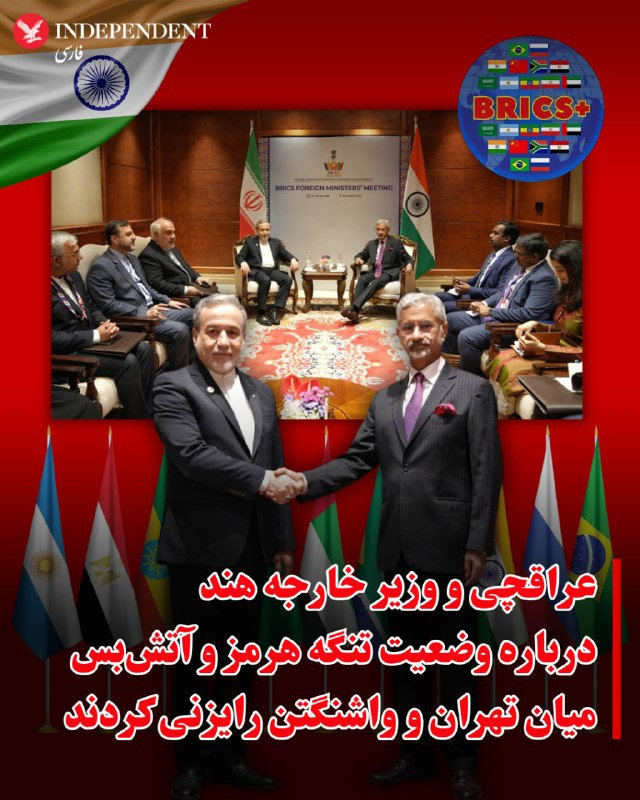
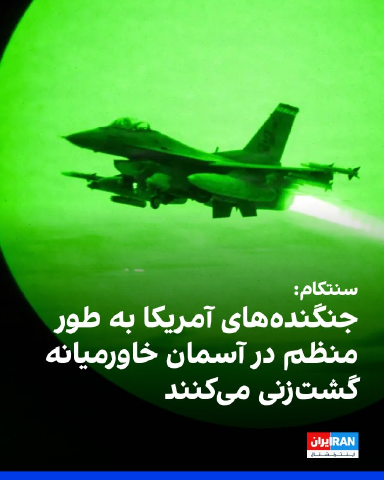
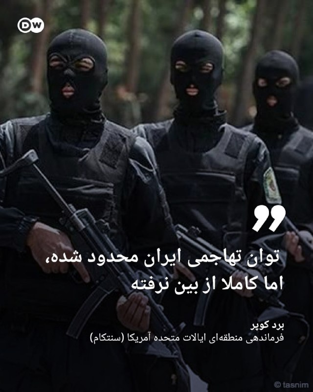
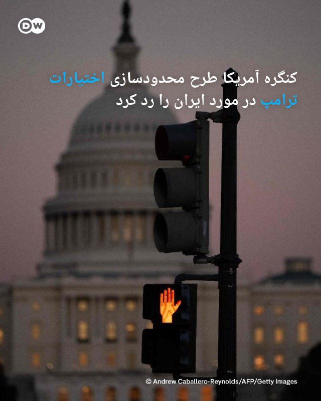
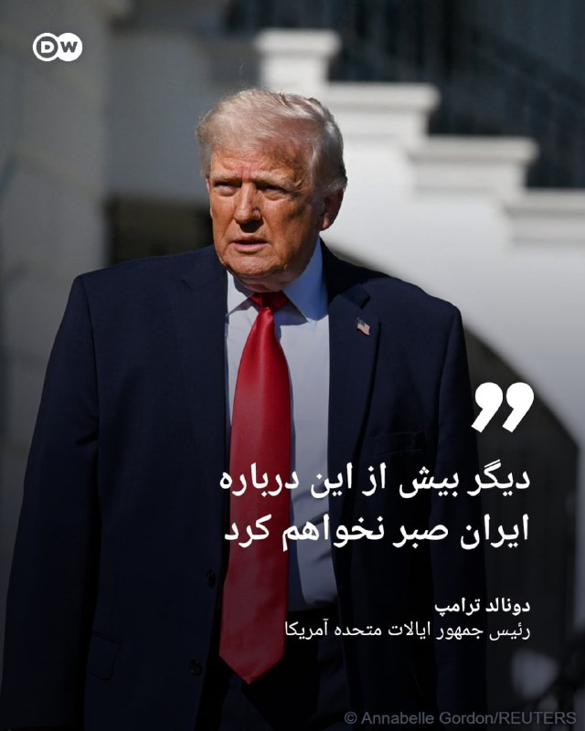
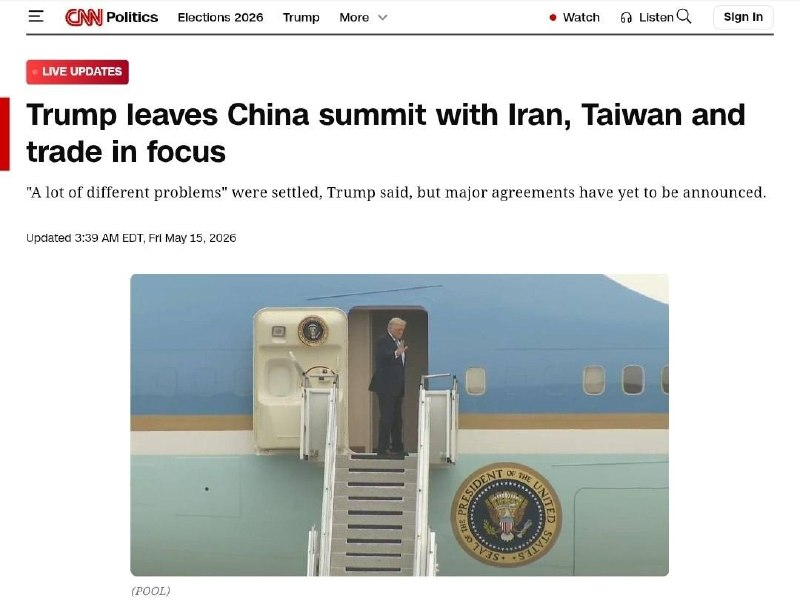
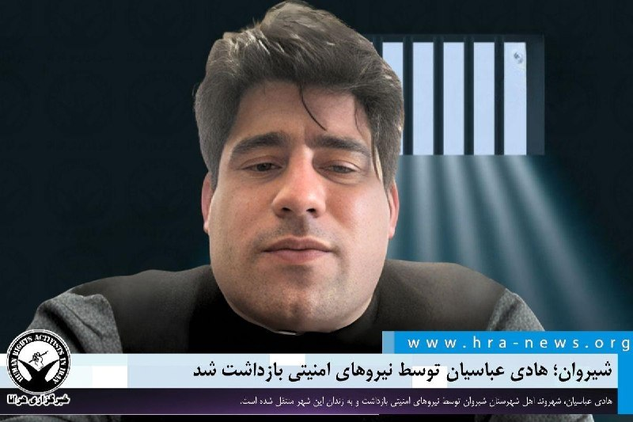

# خواننده تلگرام

<!-- TOP_NAV START -->

<a href="https://github.com/johncunner7/aio-downloader/blob/main/telegram/content/archive_1.md" style="display:inline-block; padding:6px 12px; margin:0 4px; background-color:#2ea44f; color:white; text-decoration:none; border-radius:4px; font-weight:bold;">صفحه بعد</a>

<!-- TOP_NAV END -->

<!-- MSG START -->

---
📅 بروزرسانی: 1405/02/25 12:04
---

## VahidOOnLine — post 240265

  <a href="telegram/content/VahidOOnLine_240265_1778834074.mp4" target="_blank">🎬 Download video</a>

یکی از مخاطبان ایران‌اینترنشنال که دانش‌آموز پایه دهم انسانی است می‌گوید با وجود نهایی نبودن امتحان‌های امسال، نگران سال آینده است، چون به گفته او کیفیت آموزش و شرایط یادگیری در سال جاری «افتضاح» بوده و دانش‌آموزان عملا چیزی یاد نگرفته‌اند. او می‌گوید در مدرسه غیردولتی تحصیل می‌کند.
این پیام با هوش مصنوعی خوانده شده است.
‌🏁 🇬🇧 IranintlTV

🤖 @VahidOOnLine

## VahidOOnLine — post 240264

  <a href="telegram/content/VahidOOnLine_240264_1778834077.mp4" target="_blank">🎬 Download video</a>

دفتر رسانه‌ای دولت ابوظبی روز جمعه ۲۵ اردیبهشت اعلام کرد امارات متحده عربی ساخت یک خط لوله نفتی تازه را برای افزایش صادرات از مسیر فجیره تسریع می‌کند.

این پروژه قرار است تا سال ۲۰۲۷ ظرفیت صادرات نفت امارات از فجیره را دو برابر کند و توان این کشور برای دور زدن تنگه هرمز را افزایش دهد.

فجیره در ساحل دریای عمان قرار دارد و نفتکش‌ها از این مسیر می‌توانند بدون عبور از تنگه هرمز بارگیری کنند.
‌🏁 🇬🇧 ManotoTV

🤖 @VahidOOnLine

## VahidOOnLine — post 240263

  <a href="telegram/content/VahidOOnLine_240263_1778834077.mp4" target="_blank">🎬 Download video</a>

گروه ناظر اینترنتی نت‌بلاکس اعلام کرد قطعی اینترنت در ایران امروز وارد هفتادوهفتمین روز خود شده و از مرز ۱۸۲۴ ساعت گذشته است.
نت‌بلاکس هشدار داده ادامه این محدودیت‌ها می‌تواند به یک خطر فزاینده برای سلامت روان شهروندان تبدیل شود؛ شهروندانی که تا حد زیادی از پلتفرم‌های آنلاین، ارتباطات و تعامل عادی با جهان خارج محروم شده‌اند.
‌🏁 🇬🇧 ManotoTV

🤖 @VahidOOnLine

## VahidOOnLine — post 240262

  <a href="telegram/content/VahidOOnLine_240262_1778834078.mp4" target="_blank">🎬 Download video</a>

دونالد ترامپ، رئیس‌جمهوری آمریکا، پس از پایان سفر دو روزه خود به چین، روز جمعه پکن را ترک کرد.
ترامپ با هواپیمای اختصاصی ریاست‌جمهوری آمریکا «ایر فورس وان» از چین خارج شد و وانگ یی، وزیر امور خارجه چین، به همراه هیاتی دیپلماتیک او را بدرقه کرد.
‌🏁 🇬🇧 ManotoTV

🤖 @VahidOOnLine

## VahidOOnLine — post 240261

🗣روایت شما از زندگی در آتش‌بس- جمعه ۲۶ اردیبهشت ۱۴۰۵

🔹از مشهد پیام می‌دهم. واقعاً ما از این بلاتکلیفی خسته شدیم، گرانی بیداد می‌کند، دخل و خرج‌مان با هم همخوانی ندارد، باید ده نفر کار کنیم که یک نفر بتواند بخورد.

🔹یادم هست اینترنت غزه فقط چند روز قطع بود، کل دنیا و سازمان ملل گفتند جنایت جنگی است، علیه بشریت است و کلی فشار آوردند به اسرائیل و گفتند می‌خواهد حقایق جنگ در غزه را سرکوب کند. هی روزگار.

🔹یک عدد مرغ یک‌میلیون تومان شده است، ما چند ماه پیش با این رقم چهار عدد مرغ خریداری می‌کردیم، دیگر نمی‌دانم چه بگویم، باز ارزشی‌ها بروند بیرون شعار بدهند.

🔹از ملارد تهران، ما خیلی بدبختیم، به کی بگوییم آخه آب را روزی سه مرتبه قطع می‌کنند، بعدازظهرها از ساعت ۶ تا فردا ۶ صبح کلاً قطع می‌کنند، با این همه بارندگی باز می‌گویند آب کم است. با همه این قطعی‌ها قبض آب نجومی می‌آید.

🔹در مشهد، محله‌ی دلاوران. به هزار و یک بدبختی توانستیم وصل شویم، اینترنت نداریم، بنزین نداریم. از دوازده شب به بعد باید تو صف بنزین بایستی، شاید بنزین گیرت آمد، الان حتی بنزین پنج‌تومانی هم نمی‌دهند.

🔹من از تهران پیام می‌دهم، اوضاع واقعاً داغون است، شرکت‌ها همه تعطیل شدند و تعدیل نیرو می‌کنند، شرکت سیماران از ۶۰۰ پرسنل فقط ۵۰ نفر را نگه داشتند و بقیه را اخراج کردند.
‌🏁 🇬🇧 IranintlTV

🤖 @VahidOOnLine

## VahidOOnLine — post 240260

  

یک پژوهشگر مسائل چین در گفت‌وگو با سی‌ان‌ان نشست دونالد ترامپ و شی جین‌پینگ را «۹.۹۹ از ۱۰» ارزیابی کرد و آن را رویدادی تاریخی توصیف کرد.

ویکتور گائو، مترجم پیشین انگلیسی دنگ شیائوپینگ، رییس‌جمهور پیشین چین، و استاد ممتاز دانشگاه سوچو، گفت: «بسیار موفق، با برنامه‌ریزی دقیق، اما در عین حال همراه با خودجوشی و هیجان فراوان.»

او افزود: «چین بهترین عملکرد خود را ارائه داد. مقام‌های دولتی آمریکا و همچنین رهبران تجاری نیز کار درست را انجام دادند. بنابراین این واقعا یک لحظه تاریخی است.»

گائو همچنین از اقدام دونالد ترامپ برای از سرگیری سفرهای ریاست‌جمهوری آمریکا به چین استقبال کرد و آن را «گامی مهم در مسیر درست» برای روابط دو کشور دانست. او یادآور شد روسای‌جمهوری آمریکا از زمان رونالد ریگان دست‌کم یک بار در دوره مسئولیت خود به چین سفر کرده بودند، اما جو بایدن، رییس‌جمهوری سابق آمریکا، در فاصله ژانویه ۲۰۲۱ تا ژانویه ۲۰۲۵ چنین سفری انجام نداد.

این پژوهشگر انتخاب معبد بهشت در پکن برای دیدار دو رهبر را نیز معنادار خواند و گفت در گذشته امپراتورها در آنجا برای برداشت خوب، صلح و ثبات دعا می‌کردند.
‌🏁 🇬🇧 IranintlTV

🤖 @VahidOOnLine

## VahidOOnLine — post 240259

  

دفتر رسانه‌ای دولت ابوظبی روز جمعه اعلام کرد امارات متحده عربی ساخت یک خط لوله جدید نفت را برای دو برابر کردن ظرفیت صادراتی خود از طریق فجیره تا سال ۲۰۲۷ تسریع می‌کند؛ اقدامی که توان این کشور برای دور زدن تنگه هرمز را به طور چشمگیری افزایش می‌دهد.

بر اساس اعلام این دفتر، شیخ خالد بن محمد بن زاید، ولیعهد ابوظبی، در نشست کمیته اجرایی به شرکت ملی نفت ابوظبی، ادنوک، دستور داد پروژه خط لوله غرب-شرق را با سرعت بیشتری پیش ببرد. این دفتر افزود این خط لوله در حال ساخت است و انتظار می‌رود در سال ۲۰۲۷ آغاز به کار کند. در این گزارش به جدول زمانی اولیه اجرای پروژه اشاره‌ای نشده است.

خط لوله موجود نفت خام ابوظبی که با نام خط لوله حبشان-فجیره نیز شناخته می‌شود، توان انتقال روزانه تا ۱.۸ میلیون بشکه نفت را دارد و در شرایطی که این کشور در پی افزایش صادرات مستقیم از سواحل خلیج عمان است، نقشی حیاتی ایفا کرده است.
‌🏁 🇬🇧 IranintlTV

🤖 @VahidOOnLine

## VahidOOnLine — post 240258

  

بر اساس این گزارش، در رایزنی‌های اخیر گزینه انجام حملات محدود و هدفمند آمریکا علیه تاسیسات سوخت و انرژی در ایران مطرح شده است.

کانال ۱۱ افزود اسرائیل برای چنین سناریویی در حال آماده‌سازی است؛ از جمله آمادگی برای واکنش احتمالی جمهوری اسلامی و ازسرگیری حملات موشکی به سوی اسرائیل.
‌🏁 🇬🇧 IranintlTV

🤖 @VahidOOnLine

## VahidOOnLine — post 240257

  

♦️وزارت خارجه چین روز جمعه ۲۵ اردیبهشت ماه، در بیانیه‌ای خواستار برقراری آتش‌بسی پایدار در خاورمیانه و بازگشایی هرچه سریع‌تر مسیرهای کشتیرانی شد.
وزارت خارجه چین در واکنش به پرسش‌هایی درباره گفتگوهای دونالد ترامپ و شی جین‌پینگ اعلام کرد پکن امیدوار است «در سریع‌ترین زمان ممکن» آتش‌بسی پایدار برقرار شود تا صلح و ثبات به خاورمیانه بازگردد.
این وزارتخانه همچنین تاکید کرد: «مسیرهای کشتیرانی باید در پاسخ به درخواست جامعه جهانی هرچه سریع‌تر بازگشایی شوند.»
در بیانیه وزارت خارجه چین درباره بحران خاورمیانه آمده است: «ادامه این درگیری که اساسا نباید رخ می‌داد، هیچ فایده‌ای ندارد.»
به گزارش خبرگزاری فرانسه، این بیانیه پس از آن منتشر شد که دونالد ترامپ به شبکه فاکس نیوز گفت در مورد احتمال دستیابی به یک توافق صلح با ایران «دیگر خیلی صبور نخواهد ماند.» ترامپ پس از نخستین روز گفتگو با همتای چینی‌اش، در گفتگو با فاکس‌نیوز افزود شی به او اطمینان داده که چین قصد ندارد کمک نظامی به ایران ارائه کند.
تنگه هرمز در شرایط عادی مسیر انتقال حدود یک‌پنجم نفت و گاز طبیعی مایع جهان و دیگر کالاهای راهبردی است. در همین حال سپاه پاسداران روز پنج‌شنبه اعلام کرد نیروهای دریایی ایران از چهارشنبه شب به تعدادی از کشتی‌های چینی اجازه عبور از تنگه هرمز را داده‌اند.
‌🇸🇦 Indypersian

🤖 @VahidOOnLine

## VahidOOnLine — post 240256

  

دونالد ترامپ، رییس‌جمهوری آمریکا، روز جمعه پس از سفری دو روزه سوار هواپیمای اختصاصی ریاست‌جمهوری آمریکا «ایر فورس وان» شد و پکن را ترک کرد. وانگ یی، وزیر امور خارجه چین، ترامپ را پیش از سوار شدن به هواپیما همراه با هیاتی دیپلماتیک بدرقه کرد.

شی جین‌پینگ، رییس‌جمهوری چین، در سخنرانی خود در مراسم ضیافت رسمی به مناسبت سفر دونالد ترامپ، این سفر را «تاریخی» خواند و گفت: «دو شعار "احیای چین" و "عظمت را به آمریکا بازگردانیم" می‌توانند در کنار یکدیگر پیش بروند.»
‌🏁 🇬🇧 IranintlTV

🤖 @VahidOOnLine

## VahidOOnLine — post 240255

  <a href="telegram/content/VahidOOnLine_240255_1778834083.mp4" target="_blank">🎬 Download video</a>

اف‌بی‌آی اعلام کرد برای دریافت اطلاعاتی که به شناسایی و بازداشت «مونیکا ویت»، مامور سابق ضدجاسوسی و متخصص اطلاعاتی نیروی هوایی آمریکا، منجر شود ۲۰۰ هزار دلار جایزه تعیین کرده است.
بر اساس بیانیه اف‌بی‌آی، ویت بین سال‌های ۱۹۹۷ تا ۲۰۰۸ در نیروی هوایی آمریکا خدمت کرده و سپس تا سال ۲۰۱۰ به‌عنوان پیمانکار دولت آمریکا فعالیت داشته است. او به اطلاعات محرمانه و فوق‌محرمانه، از جمله هویت نیروهای مخفی جامعه اطلاعاتی آمریکا، دسترسی داشته است. مقام‌های آمریکایی می‌گویند او پس از شرکت در نشست‌هایی مرتبط با برنامه «افق نو» در تهران، به ایران پناهنده شد و اطلاعات حساسی را در اختیار جمهوری اسلامی قرار داد.
وزارت دادگستری آمریکا پیش‌تر او را به همکاری در عملیات جاسوسی سایبری، افشای اطلاعات محرمانه و به خطر انداختن جان نیروهای آمریکایی و خانواده‌هایشان متهم کرده بود. اف‌بی‌آی می‌گوید مونیکا ویت همچنان متواری است و احتمال می‌دهد افرادی از محل اختفای او اطلاع داشته باشند.
‌🏁 🇬🇧 ManotoTV

🤖 @VahidOOnLine

## VahidOOnLine — post 240254

  <a href="telegram/content/VahidOOnLine_240254_1778834084.mp4" target="_blank">🎬 Download video</a>

ارتش اسرائیل اعلام کرد در پی فعال شدن آژیر هشدار در مناطق مسد و عیلابون، یک پرتابه شلیک‌شده از خاک لبنان به سوی اسرائیل رهگیری شده است. به گفته ارتش اسرائیل، این اقدام «نقض دیگری از تفاهم‌های آتش‌بس» از سوی حزب‌الله به شمار می‌رود.
همزمان ارتش اسرائیل اعلام کرد یک سرباز این کشور شب گذشته بر اثر شلیک خمپاره حزب‌الله در جنوب لبنان کشته شده است. سرباز کشته‌شده، گروهبان دوم نگو داگان، ۲۰ ساله، از گردان دوازدهم تیپ گولانی و اهل شهرک دکل در جنوب اسرائیل معرفی شده است.
ارتش اسرائیل همچنین اعلام کرد شب گذشته سکوی پرتابی را که حزب‌الله از آن چندین راکت به سوی منطقه کریات شمونا شلیک کرده بود، در منطقه زبدین در جنوب لبنان هدف قرار داده و منهدم کرده است. به گفته ارتش، چندین ساختمان مورد استفاده حزب‌الله برای اهداف نظامی نیز در این حملات هدف قرار گرفته‌اند.
‌🏁 🇬🇧 ManotoTV

🤖 @VahidOOnLine

## VahidOOnLine — post 240253

  <a href="telegram/content/VahidOOnLine_240253_1778834085.mp4" target="_blank">🎬 Download video</a>

ویدئویی از قدم زدن دونالد ترامپ و شی جین‌پینگ در باغ‌های مجموعه حکومتی ژونگ‌نان‌های در پکن منتشر شده است.
در این ویدئو، ترامپ از رئیس‌جمهوری چین می‌پرسد: «وقتی دیگر رؤسای کشورها به دیدارتان می‌آیند، آن‌ها را هم اینجا می‌پذیرید؟»
شی جین‌پینگ در پاسخ می‌گوید: «به ندرت می‌آیند».
‌🏁 🇬🇧 ManotoTV

🤖 @VahidOOnLine

## VahidOOnLine — post 240252

  <a href="telegram/content/VahidOOnLine_240252_1778834087.mp4" target="_blank">🎬 Download video</a>

دونالد ترامپ پس از دیدار با شی جین‌پینگ اعلام کرد آمریکا و چین درباره ایران دیدگاه‌های «بسیار مشابهی» دارند و هر دو خواهان پایان تنش‌ها و باز ماندن تنگه هرمز هستند.
ترامپ گفت: «نمی‌خواهیم ایران به سلاح هسته‌ای دست پیدا کند.» او همچنین وضعیت کنونی را «دیوانه‌وار» توصیف کرد و افزود واشینگتن خواهان پایان بحران است.
رئیس‌جمهوری آمریکا همچنین با اشاره به روابط خود با شی جین‌پینگ گفت دو طرف طی سال‌های گذشته توانسته‌اند مشکلاتی را حل کنند که دیگران قادر به حل آن‌ها نبودند و تاکید کرد روابط میان واشینگتن و پکن همچنان «بسیار قوی» است.
‌🏁 🇬🇧 ManotoTV

🤖 @VahidOOnLine

## VahidOOnLine — post 240251

  <a href="telegram/content/VahidOOnLine_240251_1778834088.mp4" target="_blank">🎬 Download video</a>

مقام‌های فنلاند روز جمعه درباره فعالیت مشکوک پهپادی در منطقه پایتخت هشدار دادند و فرودگاه هلسینکی اعلام کرد پروازها به‌طور موقت متوقف شده است.
پتری اورپو، نخست‌وزیر فنلاند، در پیامی در شبکه اجتماعی ایکس اعلام کرد: «مقام‌ها در حال اقدام هستند. نیروهای مسلح نیز توان نظارتی و واکنش خود را تقویت کرده‌اند. از همه می‌خواهم اطلاعیه‌های رسمی را دنبال کنند.
‌🏁 🇬🇧 ManotoTV

🤖 @VahidOOnLine

## VahidOOnLine — post 240250

♦️دونالد ترامپ، رئیس‌جمهوری ایالات متحده، روز جمعه در پایان سفر رسمی دو روزه به چین و دیدار با شی جین‌پینگ، رئیس‌جمهوری این کشور، پکن را ترک کرد.
دونالد ترامپ پس از مراسم رسمی بدرقه ‌در فرودگاه بین‌المللی پکن، با هواپیمای ریاست‌جمهوری آمریکا، «ایرفورس وان» به واشنگتن بازگشت.
‌🇸🇦 Indypersian

🤖 @VahidOOnLine

## VahidOOnLine — post 240249

  <a href="telegram/content/VahidOOnLine_240249_1778834089.mp4" target="_blank">🎬 Download video</a>

⭕️پرواز خودروی متهم فراری در جریان تعقیب و گریز پلیس در آمریکا

♦️مقام‌های پلیس در ایالت ویسکانسین آمریکا، ویدیویی منتشر کرده‌اند که لحظه پرتاب شدن خودروی یک مظنون روی خودرویی دیگر را هنگام تلاش برای فرار نشان می‌دهد.

بر اساس این ویدیو، خودروی مظنون هنگام فرار با سرعت از روی بخشی از بزرگراه به هوا پرتاب شد و پس از عبور از بالای یک خودروی دیگر، در یک مزرعه فرود آمد.

به گفته مقام‌ها، مظنون پس از توقف خودرو تلاش کرد پیاده فرار کند، اما پس از یک تعقیب و گریز کوتاه بازداشت شد. مقام‌های محلی اعلام کردند او اکنون با چندین اتهام روبه‌رو است.
‌🇸🇦 Indypersian

🤖 @VahidOOnLine

## VahidOOnLine — post 240248

  

⭕️عراقچی و وزیر خارجه هند درباره وضعیت تنگه هرمز و آتش‌بس میان تهران و واشنگتن رایزنی کردند

♦️عباس عراقچی، در حاشیه اجلاس وزیران امورخارجه بریکس، در دیدار با همتای هندی خود درباره آخرین تحولات پس از جنگ ایران و ائتلاف آمریکا و اسرائیل، وضعیت آتش‌بس شکننده جاری و روند مذاکرات مرتبط با پایان جنگ گفتگو کرد.

به گزارش میزان، عراقچی در این دیدار همتای هندی خود را در جریان آخرین تحولات سیاسی و امنیتی منطقه قرار داد و درباره روند مذاکرات مرتبط با خاتمه جنگ توضیحاتی ارائه کرد. وزیر امور خارجه هند نیز بر حمایت کشورش از راهکارهای دیپلماتیک برای حل‌وفصل مسائل و اختلافات بین‌المللی تاکید کرد.

دو طرف همچنین درباره آخرین وضعیت تنگه هرمز و تحولات مرتبط با امنیت دریایی و ثبات منطقه‌ای رایزنی و تبادل نظر کردند، موضوعی که در هفته‌های اخیر به‌دلیل تنش‌های منطقه‌ای و نگرانی‌ها درباره امنیت مسیرهای کشتیرانی، اهمیت بیشتری یافته است.
‌🇸🇦 Indypersian

🤖 @VahidOOnLine

## VahidOOnLine — post 240247

  

سنتکام، ستاد فرماندهی مرکزی آمریکا، تصویری از یک جنگنده اف-۱۶ نیروی هوایی آمریکا منتشر کرد و اعلام کرد این جنگنده برای پرواز شبانه از پایگاهی در خاورمیانه به پرواز درآمده است.

سنتکام نوشت: «جنگنده‌های نیروی هوایی آمریکا به طور منظم در حمایت از امنیت منطقه‌ای، آسمان خاورمیانه را گشت‌زنی می‌کنند.»
‌🏁 🇬🇧 IranintlTV

🤖 @VahidOOnLine

## VahidOOnLine — post 240246

  

عباس عراقچی، وزیر خارجه جمهوری اسلامی، در نشست وزیران خارجه بریکس خواستار اصلاح ساختار سازمان ملل و «نمایندگی عادلانه» همه مناطق جهان در شورای امنیت شد.

او در این نشست گفت: «جمهوری اسلامی خواستار اصلاح ساختار سازمان ملل و نمایندگی عادلانه همه مناطق جهان در شورای امنیت است.»

وزیر خارجه جمهوری اسلامی همچنین تحریم‌های «یکجانبه» را سلاحی علیه حقوق انسان‌ها توصیف کرد و افزود: «تحریم‌های یکجانبه به سلاحی علیه حقوق انسان‌ها تبدیل شده‌اند و مقابله با تروریسم اقتصادی ماموریت ضروری بریکس است.»
‌🏁 🇬🇧 IranintlTV

🤖 @VahidOOnLine

## WithYashar — post 11268

هم‌اکنون حمله سنگین جمهوری اسلامی به مقر گروه های مخالف در عراق
@withyashar

## WithYashar — post 11267

طبق گزارش روزنامه «ساوت چاینا مورنینگ پست» و بازنشر آن توسط «بلومبرگ»، انتظار می‌رود «ولادیمیر پوتین» در حدود ۲۰ مه به «پکن» سفر کند؛ تنها حدود ۵ روز پس از دیدار «شی جین‌پینگ» و «دونالد ترامپ» در پکن.

رسانه‌ها می‌گویند این سفر احتمالاً فقط یک روز طول می‌کشد و بیشتر در قالب یک دیدار کاری و هماهنگی سیاسی انجام می‌شود. همچنین برخلاف سفر ترامپ، ظاهراً خبری از تشریفات بزرگ، رژه رسمی یا استقبال بسیار گسترده نخواهد بود و این سفر در سطحی ساده‌تر و کم‌نمایش‌تر برگزار می‌شود
@withyashar

## WithYashar — post 11266

@withyashar part2

## WithYashar — post 11265

ترامپ در تروث : «وقتی رئیس‌جمهور شی با بیانی بسیار سنجیده از ایالات متحده به‌عنوان کشوری که شاید در حال افول باشد یاد کرد، منظور او آسیب عظیمی بود که ما در چهار سال دوران جو بایدنِ خواب‌آلود و دولت بایدن متحمل شدیم؛ و در این مورد، او صددرصد درست می‌گفت. کشور…

## WithYashar — post 11264

@withyashar part1

## WithYashar — post 11263

  <a href="telegram/content/WithYashar_11263_1778834093.mp4" target="_blank">🎬 Download video</a>

@withyashar منتظر ری اکشننن

## WithYashar — post 11262

نظرت چیه؟قبل جام جهانی میزنع یا بعد؟

## WithYashar — post 11261

کانال 13 اسرائیل:اسرائیل انتظار دارد حمله احتمالی آمریکا در ایران از فردا با بازگشت ترامپ از چین آغاز شود
@withyashar

## WithYashar — post 11260

  <a href="telegram/content/WithYashar_11260_1778834095.mp4" target="_blank">🎬 Download video</a>

پایان سفر ترامپ به چین

دونالد ترامپ، رئیس جمهور آمریکا، پکن را ترک کرد و سفر خود به جمهوری خلق چین را به پایان رساند.

شی جین‌پینگ، رئیس‌جمهور چین در آخرین روز سفر رئیس جمهور ایالات متحده گفت که دونالد ترامپ به دنبال بازگرداندن عظمت آمریکا است و او نیز متعهد به هدایت مردم چین برای تحقق رستاخیز ملی است.

شی جین‌پینگ همچنین تأکید کرده است که چین و آمریکا می‌توانند از طریق تقویت همکاری‌ها، روند توسعه و پیشرفت خود را تسریع کنند.
@withyashar

## WithYashar — post 11259

  <a href="telegram/content/WithYashar_11259_1778834098.mp4" target="_blank">🎬 Download video</a>

ترامپ: امیدوارم ایران تماشا کند. ما دقیقاً می‌دانیم چه چیزی را آماده کرده‌اند. می‌دانید، آن‌ها کمی استراحت داشتند، بنابراین سعی دارند چند چیز را با هم جمع کنند. آن‌ها موشک‌هایی را از زیر زمین بیرون آورده‌اند. همه این‌ها در یک روز از بین خواهند رفت. امیدوارم این رو ببینند چون همه کارهایی که در چهار هفته گذشته انجام داده‌اند، در یک روز از بین خواهد رفت.
@withyashar
یاشار:خوب دیگه رسمأ داره میگه جنگ میشه و هم داره میگه حمله خیلی سریع و محکم انجام میشه همانطور که گفتیم

## WithYashar — post 11258

آمریکا پیشنهاد ۱۴ ماده‌ای ایران را رد کرد

طبق اطلاعات رسیده به تهران تایمز، دولت آمریکا پاسخ پیشنهاد مکتوب ایران درباره پایان جنگ را داده است.

گفتنی است ایران پیشنهاد خود را مبتنی بر مذاکرات دو مرحله ای ارائه کرده بود که در مرحله اول منجر به پایان جنگ در همه جبهه ها شده و در صورت تحقق شروط ایران، مرحله دوم مذاکرات که درباره موضوع هسته ای بود، آغاز می شد
@withyashar

## WithYashar — post 11257

مجلس نمایندگان آمریکا برای سومین بار طرح دموکرات‌ها جهت محدود کردن اختیارات نظامی ترامپ علیه جمهوری اسلامی رو رد کرد.

این طرح با نتیجه ۲۱۲ در برابر ۲۱۲ به تساوی رسید و در نهایت با اختلاف یک رای شکست خورد.
@withyashar

## WithYashar — post 11256

ترامپ، به شبکه فاکس نیوز: مذاکره با ایران درباره کنار گذاشتن غبار هسته‌ای به دلیل تضاد در تصمیمات ایران، رفت و برگشت دارد تأسیسات هسته‌ای ایران تحت نظارت مداوم ۹ دوربین، ۲۴ ساعته قرار دارند. هرگونه تحرک ایرانی در داخل تأسیسات هسته‌ای با واکنش مستقیم نظامی…

## WithYashar — post 11255

  <a href="telegram/content/WithYashar_11255_1778834100.mp4" target="_blank">🎬 Download video</a>

‏ ترامپ: ما مشکلات زیادی را حل کرده‌ایم که دیگران قادر نبودند و این رابطه یک رابطه بسیار قوی است. فکر می‌کنم در مورد ایران کارهای فوق‌العاده‌ای انجام داده‌ایم، ما هم صحبت کردیم.

‏ما در مورد ایران بسیار مشابه‌ایم، می‌خواهیم این وضعیت پایان یابد. نمی‌خواهیم آن‌ها به سلاح هسته‌ای دست پیدا کنند. می‌خواهیم تنگه‌ها باز باشند و ما آن را برایشان می‌بندیم، آن‌ها تنها تنگه را بستند و بعد ما هم روی سرشان بستیم.
@withyashar

## WithYashar — post 11254

ترامپ، به شبکه فاکس نیوز: مذاکره با ایران درباره کنار گذاشتن غبار هسته‌ای به دلیل تضاد در تصمیمات ایران، رفت و برگشت دارد
تأسیسات هسته‌ای ایران تحت نظارت مداوم ۹ دوربین، ۲۴ ساعته قرار دارند.
هرگونه تحرک ایرانی در داخل تأسیسات هسته‌ای با واکنش مستقیم نظامی مواجه خواهد شد.
@withyashar

## mwarmonitor — post 9108

علی هاشم خبرنگار الجزیره:

🇮🇷«یک منبع آگاه ایرانی به من گفته است که تهران به‌طور رسمی پاسخ آمریکا به پیشنهاد ایران را دریافت کرده و واشنگتن تمامی شروط ایران را به‌طور کامل رد کرده است.

🔸تیم مذاکره‌کننده ایران پنج شرط را برای ورود به گفت‌وگو درباره پرونده هسته‌ای مطرح کرده بود:

1. پایان دادن به جنگ در همه جبهه‌ها

2. لغو کامل تمامی تحریم‌ها

3. آزادسازی دارایی‌های مسدودشده

4. جبران خسارات و تلفات ناشی از جنگ

5. به‌رسمیت شناختن حق حاکمیت ایران بر تنگه هرمز»

@mwarmonitor

## mwarmonitor — post 9107

  <a href="telegram/content/mwarmonitor_9107_1778834102.mp4" target="_blank">🎬 Download video</a>

🔴«جزیره خارک به سقف ظرفیت ذخیره‌سازی خود نرسیده است. اگر چنین بود، نزدیک‌ترین نفتکش‌های در دسترس را به‌کار می‌گرفتند و آن‌ها را کاملاً بارگیری می‌کردند. در عوض، تولید نفت کاهش یافته تا با افت بارگیری نفتکش‌ها هم‌خوان شود. همچنان تعداد زیادی نفتکش وجود دارد که می‌توان آن‌ها را بارگیری کرد.» TANKER TRACKER

@mwarmonitor

## mwarmonitor — post 9106

  

✈️🇺🇸نیروی هوایی ایالات متحده|جابجایی تانکرها ادامه دارد

✈️همان‌طور که در بیشتر روزهای آتش‌بس دیده شده، ناوگان تانکرهای هوایی ایالات متحده (با بیش از ۲۲۰ فروند هواپیما) در سراسر اروپا و حوزه سنتکام همچنان در حال جابجایی است؛ به‌طوری‌که هواپیماهایی که فشار کاری بیشتری داشته‌اند، به‌تدریج خارج و با نمونه‌های دیگر جایگزین می‌شوند. تا این لحظه امروز:

KC-135R «RCH736» 57-1486 AE041D (از EGUN به LLBG)
KC-135R «؟» 61-0300 AE0689 (از LLBG به EDDS)
KC-135R «RCH314» 62-3521 AE0485 (از LFOA به EDDS و سپس نامشخص)
KC-135T «RCH559» 59-1471 AE07A5 (از CONUS به EDDS)

@mwarmonitor

## mwarmonitor — post 9105

  <a href="telegram/content/mwarmonitor_9105_1778834105.mp4" target="_blank">🎬 Download video</a>

✈️«اکنون: رئیس‌جمهور ترامپ با هواپیمای ایرفورس وان چین را ترک کرد و به نشست دو روزه خود با رئیس‌جمهور چین، شی جین‌پینگ، پایان داد.

🔹پیش از پرواز بازگشت به ایالات متحده، مراسمی کوتاه در باند فرودگاه برگزار شد.

🇺🇸🇨🇳ترامپ پس از این دیدارها از «توافق‌های تجاری فوق‌العاده» سخن گفت و اعلام کرد که دو رهبر درباره ایران هم‌نظر هستند.»

@mwarmonitor

## FoxNewsTwitter — post 341768

  <a href="telegram/content/FoxNewsTwitter_341768_1778834107.mp4" target="_blank">🎬 Download video</a>

Fox News (Twitter/X)

NOW: President Trump departed China aboard Air Force One, wrapping up his two-day summit with Chinese President Xi Jinping.

A brief ceremony was held on the tarmac before his return flight to the U.S.

Trump touted “fantastic trade deals” following his meetings and said the two leaders were aligned on Iran.

## FoxNewsTwitter — post 341767

  <a href="telegram/content/FoxNewsTwitter_341767_1778834109.mp4" target="_blank">🎬 Download video</a>

Fox News (Twitter/X)

NOW: President Trump gives a fist pump as he departs China after a series of crucial meetings with President Xi Jinping on the Iran war, trade tensions, technology, and Taiwan.

Ahead of his departure, Trump met with Xi and expressed optimism about hosting him in the U.S. this September.

“You're going to walk away hopefully very impressed, like I'm very impressed with China."

## FoxNewsTwitter — post 341766

  <a href="telegram/content/FoxNewsTwitter_341766_1778834111.mp4" target="_blank">🎬 Download video</a>

Fox News (Twitter/X)

NOW: President Trump exits the Beast to fanfare and pumps his fist during a departure ceremony at Beijing Capital International Airport.

Ahead of his departure, Trump met with Chinese President Xi Jinping and expressed optimism about hosting him in the U.S. this September.

“You're going to walk away hopefully very impressed, like I'm very impressed with China."

## FoxNewsTwitter — post 341765

  

Fox News (Twitter/X)

WATCH LIVE: President Trump departs Beijing after summit with President Xi https://twitter.com/i/broadcasts/1XxygmDlakEGM

## pm_afshaa — post 90768

🔴ترامپ به فاکس‌ نیوز : من از الان دیگه آدم صبوری نیستم و صبر بیشتری به ایران نشان نخواهم داد

💧 Rainbet.com the #1 Non-KYC Crypto Casino & Sportsbook @rainbetcom

😁 @Pm_Afshaa

## pm_afshaa — post 90767

  <a href="telegram/content/pm_afshaa_90767_1778834113.mp4" target="_blank">🎬 Download video</a>

ترامپ رفت به شهر ممنوعه چین جایی که رهبرای خیلی کمی تو دنیا به اونجا رفتن و هر کسی رو راه نمیدن اونجا

💧 Rainbet.com the #1 Non-KYC Crypto Casino & Sportsbook @rainbetcom

😁 @Pm_Afshaa

## pm_afshaa — post 90766

🔴کانال 13 اسرائیل:اسرائیل انتظار دارد حمله احتمالی آمریکا در ایران از فردا با بازگشت ترامپ از چین آغاز شود

💧 Rainbet.com the #1 Non-KYC Crypto Casino & Sportsbook @rainbetcom

😁 @Pm_Afshaa

## pm_afshaa — post 90765

🔴ترامپ به فاکس نیوز:امیدوارم ایران در حال تماشا باشد. ما دقیقاً می‌دانیم چه چیزی را به نمایش گذاشته‌اند.

می‌دانید، آنها کمی استراحت داشتند، بنابراین سعی می‌کنند چند چیز را جمع کنند. آنها چند موشک را از زیر زمین برداشته‌اند. همه آن‌ها در یک روز از بین خواهد رفت.

هر کاری که در چهار هفته گذشته انجام داده‌اند، در یک روز از بین خواهد رفت

💧 Rainbet.com the #1 Non-KYC Crypto Casino & Sportsbook @rainbetcom

😁 @Pm_Afshaa

## pm_afshaa — post 90764

🔴توییت جدید ترامپ:جنگ با ایران ادامه خواهد داشت

💧 Rainbet.com the #1 Non-KYC Crypto Casino & Sportsbook @rainbetcom

😁 @Pm_Afshaa

## DEJradio — post 4639

  <a href="telegram/content/DEJradio_4639_1778834115.webm" target="_blank">🎬 Download video</a>

🔺📌 با تخریب گسترده کلانتری‌ها و مقرهای نیروی انتظامی در جنگ ۴۰ روزه، ماموران با مشکل «مکان» مواجه‌اند. راه‌حل‌ موقت استقرار کانکس‌ و استقرار در مینی‌بوس و اتوبوس و افزایش ماموریت‌های گشتی گوشه و کنار شهرها بود اما روزنامه «اعتماد» به نقل از یک منبع آگاه در دانشگاه تربیت مدرس گزارش داد که نیروهای انتظامی برای دومین بار طی سه هفته اخیر وارد پردیس بابایی، محل استقرار پارک علم و فناوری این دانشگاه، شده و خواستار تخلیه و واگذاری این زمین ۶۰ هکتاری به نیروی انتظامی شده‌اند.

بر اساس این گزارش، ماموران بدون ارائه مجوز قضایی وارد محوطه شده و اقدام به استقرار کانکس و تجهیزات در بخشی از پردیس کرده‌اند؛ اقدامی که به تنش میان نیروهای حاضر و کارکنان دانشگاه انجامیده است.

پیش‌تر روابط عمومی دانشگاه تربیت مدرس نیز اعلام کرده بود که شامگاه پنجم اردیبهشت، افرادی ناشناس وارد پردیس بابایی شده و با برپایی چادر در محوطه مستقر شده‌اند. دانشگاه گفته بود که از طریق مراجع قانونی در حال پیگیری موضوع است.

پردیس بابایی پارک علم و فناوری دانشگاه تربیت مدرس در شمال بزرگراه شهید بابایی قرار دارد و میزبان ۱۶ شرکت دانش‌بنیان در حوزه‌هایی از جمله تجهیزات پزشکی، صنایع دارویی، انرژی‌های پاک، فناوری زیستی، کشاورزی و تصفیه آب است.

منبع آگاه مورد استناد روزنامه اعتماد، اقدام نیروهای انتظامی را بخشی از تلاش برای تغییر کاربری این مجموعه علمی و واگذاری آن به نهادهای امنیتی و انتظامی توصیف کرده است.

#نیروی_انتظامی #جنگ۴۰روزه
@DEJradio

## DEJradio — post 4638

  <a href="telegram/content/DEJradio_4638_1778834116.webm" target="_blank">🎬 Download video</a>

🔺📢 دونالد ترامپ رئیس‌جمهوری آمریکا درباره «توافق» با جمهوری اسلامی، به شبکه فاکس‌نیوز، گفت: «من دیگر خیلی بیشتر صبر نخواهم کرد.» او افزود: «آن‌ها باید توافق کنند.»

او بار دیگر از عملیات نظامی علیه جمهوری اسلامی دفاع کرد و گفت حکومت ایران بخش عمده توان نظامی خود را از دست داده و واشنگتن در صورت لزوم می‌تواند باقی‌مانده زیرساخت‌های نظامی تهران را نیز به سرعت نابود کند.

ترامپ در این مصاحبه که در جریان سفر او به چین انجام شد، گفت: «ایران از نظر نظامی نابود شده است. فقط مسئله زمان است.»
رییس‌جمهوری آمریکا با تاکید بر اینکه آمریکا «دیگر قرار نیست خیلی بیشتر درباره ایران صبر کند» گفت: «آن‌ها باید توافق کنند او رهبران فعلی حکومت ایران را که واشینگتن با آن‌ها در تماس است، افرادی «منطقی» توصیف کرد.

تعدادی از رهبران فعلی جمهوری اسلامی مخالف توافق‌اند. محمدعلی (عزیز) جعفری فرمانده پیشین سـ.ـپاه پاسداران که مدت‌ها در عرصه عمومی کمتر درباره سیاست صحبت می‌کرد، مدتی است به صحنه بازگشته است.
او در مصاحبه با خبرگزاری تسنیم گفت، ایران بدون انجام پیش‌شرط‌ها و اقدامات اعتمادساز توسط آمریکا وارد مذاکرات نمی‌شود.
جعفری تاکید می‌کند تا زمانی که جنگ در همه جبهه‌ها پایان نیافته، تحریم‌ها برداشته نشده، پول‌های بلوکه‌شده آزاد نشده، خسارت‌های ناشی از جنگ جبران نشده و حق حاکمیت ایران بر تنگه هرمز به رسمیت شناخته نشده باشد، هیچ مذاکره دیگری در کار نیست. اینها در واقع شروطی است که طی این مدت دونالد ترامپ نپذیرفته است.

#ترامپ #توافق #مذاکرات
@DEJradio

## IranIntlTV — post 337280

  <a href="telegram/content/IranIntlTV_337280_1778834117.mp4" target="_blank">🎬 Download video</a>

یکی از مخاطبان ایران‌اینترنشنال که دانش‌آموز پایه دهم انسانی است می‌گوید با وجود نهایی نبودن امتحان‌های امسال، نگران سال آینده است، چون به گفته او کیفیت آموزش و شرایط یادگیری در سال جاری «افتضاح» بوده و دانش‌آموزان عملا چیزی یاد نگرفته‌اند. او می‌گوید در مدرسه غیردولتی تحصیل می‌کند.
این پیام با هوش مصنوعی خوانده شده است.

## IranIntlTV — post 337279

🗣روایت شما از زندگی در آتش‌بس- جمعه ۲۵ اردیبهشت ۱۴۰۵

🔹از مشهد پیام می‌دهم. واقعاً ما از این بلاتکلیفی خسته شدیم، گرانی بیداد می‌کند، دخل و خرج‌مان با هم همخوانی ندارد، باید ده نفر کار کنیم که یک نفر بتواند بخورد.

🔹یادم هست اینترنت غزه فقط چند روز قطع بود، کل دنیا و سازمان ملل گفتند جنایت جنگی است، علیه بشریت است و کلی فشار آوردند به اسرائیل و گفتند می‌خواهد حقایق جنگ در غزه را سرکوب کند. هی روزگار.

🔹یک عدد مرغ یک‌میلیون تومان شده است، ما چند ماه پیش با این رقم چهار عدد مرغ خریداری می‌کردیم، دیگر نمی‌دانم چه بگویم، باز ارزشی‌ها بروند بیرون شعار بدهند.

🔹از ملارد تهران، ما خیلی بدبختیم، به کی بگوییم آخه آب را روزی سه مرتبه قطع می‌کنند، بعدازظهرها از ساعت ۶ تا فردا ۶ صبح کلاً قطع می‌کنند، با این همه بارندگی باز می‌گویند آب کم است. با همه این قطعی‌ها قبض آب نجومی می‌آید.

🔹در مشهد، محله‌ی دلاوران. به هزار و یک بدبختی توانستیم وصل شویم، اینترنت نداریم، بنزین نداریم. از دوازده شب به بعد باید تو صف بنزین بایستی، شاید بنزین گیرت آمد، الان حتی بنزین پنج‌تومانی هم نمی‌دهند.

🔹من از تهران پیام می‌دهم، اوضاع واقعاً داغون است، شرکت‌ها همه تعطیل شدند و تعدیل نیرو می‌کنند، شرکت سیماران از ۶۰۰ پرسنل فقط ۵۰ نفر را نگه داشتند و بقیه را اخراج کردند.

## IranIntlTV — post 337278

  <a href="telegram/content/IranIntlTV_337278_1778834119.mp4" target="_blank">🎬 Download video</a>

🔻خبرگزاری مهر، وابسته به سازمان تبلیغات اسلامی در ویدیویی که از بدرقه تیم ملی در میدان انقلاب در بین طرفداران حکومت منتشر کرده، پرچم گروه حزب‌الله لبنان را سانسور کرده است. این سانسور با واکنش کاربران رسانه‌های اجتماعی روبه‌رو شده است‌.

@iranintltvsport

## IranIntlTV — post 337277

  

🔻ایسنا گزارش داده که انتشار جدیدترین صورت‌های مالی باشگاه استقلال در سامانه کدال، از بحران حقوقی این باشگاه خبر می‌دهد و نشان می‌دهد استقلال هم‌اکنون با ۶ پرونده حقوقی سنگین در فدراسیون جهانی فوتبال، فیفا و دیوان حکمیت ورزش (CAS) روبه‌رو است.

🔹در صورت محکومیت، بیش از ۳ میلیون و ۳۰۰ هزار دلار تعهد مالی به همراه یک ادعای ریالی ۲۸۸ میلیارد تومانی به این باشگاه تحمیل خواهد شد.

🔹اگرچه این پرونده‌ها هنوز به مرحله صدور رای قطعی نرسیده‌اند و بدهی قطعی محسوب نمی‌شوند، اما جزییات آن‌ها ابعاد سوءمدیریت‌های گذشته را آشکار می‌کند.

🔹بخش عمده این بحران مالی به دو بازیکن بوسنیایی مربوط می‌شود که در نقل‌وانتقالات تابستانی و در دوران مدیریت احمد شهریاری و فرشید سمیعی و سرمربی‌گری جواد نکونام به استقلال پیوستند.

🔹آلمدین زیلیکیچ پس از سه هفته حضور و بدون انجام حتی یک دقیقه بازی، قراردادش را فسخ کرد و اکنون شکایتی ۸۹۶ هزار دلاری ثبت کرده است.

🔹جزییات بیشتر را اینجا بخوانید

@iranintltvsport

## IranIntlTV — post 337276

  

یک پژوهشگر مسائل چین در گفت‌وگو با سی‌ان‌ان نشست دونالد ترامپ و شی جین‌پینگ را «۹.۹۹ از ۱۰» ارزیابی کرد و آن را رویدادی تاریخی توصیف کرد.

ویکتور گائو، مترجم پیشین انگلیسی دنگ شیائوپینگ، رییس‌جمهور پیشین چین، و استاد ممتاز دانشگاه سوچو، گفت: «بسیار موفق، با برنامه‌ریزی دقیق، اما در عین حال همراه با خودجوشی و هیجان فراوان.»

او افزود: «چین بهترین عملکرد خود را ارائه داد. مقام‌های دولتی آمریکا و همچنین رهبران تجاری نیز کار درست را انجام دادند. بنابراین این واقعا یک لحظه تاریخی است.»

گائو همچنین از اقدام دونالد ترامپ برای از سرگیری سفرهای ریاست‌جمهوری آمریکا به چین استقبال کرد و آن را «گامی مهم در مسیر درست» برای روابط دو کشور دانست. او یادآور شد روسای‌جمهوری آمریکا از زمان رونالد ریگان دست‌کم یک بار در دوره مسئولیت خود به چین سفر کرده بودند، اما جو بایدن، رییس‌جمهوری سابق آمریکا، در فاصله ژانویه ۲۰۲۱ تا ژانویه ۲۰۲۵ چنین سفری انجام نداد.

این پژوهشگر انتخاب معبد بهشت در پکن برای دیدار دو رهبر را نیز معنادار خواند و گفت در گذشته امپراتورها در آنجا برای برداشت خوب، صلح و ثبات دعا می‌کردند.
https://iranintl.com/2

## IranIntlTV — post 337275

  

دفتر رسانه‌ای دولت ابوظبی روز جمعه اعلام کرد امارات متحده عربی ساخت یک خط لوله جدید نفت را برای دو برابر کردن ظرفیت صادراتی خود از طریق فجیره تا سال ۲۰۲۷ تسریع می‌کند؛ اقدامی که توان این کشور برای دور زدن تنگه هرمز را به طور چشمگیری افزایش می‌دهد.

بر اساس اعلام این دفتر، شیخ خالد بن محمد بن زاید، ولیعهد ابوظبی، در نشست کمیته اجرایی به شرکت ملی نفت ابوظبی، ادنوک، دستور داد پروژه خط لوله غرب-شرق را با سرعت بیشتری پیش ببرد. این دفتر افزود این خط لوله در حال ساخت است و انتظار می‌رود در سال ۲۰۲۷ آغاز به کار کند. در این گزارش به جدول زمانی اولیه اجرای پروژه اشاره‌ای نشده است.

خط لوله موجود نفت خام ابوظبی که با نام خط لوله حبشان-فجیره نیز شناخته می‌شود، توان انتقال روزانه تا ۱.۸ میلیون بشکه نفت را دارد و در شرایطی که این کشور در پی افزایش صادرات مستقیم از سواحل خلیج عمان است، نقشی حیاتی ایفا کرده است.
https://iranintl.com/202605157635

## IranIntlTV — post 337274

  

کانال ۱۱ اسرائیل به نقل از منابع آمریکایی و اسرائیلی گزارش داد اورشلیم در «پیامی روشن» به واشینگتن اعلام کرده خواهان ازسرگیری کارزار نظامی علیه جمهوری اسلامی است. هدف این حملات، وادار کردن جمهوری اسلامی به بازگشت به میز مذاکره و عقب‌نشینی در پرونده هسته‌ای عنوان شده است.

بر اساس این گزارش، در رایزنی‌های اخیر گزینه انجام حملات محدود و هدفمند آمریکا علیه تاسیسات سوخت و انرژی در ایران مطرح شده است.

کانال ۱۱ افزود اسرائیل برای چنین سناریویی در حال آماده‌سازی است؛ از جمله آمادگی برای واکنش احتمالی جمهوری اسلامی و ازسرگیری حملات موشکی به سوی اسرائیل.
https://iranintl.com/202605155749

## IranIntlTV — post 337273

  <a href="telegram/content/IranIntlTV_337273_1778834123.mp4" target="_blank">🎬 Download video</a>

دونالد ترامپ گفت شی جین‌پینگ در مورد جمهوری اسلامی با او هم‌نظر است و معتقد است تهران هرگز نباید به سلاح هسته‌ای دست یابد. از سوی دیگر، وزارت خارجه چین، خواستار راه‌حلی فوری برای پایان دادن به جنگ با جمهوری اسلامی شده است.

توماج طاهباز، خبرنگار ایران‌اینترنشنال، گزارش می‌دهد
@iranintltv

## IranIntlTV — post 337272

  <a href="telegram/content/IranIntlTV_337272_1778834125.mp4" target="_blank">🎬 Download video</a>

یک شهروند با ارسال پیامی به ایران اینترنشنال با مقایسه قطع اینترنت در ایران و غزه گفت که در مورد غزه مواضع جهانی دیده شد. پیام این مخاطب با هوش مصنوعی خوانده شده است.

## IranIntlTV — post 337271

  

دونالد ترامپ، رییس‌جمهوری آمریکا، روز جمعه پس از سفری دو روزه سوار هواپیمای اختصاصی ریاست‌جمهوری آمریکا «ایر فورس وان» شد و پکن را ترک کرد. وانگ یی، وزیر امور خارجه چین، ترامپ را پیش از سوار شدن به هواپیما همراه با هیاتی دیپلماتیک بدرقه کرد.

شی جین‌پینگ، رییس‌جمهوری چین، در سخنرانی خود در مراسم ضیافت رسمی به مناسبت سفر دونالد ترامپ، این سفر را «تاریخی» خواند و گفت: «دو شعار "احیای چین" و "عظمت را به آمریکا بازگردانیم" می‌توانند در کنار یکدیگر پیش بروند.»
https://iranintl.com/202605150729

## IranIntlTV — post 337270

  <a href="telegram/content/IranIntlTV_337270_1778834128.mp4" target="_blank">🎬 Download video</a>

عباس عراقچی، وزیر خارجه جمهوری اسلامی، در دومین روز نشست وزیران خارجه کشورهای عضو بریکس، خواستار اصلاح ساختار سازمان ملل و «نمایندگی عادلانه» همه مناطق جهان در شورای امنیت شد.

جواد همدانی، خبرنگار ایران‌اینترنشنال، گزارش می‌دهد
@iranintltv

## IranIntlTV — post 337269

یک دانش‌آموز با ارسال پیامی به ایران اینترنشنال با روایت تاثیرات روحی کشتار معترضان در دی‌ماه و حمله به جمهوری اسلامی پس از آن می‌گوید وقتی صدای بمباران و انفجار نمی‌شنیدیم ناراحت می‌شدیم. صدای او با هوش مصنوعی تغییر یافته است.

## IranIntlTV — post 337268

  <a href="telegram/content/IranIntlTV_337268_1778834130.mp4" target="_blank">🎬 Download video</a>

هوشنگ حسن‌یاری، کارشناس خاورمیانه و امور نظامی، گفت جمهوری اسلامی با بستن تنگه هرمز، خود را در یک تنگنای دیپلماتیک قرار داده و باعث شکل‌گیری ائتلافی بین‌المللی علیه خود شده است.
@iranintltv

## IranIntlTV — post 337267

  <a href="telegram/content/IranIntlTV_337267_1778834132.mp4" target="_blank">🎬 Download video</a>

جاویدنامان انقلاب ملی ایرانیان
«حمید مهدوی»، آتش‌نشان، شامگاه ۱۸ دی‌ماه در حالی که مشغول به امدادرسانی به مجروحان بود مورد اصابت مستقیم گلوله قرار گرفت. نامش در حافظه‌ این سرزمین می‌ماند و یادش چراغ راه آزادی‌خواهان است.
@iranintltv

## IranIntlTV — post 337266

  <a href="https://t.me/IranintlTV/337266" target="_blank">📎 Download file</a>

🎧نسخه صوتی اخبار بامدادی | جمعه ۲۵ اردیبهشت
@iranintlTV

## IranIntlTV — post 337265

  <a href="telegram/content/IranIntlTV_337265_1778834134.mp4" target="_blank">🎬 Download video</a>

شهروندان چینی با نگاهی محتاطانه اما امیدوار، گفت‌وگوها میان ایالات متحده و چین را دنبال می‌کنند؛ گفت‌وگوهایی که به باور آن‌ها می‌تواند بر آینده اقتصاد و روابط جهانی تاثیرگذار باشد.

گزارش راضیه دانش، خبرنگار ایران‌اینترنشنال
@iranintltv

## IranIntlTV — post 337264

  <a href="telegram/content/IranIntlTV_337264_1778834136.mp4" target="_blank">🎬 Download video</a>

محسن جوادی، معاون امور فرهنگی وزارت فرهنگ و ارشاد اسلامی و رییس نمایشگاه بین‌المللی کتاب تهران، اعلام کرد این نمایشگاه کتاب به‌صورت مجازی برگزار خواهد شد.

گفت‌وگو با تهمینه رستمی، عضو تحریریه ایران‌اینترنشنال
@iranintltv

## IranIntlTV — post 337263

  <a href="telegram/content/IranIntlTV_337263_1778834138.mp4" target="_blank">🎬 Download video</a>

نمایشگاهی دیجیتال در یونان با استفاده از فناوری تصویرسازی سه‌بعدی، بازدیدکنندگان را وارد جهان شخصی و هنری فریدا کالو کرده است. این نمایشگاه زندگی، درد و تخیل این نقاش مشهور مکزیکی را فراتر از بوم نقاشی روایت می‌کند.

گزارش فرزیا ثابتی، خبرنگار ایران‌اینترنشنال
@iranintltv

## IranIntlTV — post 337262

  <a href="telegram/content/IranIntlTV_337262_1778834139.mp4" target="_blank">🎬 Download video</a>

۲۵ اردیبهشت در تقویم رسمی ایران به نام روز بزرگداشت ابوالقاسم فردوسی و پاسداشت زبان فارسی ثبت شده است. بر اساس آنچه فردوسی در شاهنامه آورده، سرودن این اثر در ۲۵ اسفند به پایان رسیده، اما به‌دلیل هم‌زمانی این تاریخ با تعطیلات نوروز، ۲۵ اردیبهشت به‌عنوان روز فردوسی در تقویم رسمی ثبت شده است.

گفت‌وگو با شکوه میرزادگی، نویسنده و موسس بنیاد میراث پاسارگاد
@iranintltv

## IranIntlTV — post 337261

  

سنتکام، ستاد فرماندهی مرکزی آمریکا، تصویری از یک جنگنده اف-۱۶ نیروی هوایی آمریکا منتشر کرد و اعلام کرد این جنگنده برای پرواز شبانه از پایگاهی در خاورمیانه به پرواز درآمده است.

سنتکام نوشت: «جنگنده‌های نیروی هوایی آمریکا به طور منظم در حمایت از امنیت منطقه‌ای، آسمان خاورمیانه را گشت‌زنی می‌کنند.»
https://iranintl.com/202605159752

## Shin_Persian — post 6006

  

NetBlocks ✓ @netblocks
Fri, 15 May 2026 07:37:19 UTC

🌍 #Iran's digital isolation is now entering its 77th day as the internet blackout passes 1824 hours. The measure presents an emerging mental health risk to the public, who are largely cut off from online platforms, communications, and normal interaction with the outside world.

فارسی

🌍 انزوای دیجیتال #ایران اکنون در حالی وارد هفتاد و هفتمین روز خود می‌شود که خاموشی اینترنت از ۱۸۲۴ ساعت فراتر رفته است. این اقدام ریسک نوظهوری را برای سلامت روان مردمی که تا حد زیادی از پلتفرم‌های آنلاین، ارتباطات و تعامل عادی با دنیای خارج محروم شده‌اند، ایجاد می‌کند.

𝕏 · @shin_persian

## ManotoTV — post 105475

  <a href="telegram/content/ManotoTV_105475_1778834143.mp4" target="_blank">🎬 Download video</a>

دفتر رسانه‌ای دولت ابوظبی روز جمعه ۲۵ اردیبهشت اعلام کرد امارات متحده عربی ساخت یک خط لوله نفتی تازه را برای افزایش صادرات از مسیر فجیره تسریع می‌کند.

این پروژه قرار است تا سال ۲۰۲۷ ظرفیت صادرات نفت امارات از فجیره را دو برابر کند و توان این کشور برای دور زدن تنگه هرمز را افزایش دهد.

فجیره در ساحل دریای عمان قرار دارد و نفتکش‌ها از این مسیر می‌توانند بدون عبور از تنگه هرمز بارگیری کنند.

## ManotoTV — post 105474

  <a href="telegram/content/ManotoTV_105474_1778834144.mp4" target="_blank">🎬 Download video</a>

گروه ناظر اینترنتی نت‌بلاکس اعلام کرد قطعی اینترنت در ایران امروز وارد هفتادوهفتمین روز خود شده و از مرز ۱۸۲۴ ساعت گذشته است.
نت‌بلاکس هشدار داده ادامه این محدودیت‌ها می‌تواند به یک خطر فزاینده برای سلامت روان شهروندان تبدیل شود؛ شهروندانی که تا حد زیادی از پلتفرم‌های آنلاین، ارتباطات و تعامل عادی با جهان خارج محروم شده‌اند.

## ManotoTV — post 105473

  <a href="telegram/content/ManotoTV_105473_1778834144.mp4" target="_blank">🎬 Download video</a>

دونالد ترامپ، رئیس‌جمهوری آمریکا، پس از پایان سفر دو روزه خود به چین، روز جمعه پکن را ترک کرد.
ترامپ با هواپیمای اختصاصی ریاست‌جمهوری آمریکا «ایر فورس وان» از چین خارج شد و وانگ یی، وزیر امور خارجه چین، به همراه هیاتی دیپلماتیک او را بدرقه کرد.

## ManotoTV — post 105472

  <a href="telegram/content/ManotoTV_105472_1778834145.mp4" target="_blank">🎬 Download video</a>

اف‌بی‌آی اعلام کرد برای دریافت اطلاعاتی که به شناسایی و بازداشت «مونیکا ویت»، مامور سابق ضدجاسوسی و متخصص اطلاعاتی نیروی هوایی آمریکا، منجر شود ۲۰۰ هزار دلار جایزه تعیین کرده است.
بر اساس بیانیه اف‌بی‌آی، ویت بین سال‌های ۱۹۹۷ تا ۲۰۰۸ در نیروی هوایی آمریکا خدمت کرده و سپس تا سال ۲۰۱۰ به‌عنوان پیمانکار دولت آمریکا فعالیت داشته است. او به اطلاعات محرمانه و فوق‌محرمانه، از جمله هویت نیروهای مخفی جامعه اطلاعاتی آمریکا، دسترسی داشته است. مقام‌های آمریکایی می‌گویند او پس از شرکت در نشست‌هایی مرتبط با برنامه «افق نو» در تهران، به ایران پناهنده شد و اطلاعات حساسی را در اختیار جمهوری اسلامی قرار داد.
وزارت دادگستری آمریکا پیش‌تر او را به همکاری در عملیات جاسوسی سایبری، افشای اطلاعات محرمانه و به خطر انداختن جان نیروهای آمریکایی و خانواده‌هایشان متهم کرده بود. اف‌بی‌آی می‌گوید مونیکا ویت همچنان متواری است و احتمال می‌دهد افرادی از محل اختفای او اطلاع داشته باشند.

## ManotoTV — post 105471

  <a href="telegram/content/ManotoTV_105471_1778834146.mp4" target="_blank">🎬 Download video</a>

ارتش اسرائیل اعلام کرد در پی فعال شدن آژیر هشدار در مناطق مسد و عیلابون، یک پرتابه شلیک‌شده از خاک لبنان به سوی اسرائیل رهگیری شده است. به گفته ارتش اسرائیل، این اقدام «نقض دیگری از تفاهم‌های آتش‌بس» از سوی حزب‌الله به شمار می‌رود.
همزمان ارتش اسرائیل اعلام کرد یک سرباز این کشور شب گذشته بر اثر شلیک خمپاره حزب‌الله در جنوب لبنان کشته شده است. سرباز کشته‌شده، گروهبان دوم نگو داگان، ۲۰ ساله، از گردان دوازدهم تیپ گولانی و اهل شهرک دکل در جنوب اسرائیل معرفی شده است.
ارتش اسرائیل همچنین اعلام کرد شب گذشته سکوی پرتابی را که حزب‌الله از آن چندین راکت به سوی منطقه کریات شمونا شلیک کرده بود، در منطقه زبدین در جنوب لبنان هدف قرار داده و منهدم کرده است. به گفته ارتش، چندین ساختمان مورد استفاده حزب‌الله برای اهداف نظامی نیز در این حملات هدف قرار گرفته‌اند.

## ManotoTV — post 105470

  <a href="telegram/content/ManotoTV_105470_1778834147.mp4" target="_blank">🎬 Download video</a>

ویدئویی از قدم زدن دونالد ترامپ و شی جین‌پینگ در باغ‌های مجموعه حکومتی ژونگ‌نان‌های در پکن منتشر شده است.
در این ویدئو، ترامپ از رئیس‌جمهوری چین می‌پرسد: «وقتی دیگر رؤسای کشورها به دیدارتان می‌آیند، آن‌ها را هم اینجا می‌پذیرید؟»
شی جین‌پینگ در پاسخ می‌گوید: «به ندرت می‌آیند».

## ManotoTV — post 105469

  <a href="telegram/content/ManotoTV_105469_1778834149.mp4" target="_blank">🎬 Download video</a>

دونالد ترامپ پس از دیدار با شی جین‌پینگ اعلام کرد آمریکا و چین درباره ایران دیدگاه‌های «بسیار مشابهی» دارند و هر دو خواهان پایان تنش‌ها و باز ماندن تنگه هرمز هستند.
ترامپ گفت: «نمی‌خواهیم ایران به سلاح هسته‌ای دست پیدا کند.» او همچنین وضعیت کنونی را «دیوانه‌وار» توصیف کرد و افزود واشینگتن خواهان پایان بحران است.
رئیس‌جمهوری آمریکا همچنین با اشاره به روابط خود با شی جین‌پینگ گفت دو طرف طی سال‌های گذشته توانسته‌اند مشکلاتی را حل کنند که دیگران قادر به حل آن‌ها نبودند و تاکید کرد روابط میان واشینگتن و پکن همچنان «بسیار قوی» است.

## ManotoTV — post 105468

  <a href="telegram/content/ManotoTV_105468_1778834151.mp4" target="_blank">🎬 Download video</a>

مقام‌های فنلاند روز جمعه درباره فعالیت مشکوک پهپادی در منطقه پایتخت هشدار دادند و فرودگاه هلسینکی اعلام کرد پروازها به‌طور موقت متوقف شده است.
پتری اورپو، نخست‌وزیر فنلاند، در پیامی در شبکه اجتماعی ایکس اعلام کرد: «مقام‌ها در حال اقدام هستند. نیروهای مسلح نیز توان نظارتی و واکنش خود را تقویت کرده‌اند. از همه می‌خواهم اطلاعیه‌های رسمی را دنبال کنند.

## FarsiVOA — post 217806

  

بنیاد بین‌المللی زنان رسانه، الناز و الهه محمدی، دو روزنامه‌نگار ایرانی را به عنوان برندگان جایزه شجاعت در روزنامه ‌نگاری سال ۲۰۲۶ اعلام کرد.

این بنیاد در بیانیه‌ای اعلام کرد که خواهران محمدی به همراه جورجیا فورت، روزنامه‌‌نگار آمریکایی و نای مین، نی (نام مستعار) روزنامه‌نگار اهل میانمار، «به ‌دلیل افشای حقیقت در شرایط خطرناک» برنده این جایزه مهم شدند.

الهه محمدی خبرنگاری است که با انتشار گزارش‌های اختصاصی از مراسم خاکسپاری مهسا امینی، به همراه نیلوفر حامدی در سال ۱۴۰۱ به دلیل این افشاگری‌ها مدتی از سوی عوامل امنیتی جمهوری اسلامی بازداشت شد.

الناز محمدی، بر اساس اعلام بنیاد بین‌المللی زنان رسانه، گزارش‌های متعددی درباره حقوق بشر، حقوق زنان و مسائل اجتماعی، منتشر کرده است. سازمان گزارشگران بدون مرز نیز اعلام کرده که الناز محمدی در فهرست نامزدهای جایزه «شجاعت» این نهاد برای سال ۲۰۲۶ قرار دارد.
@FarsiVOA

## FarsiVOA — post 217805

🔺ترامپ پکن را به مقصد واشنگتن ترک کرد

▪️دونالد ترامپ، رئیس‌جمهور آمریکا روز جمعه با پایان دادن به سفر سه‌روزه خود به چین، سوار بر هواپیمای ایر فورس وان شد و پکن را به مقصد واشنگتن ترک کرد.

▪️سفر سه‌روزه ترامپ به چین شامل یک ضیافت رسمی دولتی، بازدید از مکان‌های تاریخی، صرف چای دوجانبه و یک ناهار کاری بود.

▪️دو روز گفت‌وگو میان رئیس‌جمهور آمریکا و رهبر چین تاکنون به توافق‌هایی منجر شده و مقام‌ها اشاره کرده‌اند که ممکن است توافق‌های بیشتری در ادامه حاصل شود.

▪️رئیس‌جمهور آمریکا روز جمعه اعلام کرد که او درباره ایران با شی گفت‌وگو کرده و هر دو رهبر درباره عدم دستیابی تهران به سلاح هسته‌ای و باز بودن تنگه‌ها نظر مشابهی دارند.

⬇️ بیشتر بخوانید:
https://ir.voanews.com/a/8150366.html

## FarsiVOA — post 217804

  

ارتش اسرائیل با صدور اطلاعیه‌ای به ساکنان مناطق شبریحا، حمادیه (صور)، زقوق المفدی، معشوق، الحوش، در لبنان هشدار داد تا برای حفظ امنیت، فوراً خانه‌های خود را تخلیه کنند.

این هشدار در پی نقض توافق آتش‌بس از سوی «حزب‌الله» صادر شد و ارتش اسرائیل اعلام کرد که ناچار است با قدرت علیه این امر اقدام کند.

در اطلاعیه ارتش اسرائيل آمده است که شهروندان دست‌کم تا فاصله ۱۰۰۰ متری از این مناطق دور شده و به مناطق باز و امن پناه ببرند. هر کسی که در نزدیکی نیروهای حزب‌الله، تأسیسات و تجهیزات نظامی آن حضور داشته باشد، جان خود را در معرض خطر قرار می‌دهد.

شامگاه پنجشنبه ۲۴ اردیبهشت، «گروهبان نقب داگان»، ۲۰ ساله، سرباز ارتش اسرائیل بر اثر خمپاره‌ای حزب‌الله در جنوب لبنان کشته شد.
@FarsiVOA

## DW_Farsi — post 124716

  

📸 عکس روز: شنا در رود راین

گرچه در بسیاری از مناطق شنا کردن در رود راین خطرناک و به همین دلیل ممنوع است، اما بنا به یک سنت ۵۰ ساله در شهر کلن، امسال ۱۰۰ زن و مرد تن به آب زدند. این شنا در روز معراج عیسی مسیح که در آلمان روز پدر نیز هست هر ساله برگزار می‌شود. شرایط شنا در رود راین در کلن برای همه شناگران یکسان است: یک ساعت در آب، عبور از زیر چهار پل، و خروج دوباره از رود راین.

@dw_farsi

## DW_Farsi — post 124715

  

🔶 فرمانده سنتکام: توان تهاجمی ایران محدود شده، اما کاملا از بین نرفته

برد کوپر، فرماندهی منطقه‌ای ایالات متحده آمریکا (سنتکام)، گزارش‌های منتشرشده در خصوص سالم ماندن بخشی از مواضع موشکی جمهوری اسلامی را رد کرد.

کوپر، فرمانده سنتکام، در جلسه‌ای در کنگره آمریکا گفت ارقامی که در حال انتشار هستند، از نگاه او نادرست‌اند. او همچنین گفت در ارزیابی توان تهاجمی ایران، موضوع اصلی بیشتر بحث ساختارهای فرماندهی و کنترل است که نابود شده‌اند. کوپر اذعان کرد توانایی‌های ایران برای مسدود کردن تنگه هرمز تضعیف شده، اما از بین نرفته است.

پیش از این، روزنامه نیویورک تایمز گزارش داده بود که زرادخانه موشکی ایران در مقایسه با ادعای دولت آمریکا در این زمینه، در وضعیت بسیار بهتری قرار دارد.

فرمانده سنتکام در این جلسه همچنین به اقدامات جمهوری اسلامی در تنگه هرمز  نیز اشاره کرد و گفت: «توانایی [حکومت ایران] به شکل قابل توجهی تضعیف شده است. اگر فقط از تجربه حرفه‌ای خودم استفاده کنم، در ۱۰۰ بار عبور از تنگه هرمز، معمولا ۲۰ تا ۴۰ قایق تندرو می‌دیدید؛ اما اخیرا فقط دو یا سه قایق دیده‌ایم..»

@dw_farsi

## DW_Farsi — post 124714

  

🔶 کنگره آمریکا طرح محدودسازی اختیارات ترامپ در ایران را رد کرد

مجلس نمایندگان ایالات متحده آمریکا که جمهوری‌خواهان در آن اکثریت دارند، با اختلافی بسیار اندک قطعنامه‌ای را که دموکرات‌ها برای توقف جنگ با جمهوری اسلامی ارائه کرده بودند رد کرد.

این قطعنامه با هدف متوقف کردن جنگ تا زمان دریافت مجوز رسمی از کنگره ارائه شده بود، اما تلاش ارائه‌دهندگان آن برای محدود کردن کارزار نظامی دونالد ترامپ، رئیس ‌جمهور آمریکا، با کمترین اختلاف ممکن شکست خورد.

مجلس نمایندگان با ۲۱۲ رای موافق در برابر ۲۱۲ به این قطعنامه رای مخالف داد؛ در نتیجه اکثریتی به دست نیامد و این طرح شکست خورد.

این سومین مورد رای‌گیری مجلس نمایندگان در سال جاری درباره قطعنامه اختیارات جنگی مربوط به ایران محسوب می‌شود و همچنین نخستین رای‌گیری پس از آن است که در اول ماه مه، مهلت ۶۰ روزه برای مراجعه ترامپ به کنگره درباره جنگ ایران به پایان رسید.

ترامپ در آن زمان اعلام کرد که آتش‌بس، عملیات نظامی علیه جمهوری اسلامی را پایان داده است. با این حال به نظر می‌رسد که اکنون اختلاف آرا به تدریج کمتر شده است و جمهوری‌خواهان هم‌حزبی ترامپ، تنها اکثریتی شکننده را در اختیار دارند.

قطعنامه قبلی درباره اختیارات جنگی در ۱۶ آوریل با نتیجه ۲۱۳ رای مخالف در برابر ۲۱۴ رای موافق شکست خورده بود و یک نماینده نیز رای ممتنع داده بود.

اختلاف آرا در سنای آمریکا نیز کمتر شده است؛ روز چهارشنبه، یک قطعنامه مرتبط با اختیارات جنگی با نتیجه ۵۰ رای مخالف در برابر ۴۹ رای موافق متوقف شد. در آن رای‌گیری، سه جمهوری‌خواه همراه با تمام دموکرات‌ها به جز یک نفر، به پیشبرد این طرح رای داده بودند.

@dw_farsi

## DW_Farsi — post 124713

  

🔶 ترامپ: دیگر بیش از این درباره ایران صبر نخواهم کرد

دونالد ترامپ، رئیس‌ جمهور ایالات متحده آمریکا، در مصاحبه با برنامه "هانیتی" شبکه فاکس‌نیوز که پنجشنبه شب پخش شد گفت که دیگر "بیش از این" در قبال ایران صبر نخواهد کرد.

او با تکرار درخواست خود از حکومت ایران مبنی بر لزوم توافق با واشنگتن، به تلاش برای خارج کردن اورانیوم غنی‌شده از ایران اشاره کرد و گفت: «من قرار نیست خیلی بیشتر صبر کنم. آن‌ها باید توافق کنند.»

رئیس جمهور آمریکا در پاسخ به سوالی درباره ضرورت خارج کردن اورانیوم غنی‌شده از ایران نیز گفت: «فکر نمی‌کنم این کار ضروری باشد، مگر از جنبه نمایشی.»

ترامپ افزود: «البته اگر آن را به دست بیاورم احساس بهتری دارم. اما فکر می‌کنم این موضوع بیشتر جنبه تبلیغاتی دارد تا هر چیز دیگری.»

ایالات متحده آمریکا در جریان مذاکرات اتمی اخیر اصرار داشته است که جمهوری اسلامی ذخایر اورانیوم با غنای بالای خود را به خارج منتقل کند و از غنی‌سازی داخلی صرف‌نظر کند.

ترامپ در حال حاضر برای بازدید رسمی از چین و دیدار با شی جین‌پینگ، رهبر چین در پکن به سر می‌برد. بر اساس اعلام کاخ سفید، ترامپ و شی جین‌پینگ پیش از ضیافت رسمی به مدت دو ساعت و نیم با یکدیگر دیدار کردند و درباره نفت، جنگدر ایران، تنگه هرمز، افزایش دسترسی ایالات متحده آمریکا به بازارهای چین و متوقف کردن انتقال مواد اولیه تولید فنتانیل به ایالات متحده گفت‌وگو کردند.

بر اساس اعلام کاخ سفید، دو طرف توافق کردند که ایران نباید به سلاح هسته‌ای دست پیدا کند و تنگه هرمز باید باز بماند. ترامپ نیز با تایید این خبر گفت که دو طرف درباره ایران با یکدیگر گفت‌وگو کردند و توافق داشتند که این کشور نباید به سلاح هسته‌ای دست پیدا کند.

@dw_farsi

## Persian_Trend_Official — post 14178

🔴 ترامپ پکن را ترک کرد؛ پایان سفر رئیس‌جمهور آمریکا به چین

💢دونالد ترامپ پس از پایان سفر خود به چین، سوار بر هواپیمای ریاست‌جمهوری آمریکا پکن را ترک کرد.

در مراسم بدرقه:

▪️ فرش قرمز برای رئیس‌جمهور آمریکا پهن شده بود
▪️ حاضران پرچم‌های آمریکا و چین را در دست داشتند
▪️ یک گروه موسیقی نظامی نیز در مراسم خداحافظی اجرا داشت

💢سفر ترامپ به چین با دیدارهای مهم با شی جین‌پینگ و گفت‌وگو درباره موضوعاتی از جمله ایران، تایوان، تجارت و تنگه هرمز همراه بود.

🫆:Tony

📌 @persian_trend_official
پرشین ترند | متفاوت‌ترین کانال نظامی

## Persian_Trend_Official — post 14177

🔴 ارتش اسرائیل مدعی انهدام پرتابگر راکتی حزب‌الله شد

💢ارتش اسرائیل اعلام کرد یک سکوی پرتاب راکت متعلق به حزب‌الله را که برای شلیک به شمال اسرائیل استفاده شده بود، هدف قرار داده و منهدم کرده است.

بر اساس ادعای ارتش اسرائیل:

▪️ این پرتابگر در منطقه «زبقین» در جنوب لبنان قرار داشته است
▪️ حمله پس از شلیک راکت‌ها به سمت شمال اسرائیل انجام شده
▪️ این موضع متعلق به نیروهای حزب‌الله بوده است

🫆:Tony

📌 @persian_trend_official
پرشین ترند | متفاوت‌ترین کانال نظامی

## Persian_Trend_Official — post 14176

  <a href="telegram/content/Persian_Trend_Official_14176_1778834155.webm" target="_blank">🎬 Download video</a>

🔴 چین خواستار مذاکره برای پایان جنگ ایران شد

💢وزارت خارجه چین اعلام کرد ثبات در خلیج فارس و خاورمیانه در شرایط کنونی مهم‌ترین مسئله است و ادامه جنگ ایران پیامدهای خطرناکی برای منطقه به‌دنبال دارد.

💢سخنگوی وزارت خارجه چین تأکید کرد:

▪️ باید هرچه سریع‌تر راهی برای پایان جنگ پیدا شود
▪️ فرصت آغاز مذاکرات و پایان درگیری‌ها نباید از دست برود
▪️ بازگشایی و حفظ تردد آزاد در تنگه هرمز ضروری است
▪️ گفت‌وگو و مذاکره تنها مسیر مناسب برای حل بحران محسوب می‌شود

💢پکن همچنین هشدار داد هرگونه اختلال در تنگه هرمز می‌تواند تبعات گسترده‌ای برای اقتصاد و امنیت جهانی داشته باشد.

🫆:Tony

📌 @persian_trend_official
پرشین ترند | متفاوت‌ترین کانال نظامی

## Persian_Trend_Official — post 14175

  

🔴 امارات ظرفیت صادرات نفت بدون عبور از تنگه هرمز را دو برابر می‌کند

💢امارات متحده عربی اعلام کرد تا سال ۲۰۲۷ ظرفیت صادرات نفت خام خود بدون نیاز به عبور از تنگه هرمز را دو برابر خواهد کرد.

بر اساس گزارش‌ها:

▪️ شرکت ملی نفت ابوظبی در حال ساخت خط لوله جدیدی به بندر فجیره در دریای عمان است
▪️ هدف این پروژه کاهش وابستگی به تنگه هرمز عنوان شده است
▪️ بسته‌شدن مسیر هرمز در جریان جنگ ایران، بازارهای جهانی را دچار بحران کرده است

💢امارات هم‌اکنون نیز یک خط لوله با ظرفیت روزانه ۱.۵ میلیون بشکه از میادین نفتی داخلی به بندر فجیره در اختیار دارد؛ مسیری که در جریان تنش‌های اخیر نقش حیاتی برای صادرات نفت این کشور ایفا کرده است.

🫆:Tony

📌 @persian_trend_official
پرشین ترند | متفاوت‌ترین کانال نظامی

## RadioFarda — post 157201

نمایشگاه مجازی کتاب تهران؛ دولت چه می‌کند، ناشران چه می‌گویند؟

🔸در حالی که صنعت نشر و بازار کتاب ایران زیر فشار بحران‌های اقتصادی، گرانی کاغذ، پیامدهای جنگ و سانسور دولتی همچنان برای بقا تلاش می‌کند، قرار است هفتمین دورهٔ نمایشگاه مجازی کتاب تهران هم در عین قطع اینترنت برگزار شود.

🔸نمایشگاه مجازی کتاب تهران با شعار «بخوانیم برای ایران» از روز ۲۶ اردیبهشت آغاز به کار می‌کند و تا دوم خرداد ادامه دارد.

🔸به‌گفتۀ مسئولان نمایشگاه، حدود ۲۲۹۶ ناشر داخلی ثبت‌نام کرده‌اند و مشخصات بیش از ۸۰ درصد کتاب‌ها در سامانهٔ نمایشگاه بارگذاری شده است.

🔸ابراهیم حیدری، مدیرعامل خانهٔ کتاب و ادبیات ایران و قائم‌مقام هفتمین نمایشگاه مجازی کتاب تهران، روز چهارشنبه ۲۳ اردیبهشت در نشست خبری این نمایشگاه اعلام کرد که در این دوره برای حمایت از خریداران، تمامی کتاب‌ها با ۱۵ درصد تخفیف عرضه می‌شوند و همچنین برای هر خریدار مبلغ ۱۰۰ هزار تومان بن خرید مجازی در نظر گرفته شده تا بخشی از هزینه‌های خرید کتاب کاهش یابد.

🔸نمایشگاه مجازی کتاب تهران که با پشتیبانی اینترانت یا همان اینترنت داخلی فعالیت می‌کند، در شرایط قطع اینترنت جهانی در ایران به بهانهٔ جنگ است که بیش از ۷۶ روز از آن می‌گذرد.

🔸این قطعی اخلال گسترده‌ای در کار ناشران ایرانی نیز پدید آورده است. به‌عنوان نمونه، امیر حسین‌زادگان، مدیر انتشارات ققنوس، یکی از ناشران بزرگ تهران، اعلام کرده که چند وقتی است این انتشارات «به حالت تعطیل» درآمده و به دلیل قطع اینترنت «ارتباط نشر با نویسندگان و مترجمان، چه در داخل و چه خارج از ایران، قطع شده است.»

🔸نسخه کامل این گزارش را در وب‌سایت رادیوفردا بخوانید.

@RadioFarda

## RadioFarda — post 157200

  

🔸یک نمایندهٔ مجلس شورای اسلامی می‌گوید واگذاری «اینترنت کسب‌وکارها» که به‌عنوان «اینترنت پرو» یا «طبقاتی» مشهور شده، مصوبهٔ شورای عالی امنیت ملی بوده و در اجرا به «قلکی برای همراه اول، ایرانسل و رایتل» تبدیل شده است.

🔸مصطفی پوردهقان، عضو کمیسیون صنایع و معادن مجلس، روز پنجشنبه ۲۴ اردیبهشت به باشگاه خبرنگاران جوان گفت مصوبهٔ شورای عالی امنیت ملی «که به اسم مصوبهٔ باز شدن اینترنت برای کسب‌وکارهای اینترنتی بود، در اجرا به قلکی برای همراه اول، ایرانسل و رایتل تبدیل شد تا بیایند با آن اینترنت بسازند، بعد هم خودشان یک اسم عجیب اختراع کنند و اسم اینترنت پرو را روی آن بگذارند.»

🔸حکومت ایران اینترنت را از نهم اسفند پارسال، روز شروع جنگ آمریکا و اسرائیل با ایران، قطع کرد و به‌رغم گذشت ۷۶ روز هنوز برای عموم مردم قطع است و اخیراً اپراتورها اقدام به ثبت‌نام و فروش گران‌قیمت اینترنت تحت عنوان «پرو» به برخی طبقات کرده‌اند که واکنش‌های گسترده‌ای در پی داشته است.

@RadioFarda

## RadioFarda — post 157199

  

🔸محمدعلی جعفری، فرمانده کل اسبق سپاه پاسداران انقلاب اسلامی، در مصاحبه‌ای با خبرگزاری تسنیم، وابسته به سپاه، با تأکید بر آن چه «شروط اصلی» ایران خوانده می‌شود گفت: «تا زمانی که جنگ در همه جبهه‌ها پایان نیافته، تحریم‌ها برداشته نشده، پول‌های بلوکه‌شده آزاد نشده، خسارت‌های ناشی از جنگ جبران نشده و حق حاکمیت ایران بر تنگه هرمز به رسمیت شناخته نشده باشد، هیچ مذاکره دیگری در کار نیست.»

🔸این روزها تابلوهایی تبلیغاتی در سراسر شهر تهران به چشم می‌خورد که در آنها از «پنج شرط اصلی ایران برای پایان جنگ» یاد شده است.

🔸آن چه جعفری بر آنها تأکید کرده همان شروطی است که در این تابلوها آمده است.

🔸به گفته این مقام سابق سپاه، از آنجا که ایران دو بار در میانه مذاکره با آمریکا هدف حمله قرار گرفته،‌ «ما کاملاً نسبت به دشمن بی‌اعتمادیم» و «بدعهدی‌ها و عهدشکنی‌هایی که دشمن با آغاز جنگ در میانه مذاکره مرتکب شده، باید برای او تاوان داشته باشد.»

🔸شرایط مورد اشاره این مقام سابق سپاه همان مفاد طرح تازه ایران است که در هفته گذشته به دست دولت آمریکا رسید و دونالد ترامپ آن را «احمقانه» و «غیر قابل قبول» خواند.

@RadioFarda

## RadioFarda — post 157198

ترامپ می‌گوید خارج کردن اورانیوم غنی‌شده از ایران بیشتر جنبه «روابط عمومی» دارد

🔸دونالد ترامپ، که در ادامهٔ سفر خود به چین و در آستانهٔ دیدار دوباره با شی جین‌پینگ، گفت فکر نمی‌کند خارج کردن اورانیوم غنی‌شده از ایران ضروری باشد و بیشتر جنبهٔ «روابط عمومی» دارد.

🔸آقای ترامپ در مصاحبه با شبکهٔ فاکس‌نیوز که بامداد جمعه ۲۵ اردیبهشت پخش شد، دربارهٔ اورانیوم غنی‌شدهٔ مدفون در سایت‌های هسته‌ای ایران افزود: «به‌دست آوردن آن پروژهٔ بزرگی است، واقعاً پروژهٔ بزرگی است.»

🔸ارتش آمریکا در جریان جنگ ۱۲ روزهٔ اسرائیل با ایران در سال گذشته، سه سایت اصلی هسته‌ای ایران را بمباران کرد و بیش از ۴۰۰ کیلوگرم اورانیوم با غنای ۶۰ درصدی در تأسیسات بمباران‌شده مدفون مانده است.

🔸رئیس‌جمهور ایالات متحده گفت: «اوایل به انجام این کار فکر می‌کردیم، اما زمان می‌برد؛ حدود یک هفته و نیم طول می‌کشید، و این مدت زیادی است که در قلمرو دشمن باشید.»

🔸او گفت فکر نمی‌کند خارج کردن آن مواد از ایران «ضروری باشد، مگر از نظر روابط عمومی. به‌نظرم برای رسانه‌های جعلی مهم است که ما آن را به‌دست بیاوریم. من همان کسی بودم که گفتم آن را به‌دست خواهیم آورد، و به‌دستش هم می‌آوریم. حواس‌مان به آن هست.»

🔸توقف برنامه هسته‌ای تهران و نیز خارج کردن اورانیوم غنی‌شده از ایران یکی از محورهای اصلی خواسته‌های آمریکا از حکومت ایران در مذاکراتی است که به نتیجه نرسیده است. مقامات جمهوری اسلامی این خواستهٔ آمریکا را «زیاده‌خواهی» خوانده و می‌گویند به آن تن نمی‌دهند.

🔸نسخه کامل این گزارش را در وب‌سایت رادیوفردا بخوانید.

@RadioFarda

## IranianMinds — post 20167

🔴 ترامپ به فاکس‌ نیوز :

من از الان دیگه آدم صبوری نیستم و صبر بیشتری به ایران نشان نخواهم داد!

@IranianMinds

## IranianMinds — post 20166

  

🔴 ترامپ :

من و رئیس جمهور چین درباره ایران صحبت کردیم. احساساتمان بسیار شبیه هم است. ما می‌خواهیم تنگه‌ هرمز باز باشد و هدف ما یکیه.

@IranianMinds

## IranianMinds — post 20165

  <a href="telegram/content/IranianMinds_20165_1778834159.mp4" target="_blank">🎬 Download video</a>

🔴 نتانیاهو:

امروز، ۶۰٪ از نوار غزه تحت کنترل ماست. ولی فردا باید ببینیم…

@IranianMinds

## IranianMinds — post 20164

  <a href="telegram/content/IranianMinds_20164_1778834161.mp4" target="_blank">🎬 Download video</a>

چه عظمتی داره هواپیماش

لحظه ی خروج هواپیمای ریاست جمهوری ایالات متحده از چین

@IranianMinds

## IranianMinds — post 20163

  

ترامپ چین رو‌‌ ترک‌ کرد

@IranianMinds

## BBCPersian — post 281119

🔻سفر ترامپ با تشریفات فراوان و دستاوردهای سیاسی اندک همراه بود

🖌لورا بیکر- بی‌بی‌سی

این سفر بیشتر بر تشریفات و نمایش‌های رسمی متمرکز بود، اما تا اینجا توافق‌های سیاسی بسیار کمی میان دو طرف حاصل شده است.

به نظر می‌رسد که جنگ ایران بر نشستی سایه انداخت که قرار بود محور اصلی آن تجارت باشد.

دونالد ترامپ مدعی شده است که شی جین‌پینگ متعهد شده از ارسال تجهیزات نظامی به ایران خودداری کند. وزارت خارجه چین هم بیانیه‌ای منتشر کرده که در آن آمده پکن «بی‌وقفه» برای کمک به پایان دادن به این درگیری تلاش کرده است.موضوعی که نشان می‌دهد مقامات چینی پشت‌پرده در حال تلاش هستند تا متحد خود ایران را به سمت میز مذاکره سوق دهند.

آقای ترامپ همچنین گفته است که چین در حال گفت‌وگو برای خرید ۲۰۰ فروند هواپیمای بوئینگ و حتی احتمالاً نفت آمریکا است.

انتظار می‌رود که اعلام شود که دو طرف همچنین توافق کرده‌اند آتش‌بس تجاری‌ای را که در اکتبر گذشته در بوسان حاصل شده بود، ادامه دهند.

شاید دستاورد واقعی این باشد که اصلاً این مذاکرات انجام شده است.

https://bbc.in/3R12525
@BBCPersian

## BBCPersian — post 281118

🔻ارتش اسرائیل برای پنج روستا در جنوب لبنان دستور تخلیه صادر کرد

ارتش اسرائیل روز جمعه از ساکنان پنج روستا در جنوب لبنان خواست تا فوراً این مناطق را تخلیه کنند. اقدامی که در آستانه حملات احتمالی علیه حزب‌الله و با وجود آتش‌بسی که برای توقف درگیری‌ها برقرار شده بود، انجام می‌شود.

آویخای ادرعی، سخنگوی عرب‌زبان ارتش اسرائیلدر شبکه اجتماعی ایکس اعلام کرد که «با توجه به نقض توافق آتش‌بس از سوی حزب‌الله، ارتش ناچار به اقدام قاطع علیه آن است» و نام پنج روستا در نزدیکی شهر صور در ساحل جنوبی لبنان را منتشر کرد.

او همچنین هشدار داد: «برای حفظ جان خود، فوراً خانه‌هایتان را تخلیه کنید و حداقل هزار متر از این مناطق فاصله بگیرید.»

https://bbc.in/3R12525
@BBCPersian

## BBCPersian — post 281117

  

🔻اکنون گزارشی از رسانه‌های دولتی چین درباره دور نهایی گفت‌وگوها میان شی جین‌پینگ، رهبر چین و دونالد ترامپ، رئیس جمهور آمریکا در ژونگ‌نان‌های منتشر شده است.

شی جین‌پینگ این دیدار را «تاریخی و مهم» توصیف کرده و گفته است دو رهبر «جایگاه جدیدی برای روابط سازنده، استراتژیک و باثبات» میان دو کشور خود ایجاد کرده‌اند.

او در ادامه گفته است: «رئیس‌جمهور ترامپ امیدوار است آمریکا را دوباره بزرگ کند و من نیز متعهد هستم مردم چین را برای تحقق احیای عظمت ملت چین رهبری کنم» و افزوده که دو طرف باید «اجماع مهم» حاصل‌شده را اجرا کنند.

در همین حال، بر اساس روایت رسانه‌های چینی، آقای ترامپ این سفر را «بسیار موفق، شناخته‌شده در سطح جهانی و فراموش‌نشدنی» توصیف کرده و شی جین‌پینگ را «دوستی قدیمی» خوانده و گفته است: «احترام زیادی برای او قائلم.»

او همچنین گفته است که مایل است «ارتباط صمیمانه و عمیق را با شی جین‌پینگ حفظ کند و مشتاق است میزبان او در واشنگتن باشد.»

📸 Reuters

https://bbc.in/3R12525
@BBCPersian

## BBCPersian — post 281116

🔻این هفته در پرگار: سلامت روانی

🔻سلامت روانی چیست و عوامل موثر در حفظ آن چه هستند؟ سلامت روانی شاخص‌های شناخته شده‌ی جهانی دارد یا متاثر از محیط فرهنگی و اجتماعی است؟

میهمان‌ها:
نازی اکبری، متخصص در روان درمانی بین فرهنگی
رضا کاظم زاده، روانشناس بالینی
ارشیا صدیق، متخصص مغز و اعصاب

این برنامه یک بار دیگر پیش از این پخش شده است.

@BBCPersian

## BBCPersian — post 281109

🖌پاول آکسیونوف, تحلیلگر نظامی بخش روسی بی‌بی‌سی:

🔻روسیه از موفقیت‌آمیز بودن آزمایش موشک بالستیک قاره‌پیمای «سارمات» خبر داد. سرگی کاراکایف، فرمانده نیروهای موشکی راهبردی، این موضوع را در گزارشی به ولادیمیر پوتین اطلاع داده است. هم‌زمان، وزارت دفاع روسیه ویدیویی از لحظه پرتاب این موشک منتشر کرده است.

منابع مستقل غربی هنوز درباره پرتاب این موشک روسی اظهارنظر نکرده‌اند. مسیر پرواز آن نیز نامشخص است.

این دومین آزمایش موفق موشک بالستیک سنگین جدید است. نخستین پرتاب در سال ۲۰۲۲ انجام شد.

📸GettyImages/ HANDOUT/EPA/Shutterstock/ Anadolu via Getty Images/ Planet Labs/ AFP via Getty Images/ Official channel of the Russian Ministry of Defense

https://bbc.in/4395RJj
@BBCPersian

## BBCPersian — post 281108

  

🔻نارندرا مودی، نخست‌وزیر هند، روز جمعه سفر خود به پنج کشور را آغاز می‌کند؛ این سفر با ورود به امارات متحده عربی شروع می‌شود و سپس با دیدار از کشورهای اروپایی ادامه می‌یابد. این سفر در حالی انجام می‌شود که نگرانی‌ها درباره انرژی و اختلال در زنجیره تأمین به‌دلیل جنگ ایران افزایش یافته است.

اختلال در مسیر کشتیرانی در تنگه هرمز همچنان باعث نوسان در بازارهای نفت و گاز است و فشار بیشتری بر کشورهای واردکننده انرژی، از جمله هند، وارد می‌کند.

اما این سفر همچنین نشان دهنده تلاش گسترده‌تر هند برای تنوع بخشیدن به مشارکت‌های اقتصادی و استراتژیک است، در حالی که خود را به عنوان یک مرکز بزرگ تولید و فناوری معرفی می‌کند.

این سفر شش‌روزه که شامل دیدار از هلند، سوئد، نروژ و ایتالیا هم خواهد بود، پس از آن انجام می‌شود که هند و اتحادیه اروپا در ماه ژانویه یک توافق تجارت آزاد امضا کردند؛ توافقی که نارندرا مودی از آن با عنوان «مادر همه توافق‌ها» یاد کرده است.

این سفر فشرده با امارات متحده عربی آغاز می‌شود؛ کشوری که میزبان جامعه‌ حدود ۴.۵ میلیون نفری از هندی‌هاست.

📸 Getty

https://bbc.in/3R12525
@BBCPersian

## BBCPersian — post 281107

  

🔻فاطمه وحدت، نایب رئیس اتحادیه زنان کارگر سراسر ایران در مورد تاثیرات جنگ بر وضعیت اشتغال زنان گفت که در شرایط بحرانی «زنان کارگر بیشتر در معرض اخراج قرار می‌گیرند و زنانی که سرپرست خانوار هستند، بیشترین آسیب را متحمل می‌شوند.»

به گفته خانم وحدت ادامه این روند می‌تواند پیامدهای اجتماعی گسترده‌ای داشته باشد.

نایب رئیس اتحادیه زنان کارگر ضمن انتقاد از نبود حمایت کافی برای زنان کارگر تاکید کرد که «بسیاری از مسئولان از شرایط فعلی اطلاع دارند، اما نظارت جدی در این مورد وجود ندارد.»

او همچنین گفت که نشانه‌های گسترده فقر در جامعه مشهود است و برخی از مردم حتی برای خرید نان مشکل دارند.

📸 Getty

https://bbc.in/3R12525
@BBCPersian

## BBCPersian — post 281104

🔻دونالد ترامپ، رئیس جمهور آمریکا و شی جین‌پینگ،‌ رهبر چین بار دیگر امروز با هم دیدار و گفتگو کردند.

دو رهبر پیش از مذاکرات امروز صبح، در ژونگ‌نان‌های، مجتمعی که رهبری مرکزی چین در آن اقامت دارد، قدم زدند.

📸 Reuters

https://bbc.in/3R12525
@BBCPersian

## Dirty_Kids — post 389484

  

هیچ کودکی نباید اول قصه‌اش از کنار قبر پدرش شروع شود…
در ایران اما این سرنوشت خیلی از کودکان است.
#علیرضا_احمدی

@Dirty_Kids 👻

## Dirty_Kids — post 389483

  

پستِ خواهرِ جاویدنام سپهر ابراهیمی نشون میده که سپهر هم یه پادشاهی خواه بود ❤️
این انقلاب و پادشاهی خواها با خونشون به ثمر میرسونن.

@Dirty_Kids 👻

## Dirty_Kids — post 389482

  

زندگی تو ایران که استرس نداره بابا
ممد ۲۰ ساله:

@Dirty_Kids 👻

## Dirty_Kids — post 389481

کاش حداقل خودمون ریده بودیم تو زندگیمون. درس خوندیم، کار کردیم، زحمت کشیدیم و نهایتا دستاوردش چی بوده؟ کیرخر

@Dirty_Kids 👻

## Dirty_Kids — post 389480

  

امیدوارم برسه به دست ترامپ.
عمویم خریت بچه ‌شیعه:

@Dirty_Kids 👻

## Hranews — post 112949

  

شیروان؛ هادی عباسیان توسط نیروهای امنیتی بازداشت شد

❗️
❗️
❗️
❗️
❗️– هادی عباسیان، شهروند اهل شهرستان شیروان روز چهارشنبه ۲۳ اردیبهشت‌ماه توسط نیروهای امنیتی بازداشت و به زندان این شهر منتقل شده است.

به گزارش خبرگزاری هرانا، ارگان خبری مجموعه فعالان حقوق بشر در ایران، هادی عباسیان بازداشت شد.

براساس اطلاعات دریافتی هرانا،‌ آقای عباسیان روز چهارشنبه ۲۳ اردیبهشت‌ماه در محله فرهنگ شهرستان شیروان بازداشت و پس از یک روز به زندان این شهر منتقل شده است.
#هادی_عباسیان

ادامه مطلب

↘️
@hranews_bot تماس ✉️ - @Hranews کانال هرانا 🆑

## Hranews — post 112948

  

آخرین داده‌های نت بلاکس نشان می‌دهد که قطع #اینترنت در ایران با گذشت ۱۸۲۴ ساعت، وارد هفتاد و هفتمین روز خود شده است. این نهاد ناظر بر وضعیت دسترسی به اینترنت در جهان همچنین اعلام کرد: این وضعیت خطری نوظهور برای سلامت روان عموم مردم ایجاد می‌کند، مردمی که عمدتاً از پلتفرم‌های آنلاین، ارتباطات و تعامل عادی با دنیای خارج جدا شده‌اند.

↘️
@hranews_bot تماس ✉️ - @Hranews کانال هرانا 🆑

## manototv — post 105475

  <a href="telegram/content/manototv_105475_1778834168.mp4" target="_blank">🎬 Download video</a>

دفتر رسانه‌ای دولت ابوظبی روز جمعه ۲۵ اردیبهشت اعلام کرد امارات متحده عربی ساخت یک خط لوله نفتی تازه را برای افزایش صادرات از مسیر فجیره تسریع می‌کند.

این پروژه قرار است تا سال ۲۰۲۷ ظرفیت صادرات نفت امارات از فجیره را دو برابر کند و توان این کشور برای دور زدن تنگه هرمز را افزایش دهد.

فجیره در ساحل دریای عمان قرار دارد و نفتکش‌ها از این مسیر می‌توانند بدون عبور از تنگه هرمز بارگیری کنند.

## manototv — post 105474

  <a href="telegram/content/manototv_105474_1778834169.mp4" target="_blank">🎬 Download video</a>

گروه ناظر اینترنتی نت‌بلاکس اعلام کرد قطعی اینترنت در ایران امروز وارد هفتادوهفتمین روز خود شده و از مرز ۱۸۲۴ ساعت گذشته است.
نت‌بلاکس هشدار داده ادامه این محدودیت‌ها می‌تواند به یک خطر فزاینده برای سلامت روان شهروندان تبدیل شود؛ شهروندانی که تا حد زیادی از پلتفرم‌های آنلاین، ارتباطات و تعامل عادی با جهان خارج محروم شده‌اند.

## manototv — post 105473

  <a href="telegram/content/manototv_105473_1778834169.mp4" target="_blank">🎬 Download video</a>

دونالد ترامپ، رئیس‌جمهوری آمریکا، پس از پایان سفر دو روزه خود به چین، روز جمعه پکن را ترک کرد.
ترامپ با هواپیمای اختصاصی ریاست‌جمهوری آمریکا «ایر فورس وان» از چین خارج شد و وانگ یی، وزیر امور خارجه چین، به همراه هیاتی دیپلماتیک او را بدرقه کرد.

## manototv — post 105472

  <a href="telegram/content/manototv_105472_1778834171.mp4" target="_blank">🎬 Download video</a>

اف‌بی‌آی اعلام کرد برای دریافت اطلاعاتی که به شناسایی و بازداشت «مونیکا ویت»، مامور سابق ضدجاسوسی و متخصص اطلاعاتی نیروی هوایی آمریکا، منجر شود ۲۰۰ هزار دلار جایزه تعیین کرده است.
بر اساس بیانیه اف‌بی‌آی، ویت بین سال‌های ۱۹۹۷ تا ۲۰۰۸ در نیروی هوایی آمریکا خدمت کرده و سپس تا سال ۲۰۱۰ به‌عنوان پیمانکار دولت آمریکا فعالیت داشته است. او به اطلاعات محرمانه و فوق‌محرمانه، از جمله هویت نیروهای مخفی جامعه اطلاعاتی آمریکا، دسترسی داشته است. مقام‌های آمریکایی می‌گویند او پس از شرکت در نشست‌هایی مرتبط با برنامه «افق نو» در تهران، به ایران پناهنده شد و اطلاعات حساسی را در اختیار جمهوری اسلامی قرار داد.
وزارت دادگستری آمریکا پیش‌تر او را به همکاری در عملیات جاسوسی سایبری، افشای اطلاعات محرمانه و به خطر انداختن جان نیروهای آمریکایی و خانواده‌هایشان متهم کرده بود. اف‌بی‌آی می‌گوید مونیکا ویت همچنان متواری است و احتمال می‌دهد افرادی از محل اختفای او اطلاع داشته باشند.

## manototv — post 105471

  <a href="telegram/content/manototv_105471_1778834171.mp4" target="_blank">🎬 Download video</a>

ارتش اسرائیل اعلام کرد در پی فعال شدن آژیر هشدار در مناطق مسد و عیلابون، یک پرتابه شلیک‌شده از خاک لبنان به سوی اسرائیل رهگیری شده است. به گفته ارتش اسرائیل، این اقدام «نقض دیگری از تفاهم‌های آتش‌بس» از سوی حزب‌الله به شمار می‌رود.
همزمان ارتش اسرائیل اعلام کرد یک سرباز این کشور شب گذشته بر اثر شلیک خمپاره حزب‌الله در جنوب لبنان کشته شده است. سرباز کشته‌شده، گروهبان دوم نگو داگان، ۲۰ ساله، از گردان دوازدهم تیپ گولانی و اهل شهرک دکل در جنوب اسرائیل معرفی شده است.
ارتش اسرائیل همچنین اعلام کرد شب گذشته سکوی پرتابی را که حزب‌الله از آن چندین راکت به سوی منطقه کریات شمونا شلیک کرده بود، در منطقه زبدین در جنوب لبنان هدف قرار داده و منهدم کرده است. به گفته ارتش، چندین ساختمان مورد استفاده حزب‌الله برای اهداف نظامی نیز در این حملات هدف قرار گرفته‌اند.

## manototv — post 105470

  <a href="telegram/content/manototv_105470_1778834172.mp4" target="_blank">🎬 Download video</a>

ویدئویی از قدم زدن دونالد ترامپ و شی جین‌پینگ در باغ‌های مجموعه حکومتی ژونگ‌نان‌های در پکن منتشر شده است.
در این ویدئو، ترامپ از رئیس‌جمهوری چین می‌پرسد: «وقتی دیگر رؤسای کشورها به دیدارتان می‌آیند، آن‌ها را هم اینجا می‌پذیرید؟»
شی جین‌پینگ در پاسخ می‌گوید: «به ندرت می‌آیند».

## manototv — post 105469

  <a href="telegram/content/manototv_105469_1778834174.mp4" target="_blank">🎬 Download video</a>

دونالد ترامپ پس از دیدار با شی جین‌پینگ اعلام کرد آمریکا و چین درباره ایران دیدگاه‌های «بسیار مشابهی» دارند و هر دو خواهان پایان تنش‌ها و باز ماندن تنگه هرمز هستند.
ترامپ گفت: «نمی‌خواهیم ایران به سلاح هسته‌ای دست پیدا کند.» او همچنین وضعیت کنونی را «دیوانه‌وار» توصیف کرد و افزود واشینگتن خواهان پایان بحران است.
رئیس‌جمهوری آمریکا همچنین با اشاره به روابط خود با شی جین‌پینگ گفت دو طرف طی سال‌های گذشته توانسته‌اند مشکلاتی را حل کنند که دیگران قادر به حل آن‌ها نبودند و تاکید کرد روابط میان واشینگتن و پکن همچنان «بسیار قوی» است.

## manototv — post 105468

  <a href="telegram/content/manototv_105468_1778834176.mp4" target="_blank">🎬 Download video</a>

مقام‌های فنلاند روز جمعه درباره فعالیت مشکوک پهپادی در منطقه پایتخت هشدار دادند و فرودگاه هلسینکی اعلام کرد پروازها به‌طور موقت متوقف شده است.
پتری اورپو، نخست‌وزیر فنلاند، در پیامی در شبکه اجتماعی ایکس اعلام کرد: «مقام‌ها در حال اقدام هستند. نیروهای مسلح نیز توان نظارتی و واکنش خود را تقویت کرده‌اند. از همه می‌خواهم اطلاعیه‌های رسمی را دنبال کنند.

## alonews — post 120112

  <a href="telegram/content/alonews_120112_1778834176.webm" target="_blank">🎬 Download video</a>

👈صدای چند انفجار در اربیل 
✅ @AloNews خبر جنگ

## alonews — post 120111

  <a href="telegram/content/alonews_120111_1778834176.webm" target="_blank">🎬 Download video</a>

👈سخنگوی وزارت امور خارجه چین: درگیری بین ایران و ایالات متحده از همان ابتدا هرگز نباید رخ می‌داد و نیازی به ادامه آن نیست

🔴یافتن راه‌حل در اسرع وقت به نفع ایالات متحده، ایران، کشورهای منطقه و جهان است

✅ @AloNews خبر جنگ

## alonews — post 120110

  <a href="telegram/content/alonews_120110_1778834177.webm" target="_blank">🎬 Download video</a>

👈سازمان پخش اسرائیل: ایال زمیر، رئیس ستاد کل ارتش اسرائیل، در طول جنگ با ایران مخفیانه از امارات متحده عربی بازدید و با محمد بن زاید، دیدار کرد

✅ @AloNews خبر جنگ

## alonews — post 120109

  <a href="telegram/content/alonews_120109_1778834177.webm" target="_blank">🎬 Download video</a>

👈سخنگوی صنعت آب: ناچار به مدیریت مصرف به روش‌های مختلف هستیم تا بتوانیم آب را تأمین کنیم، از جمله افت فشار آب

✅ @AloNews خبر جنگ

## alonews — post 120108

  <a href="telegram/content/alonews_120108_1778834177.webm" target="_blank">🎬 Download video</a>

👈صدای چند انفجار در اربیل

✅ @AloNews خبر جنگ

## alonews — post 120107

  <a href="telegram/content/alonews_120107_1778834177.webm" target="_blank">🎬 Download video</a>

👈رسایی: جلسات مجلس به طرز بی‌سابقه‌ای تعطیل شده تا در مذاکرات دخالت نکنیم

🔴 دبیر شورای عالی امنیت در نامه‌ای اعلام کردند مصلحت نیست جلسات مجلس برگزار شود.

✅ @AloNews خبر جنگ

## alonews — post 120106

  <a href="telegram/content/alonews_120106_1778834178.mp4" target="_blank">🎬 Download video</a>

▪️خبرنگار:
امیرعلی چرا اومدی تجمع؟!
▪️امیرعلی:
به عشق رهبرم.
▪️خبرنگار:
مامان و بابات مجبورت کردن که بیای تجمعات؟!
▪️امیرعلی:
آره

[@AloTweet]

## alonews — post 120105

اخبار جنگ الونیوز AloNews pinned a photo

## alonews — post 120104

  <a href="telegram/content/alonews_120104_1778834179.webm" target="_blank">🎬 Download video</a>

👈فایننشال‌تایمز به‌نقل از دنیس وایلدر، رئیس سابق بخش تحلیل چین در سیا نوشت: بسیار قابل توجه است که گزارش‌های رسمی چین تاکنون هیچ اشاره‌ای به توافق آمریکا و چین بر سر «ایران غیرهسته‌ای» یا مخالفت با «مالکیت ایران بر تنگهٔ هرمز» نکرده‌اند.

🔴این سکوت، سوالات جدی را دربارهٔ این ایجاد می‌کند که آیا واقعاً صحبت‌های ترامپ به‌نقل از چینی‌ها در این‌ موارد درست است یا خیر.

✅ @AloNews خبر جنگ

## alonews — post 120103

  <a href="telegram/content/alonews_120103_1778834180.webm" target="_blank">🎬 Download video</a>

👈نیویورک پست: اداره تحقیقات فدرال آمریکا (FBI) اعلام کرده است که برای پیدا کردن و دستگیری «مونیکا ویت» مأمور سابق اطلاعاتی نیروی هوایی ایالات متحده که به جاسوسی برای ایران متهم شده است، ۲۰۰ هزار دلار جایزه تعیین کرده است.

🔴گفته شده اون از سال ۲۰۱۹ رسما به فعالیت جاسوسی برای ایران پرداخته است

✅ @AloNews خبر جنگ

## alonews — post 120102

👈لاوروف یک روزنامه‌نگار را از نشست خبری بیرون کرد!

🔴به گزارش اسپوتنیک، این فرد دو بار با مکالمه تلفنی‌اش صحبت لاوروف را قطع کرد.

🔴وزیر امور خارجه روسیه به زبان انگلیسی از روزنامه‌نگار خواست که محل کنفرانس را ترک کند

✅ @AloNews خبر جنگ

## alonews — post 120101

  <a href="telegram/content/alonews_120101_1778834180.mp4" target="_blank">🎬 Download video</a>

👈ترامپ درباره به‌دست آوردن اورانیوم غنی‌شده ایران: فکر نمی‌کنم این کار ضروری باشد مگر از نظر روابط عمومی. فکر می‌کنم برای اخبار جعلی مهم است که ما آن را به‌دست آوریم. من کسی هستم که گفتم ما آن را به‌دست خواهیم آورد و واقعاً به‌دست خواهیم آورد.

🔴چشم‌مان به آن است. به آن‌ها گفتم اگر نیرویی آنجا بفرستند تا آن را بازیابی کنند، ما فقط با چند بمب به آن حمله خواهیم کرد و این پایان کار خواهد بود. آن‌ها این کار را نخواهند کرد.

🔴ما ۹ دوربین روی این سه سایت داریم، ۲۴ ساعت شبانه‌روز. واقعاً اگر آن را به‌دست می‌آوردم احساس بهتری داشتم. اما فکر می‌کنم این بیشتر برای روابط عمومی است تا هر چیز دیگری.

✅ @AloNews خبر جنگ

## alonews — post 120100

  <a href="telegram/content/alonews_120100_1778834183.webm" target="_blank">🎬 Download video</a>

👈واردات بدون انتقال ارز برای خودرو کلید خورد

✅ @AloNews خبر جنگ

## alonews — post 120099

  <a href="telegram/content/alonews_120099_1778834183.webm" target="_blank">🎬 Download video</a>

👈لاوروف، وزیر خارجه روسیه: باید جنگ در ایران فوراً متوقف شود و به آتش‌بس دست یافت.

🔴مداخله غرب، چه نظامی باشد و چه از طریق تغییر رژیم‌ها، وضعیت را در خاورمیانه و شمال آفریقا پیچیده‌تر می‌کند.

🔴برای رسیدگی به بحران مربوط به ایران، لازم است علت اصلی بحران درک شود؛ یعنی «تجاوز غیرموجه آمریکا و اسرائیل».

🔴ضروری است که هیچ‌گونه مشکل یا مانعی در تنگه هرمز وجود نداشته باشد.

✅ @AloNews خبر جنگ

## alonews — post 120098

  <a href="telegram/content/alonews_120098_1778834183.webm" target="_blank">🎬 Download video</a>

👈 آموزش و پرورش: امتحانات پایه‌های هفتم تا دهم با مجوز شورای تأمین هر استان و بصورت حضوری یا غیر حضوری برگزار می‌شه.

✅ @AloNews خبر جنگ

## alonews — post 120097

  <a href="telegram/content/alonews_120097_1778834183.webm" target="_blank">🎬 Download video</a>

🔴فوری / ترامپ : من صبر بیشتری نسبت به ایران نشان نخواهم داد

✅ @AloNews خبر جنگ

## alonews — post 120096

  <a href="telegram/content/alonews_120096_1778834184.webm" target="_blank">🎬 Download video</a>

👈پوتین ۳۰ اردیبهشت به چین می‌رود

✅ @AloNews خبر جنگ

## alonews — post 120095

  <a href="telegram/content/alonews_120095_1778834184.webm" target="_blank">🎬 Download video</a>

👈وزارت خارجه چین: در مسئله هسته‌ای ایران، استفاده از زور به بن‌بست رسیده است

✅ @AloNews خبر جنگ

## alonews — post 120094

  <a href="telegram/content/alonews_120094_1778834184.webm" target="_blank">🎬 Download video</a>

👈کانال 13 اسرائیل:اسرائیل انتظار دارد حمله احتمالی آمریکا در ایران با بازگشت ترامپ از چین آغاز شود

✅ @AloNews خبر جنگ

## alonews — post 120093

  <a href="telegram/content/alonews_120093_1778834184.webm" target="_blank">🎬 Download video</a>

‌

👈ریزش ادامه‌دار قیمت انس جهانی

هم اکنون 4573$

✅ @AloNews خبر جنگ
‌

<!-- MSG END -->

<!-- NAV START -->

<a href="https://github.com/johncunner7/aio-downloader/blob/main/telegram/content/archive_1.md" style="display:inline-block; padding:6px 12px; margin:0 4px; background-color:#2ea44f; color:white; text-decoration:none; border-radius:4px; font-weight:bold;">صفحه بعد</a>

<!-- NAV END -->
