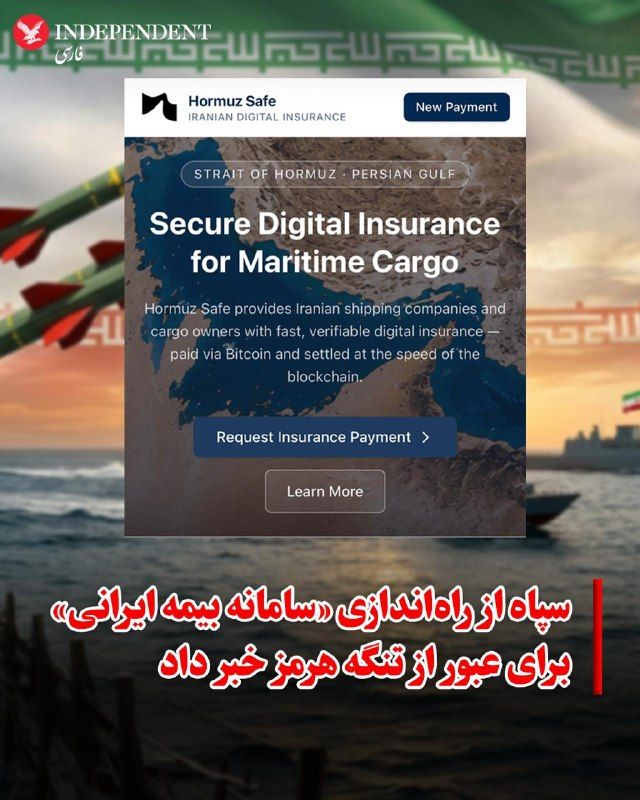
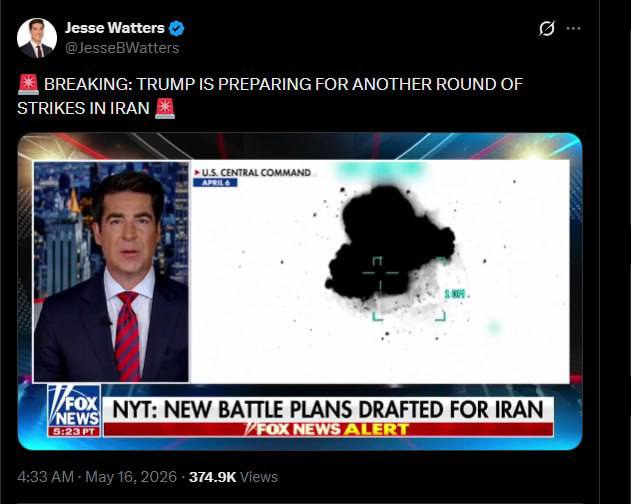

# خواننده تلگرام

<!-- TOP_NAV START -->

<a href="https://github.com/johncunner7/aio-downloader/blob/main/telegram/content/archive_1.md" style="display:inline-block; padding:6px 12px; margin:0 4px; background-color:#2ea44f; color:white; text-decoration:none; border-radius:4px; font-weight:bold;">صفحه بعد</a>

<!-- TOP_NAV END -->

<!-- MSG START -->

---
📅 بروزرسانی: 1405/02/27 00:25
---

## VahidOOnLine — post 240536

  

♦️کانال تلگرامی وابسته به سپاه از راه‌اندازی سامانه بیمه ایرانی «هرمز سیف» برای محموله‌های دریایی تنگه هرمز خبر داد
سپاه پاسداران با انتشار مطلبی اعلام کرد تارنمای «هرمز سیف» (Hormuz Safe) فعالیت خود را برای ارائه بیمه به محموله‌های دریایی عبوری از تنگه هرمز آغاز کرده است.
بر اساس توضیحات منتشرشده،، این سامانه بیمه‌نامه‌هایی سریع و با قابلیت تایید رمزنگاری‌شده برای محموله‌هایی که از خلیج فارس، تنگه هرمز و آبراه‌های اطراف آن عبور می‌کنند صادر می‌کند. همچنین طبق اطلاعات منتشرشده، تسویه و پرداخت هزینه‌های این بیمه با استفاده از ارز دیجیتال انجام خواهد شد.
پیش از این نیز مجلس طرح‌هایی را برای دریافت عوارض از کشتی‌های عبوری مطرح کرده بود؛ موضوعی که با اعتراض گسترده جامعه جهانی و بحث‌های حقوقی فراوان همراه شد. اما اکنون با ایجاد پیگیری طرح غیرنظامی مانند «بیمه هرمز»، به دنبال جایگزینی برای اخذ عوارض است.
‌🇸🇦 Indypersian

🤖 @VahidOOnLine

## VahidOOnLine — post 240535

  <a href="telegram/content/VahidOOnLine_240535_1778964923.mp4" target="_blank">🎬 Download video</a>

‌
دولت دونالد ترامپ معافیت تحریمی خرید نفت دریایی روسیه را که پس از جنگ آمریکا و اسرائیل با جمهوری اسلامی و بسته شدن تنگه هرمز صادر شده بود، تمدید نکرد.

این معافیت به کشورهایی از جمله هند اجازه می‌داد به خرید نفت روسیه ادامه دهند و برای یک ماه تمدید شده بود، اما روز شنبه به پایان رسید.

اسکات بسنت، وزیر خزانه‌داری آمریکا، پیش‌تر گفته بود این مجوز تمدید نخواهد شد. تا عصر شنبه نیز هیچ تمدیدی در وب‌سایت وزارت خزانه‌داری آمریکا منتشر نشد.
‌🏁 🇬🇧 ManotoTV

🤖 @VahidOOnLine

## VahidOOnLine — post 240534

  

دونالد ترامپ، رییس‌جمهوری آمریکا، طرحی گرافیکی در تروث سوشال منتشر کرد که در آن روی یک ناو در دریایی مواج ایستاده و شناوری با پرچم جمهوری اسلامی در محاصره ناوهای آمریکایی قرار دارد و در آن نوشته شده است: «این آرامش پیش از طوفان بود.»
‌🏁 🇬🇧 IranintlTV

🤖 @VahidOOnLine

## VahidOOnLine — post 240533

  

شاهزاده رضا پهلوی در نشست آینده تکنولوژی در ایران گفت که مردم ایران به چیزی جز تغییر کامل نظام رضایت نخواهند داد: «آن‌ها ۴۰ هزار کشته نداده‌اند که در نهایت به توافق اتمی برسند.»

شاهزاده رضا پهلوی افزود: «اتکای مخالفان نظام نباید به نیروی خارجی باشد و باید فرض را بر این گذاشت که کمکی دریافت نمی‌شود اما در صورت دریافت حمایت خارجی روند دستیابی به اهداف آسان‌تر خواهد شد.»
‌🏁 🇬🇧 IranintlTV

🤖 @VahidOOnLine

## WithYashar — post 11422

@withyashar فرهنگ ما همیشه غالب میشه

## WithYashar — post 11421

  <a href="telegram/content/WithYashar_11421_1778964924.mp4" target="_blank">🎬 Download video</a>

گوش جان میسپریم به فریدون عزیز تا من موتورم رو گرم کنم ویس بزارم
@withyashar

## WithYashar — post 11420

  

ترامپ در تروث : آرامش فبل از طوفان

قایق تندرو با پرچم جمهوری اسلامی دیده میشود …
@withyashar

## WithYashar — post 11419

## mwarmonitor — post 9178

🔴ساکنان نزدیک منطقه بیت‌شمش در اسرائیل از یک انفجار شدید و آتش‌سوزی بزرگی خبر دادند که از فاصله دور قابل مشاهده بود. 🔸شبکه Kan News اسرائیل بعداً اعلام کرد که این حادثه یک انفجار کنترل‌شده بوده که داخل یک کارخانه غیرنظامی انجام شده است. هیچ آسیب یا مجروحیتی…

## mwarmonitor — post 9177

  <a href="telegram/content/mwarmonitor_9177_1778964927.mp4" target="_blank">🎬 Download video</a>

🔴ساکنان نزدیک منطقه بیت‌شمش در اسرائیل از یک انفجار شدید و آتش‌سوزی بزرگی خبر دادند که از فاصله دور قابل مشاهده بود.

🔸شبکه Kan News اسرائیل بعداً اعلام کرد که این حادثه یک انفجار کنترل‌شده بوده که داخل یک کارخانه غیرنظامی انجام شده است. هیچ آسیب یا مجروحیتی گزارش نشده است.

@mwarmonitor

## mwarmonitor — post 9176

  

ترامپ در سوشال تروث

«این آرامشِ پیش از طوفان بود»

@mwarmonitor

## mwarmonitor — post 9175

  <a href="telegram/content/mwarmonitor_9175_1778964928.mp4" target="_blank">🎬 Download video</a>

📝 این جرثومه‌های فساد و دوزیستانِ بدنامِ سیاسی، دقیقاً مانند هم‌نوعانِ لجن‌زیستِ خود، تا بوی واریزِ جیره و مواجب به مشامشان می‌رسد، از سوراخ‌های خود بیرون می‌خزند تا با چند کلمه وقاحتِ محض، بقایِ ذلت‌بارشان را تمدید کنند. تویی که امروز پشت این میکروفونِ اجاره‌ای ژستِ مقتدرانه گرفته‌ای و از موضعِ قدرت سخن از «اجازه دادن» می‌گویی، خودت مگر بدون اذن، فرمان‌برداری و دست‌بوسیِ سردارانت تواناییِ یک دم و بازدمِ ساده را داری؟

🔸​تو نیز تن‌فروشِ فکریِ دیگری در بازارِ مکارهٔ این رژیم هستی؛ یک جیره‌خوارِ حقیر که تاریخ مصرفت به تار مویی بند است. اگر فردا روزی ورق برگردد، دست‌پرورده‌های همان سیستمی که امروز برایشان دم می‌جنبانی، مانند آن ماله کشِ اعظم، عراقچی، چنان شلنگِ تخلیهٔ رسوایی، نکبت و فاضلابِ جنایاتشان را روی سر و صورتت باز می‌کنند که حتی نامت هم در تاریخِ این سرزمین مایهٔ تهوع باشد. این پانتومیمِ وقاحت و این نقاب‌های مضحک دیگر هیچ چشمی را نمی‌فریبد؛ سهم تو و امثال تو از این نمایش، تلی از خاکستر و سقوط به همان سیاه‌چالی است که از آن برخاسته‌اید.

@mwarmonitor

## pm_afshaa — post 90873

🔴نیویورک تایمز به نقل از مقامات نظامی آمریکا: اگر جزیره خارک تصرف شود، نیروهای زمینی برای حفظ آن لازم خواهند بود

💧 Rainbet.com the #1 Non-KYC Crypto Casino & Sportsbook @rainbetcom

😁 @Pm_Afshaa

## pm_afshaa — post 90872

  <a href="telegram/content/pm_afshaa_90872_1778964929.webm" target="_blank">🎬 Download video</a>

سرور اختصاصی NPV / V2RayNG 
📶 
✅مناسب: یوتیوب | اینستاگرام | تلگرام | گیم | وب‌گردی 
✅ اتصال سریع روی همه اپراتورها 
✅بدون افت سرعت حتی در ساعات شلوغ 
➕ ویژگی‌ها: 
⚡️ بدون ضریب 
⚡️ ساب لینک اختصاصی 
⚡️بدون قطعی واقعی 
⚡️ آیپی ثابت (ترکیه 
🇹🇷 | آلمان
🇩🇪…

## pm_afshaa — post 90871

  <a href="telegram/content/pm_afshaa_90871_1778964930.webm" target="_blank">🎬 Download video</a>

سرور اختصاصی NPV / V2RayNG 
📶

✅مناسب: یوتیوب | اینستاگرام | تلگرام | گیم | وب‌گردی

✅ اتصال سریع روی همه اپراتورها

✅بدون افت سرعت حتی در ساعات شلوغ

➕ ویژگی‌ها:

⚡️ بدون ضریب

⚡️ ساب لینک اختصاصی

⚡️بدون قطعی واقعی

⚡️ آیپی ثابت (ترکیه 
🇹🇷 | آلمان
🇩🇪 | آمریکا
🇺🇸 | هلند
🇳🇱 | انگلستان
🏴)

⚡️تست رایگان قبل خرید

✔️ تضمین کیفیت + پشتیبانی 24 ساعته

💰 تک لوکیشن: 160 تومان / هر گیگ (با کد تخفیف)

🌍 مولتی لوکیشن: 200 تومان / هر گیگ (با کد تخفیف)

🎁 کد تخفیف :

conquestback

👇 همین الان بخر / تست بگیر:
@ConQuestVPN_bot

## pm_afshaa — post 90870

  

کاخ سفید پیامی تهدیدآمیز از ترامپ با عنوان «شوخی نداریم» همراه با تصویری از حضور او در اتاق جنگ منتشر کرد

💧 Rainbet.com the #1 Non-KYC Crypto Casino & Sportsbook @rainbetcom

😁 @Pm_Afshaa

## pm_afshaa — post 90868

  

پست جدید ترامپ ارامش قبل از طوفان

💧 Rainbet.com the #1 Non-KYC Crypto Casino & Sportsbook @rainbetcom

😁 @Pm_Afshaa

## VahidOnline — post 75507

  

دونالد ترامپ، رئیس‌جمهور آمریکا، روز شنبه تصویری گرافیکی از خود در کنار یک فرمانده نظامی بر عرشه یک ناو جنگی، در فضایی طوفانی و در میان شناورهایی با پرچم جمهوری اسلامی، در شبکه اجتماعی تروث‌سوشال منتشر کرد که روی آن نوشته است: «این آرامش پیش از طوفان بود.»
@VahidOOnLine

📡 @VahidOnline

## kianmeli1 — post 87438

  <a href="telegram/content/kianmeli1_87438_1778964932.mp4" target="_blank">🎬 Download video</a>

🔴ناصر رفیعی، سخنران مذهبی دفتر علی خامنه‌ای، رهبر کشته‌شده جمهوری اسلامی، به نقل از غلامعلی حداد عادل، پدرزن مجتبی خامنه‌ای، گفت اعضای خانواده علی خامنه‌ای پیش از عملیات مرگبار نهم اسفند در مجتمع رهبری باقی ماندند، زیرا مقامات «اطمینان داده بودند» که با نزدیک شدن توافق در مذاکرات، هیچ اقدام نظامی صورت نخواهد گرفت.
رفیعی در این فایل صوتی به نقل از حداد عادل می‌گوید که این اتفاق به‌ این دلیل افتاد که شرایط عادی در بیت بود و «خامنه‌ای خود را در معرض قرار داده بود.»
https://t.me/kianmeli1

## kianmeli1 — post 87437

  

🔴خبرنگار فاکس نیوز: ترامپ درحال آماده‌شدن برای دور جدیدی از حملات نظامی به ایران است
https://t.me/kianmeli1

## kianmeli1 — post 87436

  

🔴ترامپ در سوشال تروث

«این آرامشِ پیش از طوفان بود»
https://t.me/kianmeli1

## IranIntlTV — post 337529

  

دونالد ترامپ، رییس‌جمهوری آمریکا، طرحی گرافیکی در تروث سوشال منتشر کرد که در آن روی یک ناو در دریایی مواج ایستاده و شناوری با پرچم جمهوری اسلامی در محاصره ناوهای آمریکایی قرار دارد و در آن نوشته شده است: «این آرامش پیش از طوفان بود.»
https://iranintl.com/202605167228

## IranIntlTV — post 337528

  <a href="telegram/content/IranIntlTV_337528_1778964934.mp4" target="_blank">🎬 Download video</a>

شاهزاده رضا پهلوی در نشست «آینده تکنولوژی در ایران» با رد مشروعیت ساختار سیاسی جمهوری اسلامی و چهره‌هایی چون محمدباقر قالیباف گفت مردم ایران این همه کشته و هزینه نداده‌اند که بار دیگر تن به «ماموریت‌های مهره‌های این حکومت» بدهند.

او تاکید کرد: «ما باید به دنیا ثابت کنیم که ملت ایران، شریک بهتری برای جامعه جهانی است تا بقایای این حکومت.»
@iranintltv

## IranIntlTV — post 337527

  <a href="telegram/content/IranIntlTV_337527_1778964936.mp4" target="_blank">🎬 Download video</a>

شاهزاده رضا پهلوی در نشست «آینده تکنولوژی در ایران» گفت حتی اگر دوران گذار با موفقیت طی شود و مردم نظام آینده را انتخاب کنند، بدون احزاب و زیرساخت سیاسی آماده، اداره کشور ممکن نخواهد بود.

او افزود: «اگر بخواهیم سیاسی فکر کنیم، اولویت نخست یک هدف ملی است؛ هدفی فراتر از چپ و راست، جمهوری‌خواه و پادشاهی‌خواه یا هر گرایش دیگر. اما وقتی وارد مرحله سیاست عملی می‌شویم، باید زیرساخت سیاسی کشور را هم فراهم کنیم. پایه‌های تحزب در ایران باید تقویت شود.»
@iranintltv

## IranIntlTV — post 337526

  <a href="telegram/content/IranIntlTV_337526_1778964938.mp4" target="_blank">🎬 Download video</a>

شاهزاده رضا پهلوی در نشست «آینده تکنولوژی در ایران» با تشریح وظایف دولت انتقالی پس از فروپاشی جمهوری اسلامی، تاکید کرد که هدف اصلی، فراهم کردن زمینه روند دموکراتیک برای تعیین شکل نهایی حکومت است. او گفت به نفع هیچ جریانی به جز «دموکراسی» موضع نخواهد گرفت.

@iranintltv

## IranIntlTV — post 337525

  

شاهزاده رضا پهلوی در نشست آینده تکنولوژی در ایران گفت که مردم ایران به چیزی جز تغییر کامل نظام رضایت نخواهند داد: «آن‌ها ۴۰ هزار کشته نداده‌اند که در نهایت به توافق اتمی برسند.»

شاهزاده رضا پهلوی افزود: «اتکای مخالفان نظام نباید به نیروی خارجی باشد و باید فرض را بر این گذاشت که کمکی دریافت نمی‌شود اما در صورت دریافت حمایت خارجی روند دستیابی به اهداف آسان‌تر خواهد شد.»
https://iranintl.com/202605161817

## Shin_Persian — post 6040

  

Shin ✓ @hey_itsmyturn
Sat, 16 May 2026 20:23:35 UTC

POTUS on his Truth:

فارسی

رئیس‌جمهور ایالات متحده (POTUS) در حساب تروث سوشال خود:

𝕏 · @shin_persian

## Shin_Persian — post 6039

  

🔁 Quoting above tweet: DefenceGeek 🇬🇧 ✓ @DefenceGeek Sat, 16 May 2026 20:14:02 UTC Along with the 2x RAF P-8A "Poseidon" maritime patrol aircraft noted by @ArmchairAdml, the US Navy has had 3x P-8A operating in the North Atlantic today I first noted 2…

## Shin_Persian — post 6038

🔁 Quoting above tweet:
DefenceGeek 🇬🇧 ✓ @DefenceGeek
Sat, 16 May 2026 20:14:02 UTC

Along with the 2x RAF P-8A "Poseidon" maritime patrol aircraft noted by @ArmchairAdml, the US Navy has had 3x P-8A operating in the North Atlantic today

I first noted 2 depart Lajes earlier, then with a friend departed Iceland in the last 2hrs!

They've found a submarine...

فارسی

در کنار ۲ فروند هواپیمای گشت دریایی P-8A "Poseidon" متعلق به نیروی هوایی سلطنتی بریتانیا (RAF) که توسط @ArmchairAdml به آن‌ها اشاره شد، نیروی دریایی ایالات متحده نیز امروز ۳ فروند P-8A در شمال اقیانوس اطلس در حال عملیات داشته است.

من ابتدا خروج ۲ فروند را پیش‌تر از «لاژس» ثبت کردم و پس از آن، یک فروند دیگر در ۲ ساعت گذشته از ایسلند خارج شد!

آن‌ها یک زیردریایی پیدا کرده‌اند...

𝕏 · @shin_persian

## Shin_Persian — post 6036

  <a href="telegram/content/Shin_Persian_6036_1778964941.mp4" target="_blank">🎬 Download video</a>

↩️ Quoted tweet: Armchair Admiral 🇬🇧 ✓ @ArmchairAdml Sat, 16 May 2026 19:59:34 UTC #RAF Royal Air Force Boeing Poseidon MRA.1 2x #43C91E ZP807 - RAFAIR 7046 #43C91A ZP803 - RAFAIR 7042 RAFAIR 7046 departed RAF Lossiemouth this evening for a North Atlantic…

## Shin_Persian — post 6035

↩️ Quoted tweet:
Armchair Admiral 🇬🇧 ✓ @ArmchairAdml
Sat, 16 May 2026 19:59:34 UTC

#RAF Royal Air Force

Boeing Poseidon MRA.1 2x
#43C91E ZP807 - RAFAIR 7046
#43C91A ZP803 - RAFAIR 7042

RAFAIR 7046 departed RAF Lossiemouth this evening for a North Atlantic patrol. RAFAIR 7042 is already on station and operating over the Atlantic.

@MATA_osint @flightradar24

↩️ توییت نقل‌قول شده — برای پاسخ، پست زیر را ببینید.

فارسی

#RAF نیروی هوایی سلطنتی بریتانیا

بوئینگ پوزایدون MRA.1 ۲ فروند
#43C91E ZP807 - RAFAIR 7046
#43C91A ZP803 - RAFAIR 7042

پرواز RAFAIR 7046 عصر امروز پایگاه هوایی لوسی‌موث (RAF Lossiemouth) را برای گشت‌زنی در شمال اقیانوس اطلس ترک کرد. پرواز RAFAIR 7042 از قبل در منطقه مستقر شده و بر فراز اقیانوس اطلس در حال عملیات است.

@MATA_osint @flightradar24_

𝕏 · @shin_persian

## ManotoTV — post 105538

  <a href="telegram/content/ManotoTV_105538_1778964942.mp4" target="_blank">🎬 Download video</a>

‌
دولت دونالد ترامپ معافیت تحریمی خرید نفت دریایی روسیه را که پس از جنگ آمریکا و اسرائیل با جمهوری اسلامی و بسته شدن تنگه هرمز صادر شده بود، تمدید نکرد.

این معافیت به کشورهایی از جمله هند اجازه می‌داد به خرید نفت روسیه ادامه دهند و برای یک ماه تمدید شده بود، اما روز شنبه به پایان رسید.

اسکات بسنت، وزیر خزانه‌داری آمریکا، پیش‌تر گفته بود این مجوز تمدید نخواهد شد. تا عصر شنبه نیز هیچ تمدیدی در وب‌سایت وزارت خزانه‌داری آمریکا منتشر نشد.

## ManotoTV — post 105537

  <a href="telegram/content/ManotoTV_105537_1778964942.mp4" target="_blank">🎬 Download video</a>

شاهزاده رضا پهلوی در پاسخ به پرسشی درباره زمان بازگشت ایرانیان خارج از کشور، در «نشست آینده تکنولوژی در ایران» گفت سرعت تغییرات در ایران به عملکرد مردم و میزان حمایت و فشار کشورهای تاثیرگذار بستگی دارد.

او با تاکید بر اینکه مردم ایران نباید به نیروی خارجی متکی باشند، گفت هرگونه حمایت بین‌المللی می‌تواند روند تغییر را کوتاه‌تر و آسان‌تر کند، اما ایرانیان خود باید عامل اصلی این تحول باشند.

شاهزاده رضا پهلوی افزود مردم ایران «چهل هزار کشته ندادند» که نتیجه آن تنها یک توافق هسته‌ای یا ادامه جمهوری اسلامی با چهره‌هایی مانند محمدباقر قالیباف باشد و تاکید کرد ایرانیان «کمتر از تغییر کامل نظام» را نخواهند پذیرفت.

شاهزاده رضا پهلوی با اشاره به دولت دونالد ترامپ گفت مخالفان جمهوری اسلامی باید دولت‌های تاثیرگذار، به‌ویژه آمریکا، را قانع کنند که به‌جای توافق دوباره با جمهوری اسلامی، روی مردم ایران سرمایه‌گذاری کنند.

او تاکید کرد راه‌حل‌های اقتصادی، علمی و تکنولوژیک برای آینده ایران وجود دارد و آنچه اکنون اهمیت دارد، «اراده سیاسی و تصمیم‌گیری» دولت‌های تاثیرگذار برای حمایت از آزادی ایران است.

## FarsiVOA — post 217931

  

⚡️دونالد ترامپ، رئیس‌جمهوری آمریکا، روز شنبه تصویری گرافیکی از خود در کنار یک فرمانده نظامی بر عرشه یک ناو جنگی، در فضایی طوفانی و در میان شناورهایی با پرچم جمهوری اسلامی، در شبکه اجتماعی تروت‌سوشال منتشر کرد که روی آن نوشته است: «این آرامش پیش از طوفان بود.»
@FarsiVOA

## FarsiVOA — post 217930

🔺بزرگترین ناو هواپیمابر جهان پس از مشارکت در عملیات نظامی علیه جمهوری اسلامی و دستگیری مادورو به ویرجینیا بازگشت

▪️ناو هواپیمابر یو‌اس‌اس جرالد آر. فورد، بزرگترین ناو هواپیمابر جهان، روز شنبه پس از ۱۱ ماه استقرار، طولانی‌ترین مدت از زمان جنگ ویتنام، به خانه خود در ایالت ویرجینیا بازگشت.

⬇️ بیشتر بخوانید:
https://ir.voanews.com/a/8150723.html
@FarsiVOA

## Persian_Trend_Official — post 14278

  <a href="telegram/content/Persian_Trend_Official_14278_1778964944.mp4" target="_blank">🎬 Download video</a>

🔴 رسانه‌های اسرائیلی از انفجار در کارخانه صنایع موشکی «تومر» خبر دادند 💢رسانه‌های اسرائیلی گزارش دادند انفجاری در کارخانه شرکت «تومر» رخ داده است؛ شرکتی که در حوزه توسعه و تولید موتورهای موشکی و سامانه‌های پیشران فعالیت می‌کند. ▪️بر اساس گزارش‌ها، این شرکت…

## Persian_Trend_Official — post 14277

🔴انفجار بزرگ در بیت‌شمش 💢رسانه‌های عبری از وقوع انفجاری بسیار بزرگ در بیت‌شمش در اسرائیل خبر می‌دهند. 💢این رسانه‌ها با بیان اینکه ارتش مانع از ورود خودروهای امدادی به محل حادثه می‌شود، تصریح کردند این انفجار احتمالاً در تأسیساتی حساس رخ داده است. 🫆:Tony…

## Persian_Trend_Official — post 14276

  

🔴انفجار بزرگ در بیت‌شمش 💢رسانه‌های عبری از وقوع انفجاری بسیار بزرگ در بیت‌شمش در اسرائیل خبر می‌دهند. 💢این رسانه‌ها با بیان اینکه ارتش مانع از ورود خودروهای امدادی به محل حادثه می‌شود، تصریح کردند این انفجار احتمالاً در تأسیساتی حساس رخ داده است. 🫆:Tony…

## Persian_Trend_Official — post 14275

  <a href="telegram/content/Persian_Trend_Official_14275_1778964946.mp4" target="_blank">🎬 Download video</a>

🔴انفجار بزرگ در بیت‌شمش

💢رسانه‌های عبری از وقوع انفجاری بسیار بزرگ در بیت‌شمش در اسرائیل خبر می‌دهند.

💢این رسانه‌ها با بیان اینکه ارتش مانع از ورود خودروهای امدادی به محل حادثه می‌شود، تصریح کردند این انفجار احتمالاً در تأسیساتی حساس رخ داده است.

🫆:Tony

📌 @persian_trend_official
پرشین ترند | متفاوت‌ترین کانال نظامی

## Persian_Trend_Official — post 14274

https://youtube.com/live/Lj3xWW7IbLA?feature=share

## Persian_Trend_Official — post 14273

  

🔴خبرنگار فاکس نیوز

💢ترامپ درحال آماده‌شدن برای دور جدیدی از حملات نظامی به ایران است

🫆:Tony

📌 @persian_trend_official
پرشین ترند | متفاوت‌ترین کانال نظامی

## Persian_Trend_Official — post 14272

  

💢پست ترامپ

این آرامش قبل از طوفانه

🫆:Tony

📌 @persian_trend_official
پرشین ترند | متفاوت‌ترین کانال نظام

## Persian_Trend_Official — post 14271

  

💢تکرار تهدید کاخ سفید با انتشار تصویری از ترامپ در اتاق جنگ

💢کاخ سفید پیامی تهدیدآمیز از رئیس جمهوری آمریکا با عنوان «شوخی نداریم» همراه با تصویری از حضور او در اتاق جنگ منتشر کرد.

💢در پیام کاخ سفید آمده است: «اگر به آمریکایی‌ها آسیب بزنید، یا برای آسیب‌زدن به آمریکایی‌ها توطئه و طرح‌ریزی کنید، ما شما را خواهیم یافت.»

🫆:Tony

📌 @persian_trend_official
پرشین ترند | متفاوت‌ترین کانال نظامی

## Persian_Trend_Official — post 14270

  <a href="telegram/content/Persian_Trend_Official_14270_1778964948.webm" target="_blank">🎬 Download video</a>

نسخه صوتی لایو امشب در پلتفرم کست باکس : https://castbox.fm/vi/945937615

## Persian_Trend_Official — post 14269

نسخه صوتی لایو امشب در پلتفرم کست باکس :
https://castbox.fm/vi/945937615

## Persian_Trend_Official — post 14268

نسخه صوتی لایو امشب در پلتفرم اسپاتیفای :

https://open.spotify.com/episode/2Mw2hfeg12829w5zlJVOkO?si=0nFXW0pdTmCsCyiYukkcsQ

## RadioFarda — post 157274

🔸دولت ترامپ روز شنبه ۲۶ اردیبهشت معافیت تحریم نفت روی دریای روسیه را که پیش‌تر به کشورهایی از جمله هند امکان می‌داد آن را خریداری کنند، تمدید نکرد و اجازه داد که منقضی شود. 🔸این معافیت پس از یک تمدید یک‌ماهه با هدف کاهش کمبود عرضه نفت و مهار افزایش قیمت‌ها…

## RadioFarda — post 157273

  

🔸دولت ترامپ روز شنبه ۲۶ اردیبهشت معافیت تحریم نفت روی دریای روسیه را که پیش‌تر به کشورهایی از جمله هند امکان می‌داد آن را خریداری کنند، تمدید نکرد و اجازه داد که منقضی شود.

🔸این معافیت پس از یک تمدید یک‌ماهه با هدف کاهش کمبود عرضه نفت و مهار افزایش قیمت‌ها در پی جنگ با ایران و بسته شدن تنگه هرمز، برقرار مانده بود.

🔸اسکات بسنت، وزیر خزانه‌داری آمریکا، پیش‌تر گفته بود که مجوز عمومی مربوط به خرید نفت روسیه ذخیره‌شده در نفتکش‌ها را تمدید نخواهد کرد.

🔸به گزارش خبرگزاری رویترز، تا بعدازظهر شنبه به وقت واشینگتن، هیچ اطلاعیه‌ای دربارهٔ تمدید این معافیت در وب‌سایت وزارت خزانه‌داری منتشر نشده بود. سخنگوی این وزارتخانه نیز از ارائه توضیح بیشتر خودداری کرد.

@RadioFarda

## IranianMinds — post 20259

  

🔴پست ترامپ در تروث‌سوشال:

این آرامش قبل از طوفان بود.

@IranianMinds

## IranianMinds — post 20258

  <a href="telegram/content/IranianMinds_20258_1778964950.mp4" target="_blank">🎬 Download video</a>

🔴دونالد ترامپ در تروث‌سوشال یک انیمیشنی را منتشر کرد که در آن به ناو آمریکایی دستور شلیک به هدفی که پرچم جمهوری اسلامی را دارد داده و می‌گوید در فهرست اهدافمان، آتش.

@IranianMinds

## BBCPersian — post 281241

  

‌🔻مردی در شهر مودنا در شمال ایتالیا با خودرو خود با چندین عابر پیاده برخورد و هشت نفر را زخمی کرد. حال چهار نفر از آنها وخیم گزارش شده است.

یکی از مجروحان زنی است که گفته می‌شود هر دو پایش خرد شده است.

عابران پس از تعقیب راننده خودرو، یک «مرد سی و چند ساله» را دستگیر و به پلیس تحویل دادند.

جورجیا ملونی، نخست‌وزیر ایتالیا، این واقعه را «بسیار جدی» توصیف کرد. همچنین ماسیمو مزتی، شهردار مودنا، در ادامه واکنش خانم ملونی گفت اگر مشخص شود که این یک حمله از پیش برنامه‌ریزی شده بوده، «حتی جدی‌تر» خواهد بود.

این حادثه بعد از ظهر شنبه ۱۶ مه اتفاق افتاد. یک شاهد عینی گفت: «ما دیدیم که خودرو نزدیک می‌شود، به سمت جدول می‌رفت اما ناگهان سرعت گرفت و هنگام برخورد با عابران حداقل ۱۰۰ کیلومتر در ساعت سرعت داشت و ما دیدیم که مردم در حال پرواز هستند.»

شهردار مودنا گفت به نظر می‌رسد که راننده «عمدا به پیاده‌رو رفته، به چند نفر زده و به ویترین یک مغازه کوبیده است».
به گفته شهردار مودنا، فرد بازداشت‌شده یک تبعه ایتالیایی متولد برگامو، اما «اصالتا مغربی» است.

ادامه از:
https://bbc.in/4nxF8zv
📷Reuters
@BBCPersian

## BBCPersian — post 281240

  <a href="https://t.me/bbcpersian/281240" target="_blank">📎 Download file</a>

پادکست برنامه شصت دقیقه روز شنبه ۲۶ اردیبهشت ۱۴۰۵ است
این نسخه رادیویی برنامه شصت دقیقه تلویزیون فارسی بی‌بی‌سی است که هرشب بعد از پخش، با حجم کم از اپلیکیشن‌های پادگیر و صفحه تلگرام بی‌بی‌سی فارسی در دسترس است.
با هشتگ BBCPersianRadio# با ما در ارتباط باشید.
@BBCPersian

## BBCPersian — post 281239

📊بازار سهام ایران پس از توقف ناشی از جنگ از سه‌شنبه بازگشایی می‌شود

یک مقام ارشد سازمان بورس و اوراق بهادار ایران تایید کرد که پس از توقف فعالیت‌ها در دوران جنگ با آمریکا و اسرائیل، بازار سهام آن کشور از روز سه‌شنبه بازگشایی خواهد شد.

حمید یاری، معاون نظارت بر بورس‌ها و ناشران سازمان بورس و اوراق بهادار ایران می‌گوید که «بر اساس هماهنگی‌های صورت‌گرفته و پس از اخذ مجوزهای لازم، مقرر شد بازگشایی بازار سهام، انواع صندوق‌های سرمایه‌گذاری در سهام و مشتقات آن‌ از روز سه‌شنبه ۲۹ اردیبهشت ۱۴۰۵ صورت پذیرد.»

او گفت که توقف فعالیت بازار سهام از شروع جنگ، «با هدف صیانت از دارایی سهامداران، جلوگیری از بروز رفتارهای هیجانی و فراهم آوردن شرایط انجام معامله در این بازار با اطلاعات دقیق‌تر و شفاف‌تر صورت‌ گرفت.»

آقای یاری همچنین می‌گوید که با بازگشایی بازار سهام، «شاهد تکمیل فعالیت همه بخش‌های بازار سرمایه خواهیم بود.»

https://bbc.in/4wpp6f4
@BBCPersian

## Dirty_Kids — post 389580

  <a href="telegram/content/Dirty_Kids_389580_1778964951.mp4" target="_blank">🎬 Download video</a>

بیرانوند گفته: سرود حکومت را با صدای بلند میخونم… مردم مخالف جمهوری اسلامی در ورزشگاه هم هیچ کاری نمیتونن بکنن!

داداشام و خواهرام در امریکا
مدیونید بزارید آب‌خوش از گلوشون پایین بره... از دم فرودگاه تا هتل، شب قبل بازی جلوی هتل و داخل استادیوم، همه بلیطا هم بخرید تا صادراتیاشون نخرن، دیگه هرکاری در توانتون بکنید خارشونو بگایید

#فوتبالیست_سپاهی

@Dirty_Kids 👻

## Dirty_Kids — post 389579

  

پست جدید ترامپ تو تروث سوشال کنار یه فرمانده نظامی و خطاب به ایران :

این تازه آرامش قبلِ طوفان بود.

مجموع گزارش‌ها، اخبار رسمی، نقل‌وانتقالات نظامی و مصاحبه‌های ترامپ و نتانیاهو در هفته گذشته، نشان می‌دهد هر لحظه باید منتظر آغاز دور جدید حملات به جمهوری اسلامی بود؛ حملاتی که می‌تواند این‌بار با پیاده کردن سربازان آمریکایی در خاک ایران نیز همراه باشد.

@Dirty_Kids 👻

## manototv — post 105538

  <a href="telegram/content/manototv_105538_1778964953.mp4" target="_blank">🎬 Download video</a>

‌
دولت دونالد ترامپ معافیت تحریمی خرید نفت دریایی روسیه را که پس از جنگ آمریکا و اسرائیل با جمهوری اسلامی و بسته شدن تنگه هرمز صادر شده بود، تمدید نکرد.

این معافیت به کشورهایی از جمله هند اجازه می‌داد به خرید نفت روسیه ادامه دهند و برای یک ماه تمدید شده بود، اما روز شنبه به پایان رسید.

اسکات بسنت، وزیر خزانه‌داری آمریکا، پیش‌تر گفته بود این مجوز تمدید نخواهد شد. تا عصر شنبه نیز هیچ تمدیدی در وب‌سایت وزارت خزانه‌داری آمریکا منتشر نشد.

## manototv — post 105537

  <a href="telegram/content/manototv_105537_1778964953.mp4" target="_blank">🎬 Download video</a>

شاهزاده رضا پهلوی در پاسخ به پرسشی درباره زمان بازگشت ایرانیان خارج از کشور، در «نشست آینده تکنولوژی در ایران» گفت سرعت تغییرات در ایران به عملکرد مردم و میزان حمایت و فشار کشورهای تاثیرگذار بستگی دارد.

او با تاکید بر اینکه مردم ایران نباید به نیروی خارجی متکی باشند، گفت هرگونه حمایت بین‌المللی می‌تواند روند تغییر را کوتاه‌تر و آسان‌تر کند، اما ایرانیان خود باید عامل اصلی این تحول باشند.

شاهزاده رضا پهلوی افزود مردم ایران «چهل هزار کشته ندادند» که نتیجه آن تنها یک توافق هسته‌ای یا ادامه جمهوری اسلامی با چهره‌هایی مانند محمدباقر قالیباف باشد و تاکید کرد ایرانیان «کمتر از تغییر کامل نظام» را نخواهند پذیرفت.

شاهزاده رضا پهلوی با اشاره به دولت دونالد ترامپ گفت مخالفان جمهوری اسلامی باید دولت‌های تاثیرگذار، به‌ویژه آمریکا، را قانع کنند که به‌جای توافق دوباره با جمهوری اسلامی، روی مردم ایران سرمایه‌گذاری کنند.

او تاکید کرد راه‌حل‌های اقتصادی، علمی و تکنولوژیک برای آینده ایران وجود دارد و آنچه اکنون اهمیت دارد، «اراده سیاسی و تصمیم‌گیری» دولت‌های تاثیرگذار برای حمایت از آزادی ایران است.

## alonews — post 120490

  <a href="telegram/content/alonews_120490_1778964955.mp4" target="_blank">🎬 Download video</a>

👈کان نیوز: حادثه بیت شمس اسرائیل یک انفجار کنترل‌شده داخل یک کارخانه غیرنظامی بوده است.

✅ @AloNews خبر جنگ

## alonews — post 120489

  <a href="telegram/content/alonews_120489_1778964955.webm" target="_blank">🎬 Download video</a>

👈رسانه بریتانیایی امواج: این ۱۴ بند شامل خروج نظامی آمریکا از مجاورت ایران، پایان محاصره دریایی، لغو محدودیتهای فروش نفت ظرف ۳۰ روز پس از هر توافق اولیه و یک ترتیبات حاکمیتی جدید برای تنگه هرمز است. 
✅ @AloNews خبر جنگ

## alonews — post 120488

  <a href="telegram/content/alonews_120488_1778964955.webm" target="_blank">🎬 Download video</a>

👈رسانه بریتانیایی امواج: در هفته منتهی به سفر ترامپ به چین، ایران یک چارچوب ۱۴ ماده‌ای برای پایان جنگ، به واشنگتن ارائه کرد. 
🔴یک منبع ارشد سیاسی در تهران که به شرط فاش نشدن نامش صحبت میکرد، به رسانه «امواج مدیا» توضیح داد که این سند شامل ۱۱ ماده‌ای است که…

## alonews — post 120487

  <a href="telegram/content/alonews_120487_1778964956.webm" target="_blank">🎬 Download video</a>

👈رسانه بریتانیایی امواج:
در هفته منتهی به سفر ترامپ به چین، ایران یک چارچوب ۱۴ ماده‌ای برای پایان جنگ، به واشنگتن ارائه کرد.

🔴یک منبع ارشد سیاسی در تهران که به شرط فاش نشدن نامش صحبت میکرد، به رسانه «امواج مدیا» توضیح داد که این سند شامل ۱۱ ماده‌ای است که در ابتدا توسط دولت آمریکا ارائه شده بود، به اضافه سه ماده‌ای که ایران به آن افزوده است.

🔴این پیشنهاد که تا حدودی به دلیل تشدید محاصره دریایی آمریکا علیه ایران – و ظاهراً با ناراحتی ترامپ – به تأخیر افتاد، حاصل دستورات صریح به مذاکره کنندگان بود.

🔴به گفته یک منبع مطلع، پاسخ واشنگتن که از طریق میانجیگران ارسال شده، کل این چارچوب را رد کرده است. گفته می‌شود که آمریکا بار دیگر بر مواضع از پیش تعیین شده خود در مورد پرونده هسته‌ای تأکید کرده و از پذیرش این پیش‌شرط‌ها به عنوان پیش‌نیاز هرگونه مذاکره خودداری نموده است.

🔴با این حال، یک منبع سیاسی دیگر که از جزییات امور مطلع است، چنین توصیفی از وقایع را رد کرد.

✅ @AloNews خبر جنگ

## alonews — post 120485

  <a href="telegram/content/alonews_120485_1778964956.webm" target="_blank">🎬 Download video</a>

👈گزارش‌ها از انفجار و نور بسیار شدید در بیت شِمِش در اسرائیل 
✅ @AloNews خبر جنگ

## alonews — post 120484

  <a href="telegram/content/alonews_120484_1778964956.webm" target="_blank">🎬 Download video</a>

👈 رئیس‌جمهور ترامپ عکسی از خودش و شی جین‌پینگ را در Truth Social منتشر کرد.

✅ @AloNews خبر جنگ

## alonews — post 120483

  <a href="telegram/content/alonews_120483_1778964956.mp4" target="_blank">🎬 Download video</a>

👈گزارش‌ها از انفجار و نور بسیار شدید در بیت شِمِش در اسرائیل

✅ @AloNews خبر جنگ

## alonews — post 120482

  <a href="telegram/content/alonews_120482_1778964956.webm" target="_blank">🎬 Download video</a>

👈ترامپ: این آرامش قبل طوفان بود!

✅ @AloNews خبر جنگ

## alonews — post 120481

  <a href="telegram/content/alonews_120481_1778964956.webm" target="_blank">🎬 Download video</a>

👈کاخ سفید پیامی تهدیدآمیز از ترامپ با عنوان «شوخی نداریم» همراه با تصویری از حضور او در اتاق جنگ منتشر کرد.

🔴در پیام کاخ سفید آمده است: «اگر به آمریکایی‌ها آسیب بزنید، یا برای آسیب‌زدن به آمریکایی‌ها توطئه و طرح‌ریزی کنید، ما شما را خواهیم یافت.»

✅ @AloNews خبر جنگ

## alonews — post 120480

  

سال 1374، کل پاساژ علاءالدین: 500 میلیون

سال 1405، آیفون 17 پرومکس: 500 میلیون

[@AloTweet]

## alonews — post 120479

🔥 FLASH NET VPN 
🔥 
⚠️ شرایط جنگی؟ نت ملی؟ فیلترینگ سنگین؟ 
💪 ما هنوز پایدار و بدون قطعی کنار شماییم! 
🚀 پینگ خفن 
🌐 سرعت فوق‌العاده پایدار 
😍 رضایت فراوان کاربران 
🤖 ربات کاملاً خودکار 
💸 نرخ‌ها پایین‌تر از همه جا 🇧🇬 تک لوکیشن بلغارستان ♾ بدون ضریب 
🔗 دارای لینک…

## alonews — post 120478

  <a href="telegram/content/alonews_120478_1778964957.webm" target="_blank">🎬 Download video</a>

👈العربیه به نقل از پاکستان: حضور وزیر کشور پاکستان در ایران یک روز دیگر ادامه خواهد یافت تا در مورد چشم‌انداز ازسرگیری مذاکرات گفت‌وگو شود 
✅ @AloNews خبر جنگ

## alonews — post 120477

  <a href="telegram/content/alonews_120477_1778964957.webm" target="_blank">🎬 Download video</a>

👈العربیه به نقل از پاکستان: حضور وزیر کشور پاکستان در ایران یک روز دیگر ادامه خواهد یافت تا در مورد چشم‌انداز ازسرگیری مذاکرات گفت‌وگو شود

✅ @AloNews خبر جنگ

## alonews — post 120476

  <a href="telegram/content/alonews_120476_1778964957.webm" target="_blank">🎬 Download video</a>

👈سی ان ان: ترامپ بدون پیشرفت در موضوع ایران از چین بازگشت و نسبت به مذاکرات متوقف شده بی‌صبرتر می‌شود،هم اکنون ترامپ در حال بررسی گزینه های نظامی بر علیه ایران است

✅ @AloNews خبر جنگ

## alonews — post 120475

  <a href="telegram/content/alonews_120475_1778964957.webm" target="_blank">🎬 Download video</a>

👈بلومبرگ: آمریکا معافیت فروش نفت روسیه را متوقف کرد

✅ @AloNews خبر جنگ

<!-- MSG END -->

<!-- NAV START -->

<a href="https://github.com/johncunner7/aio-downloader/blob/main/telegram/content/archive_1.md" style="display:inline-block; padding:6px 12px; margin:0 4px; background-color:#2ea44f; color:white; text-decoration:none; border-radius:4px; font-weight:bold;">صفحه بعد</a>

<!-- NAV END -->
