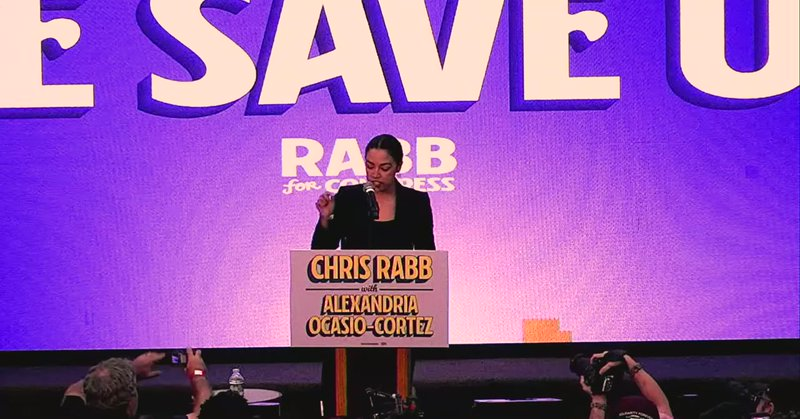
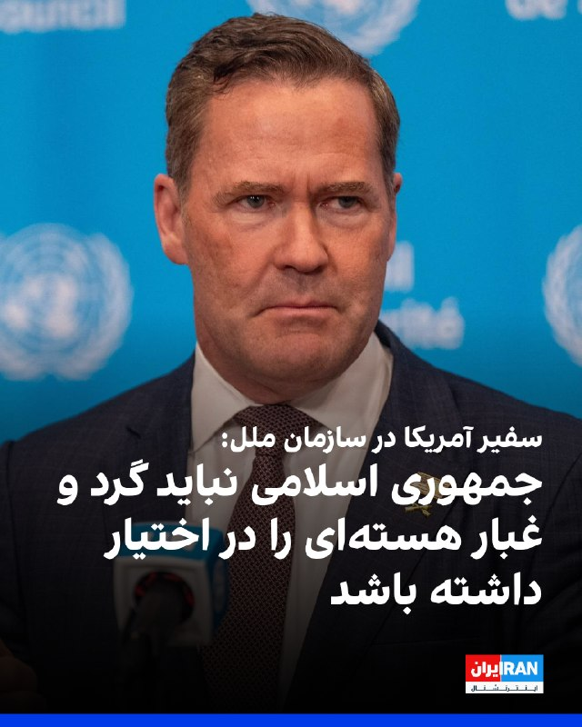
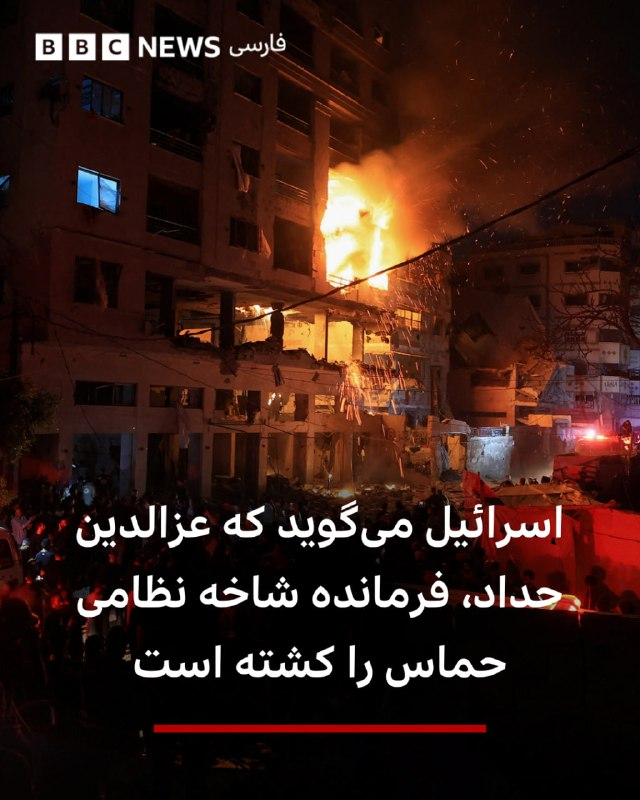
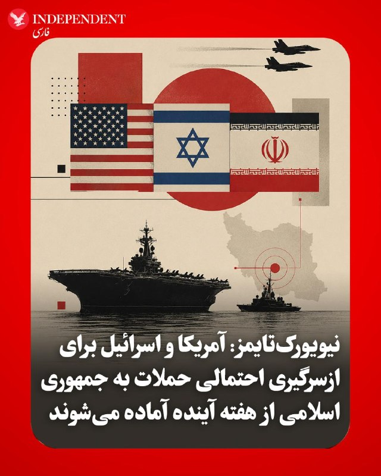
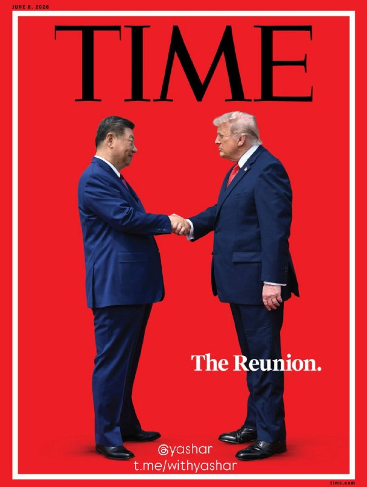

# خواننده تلگرام

<!-- TOP_NAV START -->

<a href="https://github.com/johncunner7/aio-downloader/blob/main/telegram/content/archive_1.md" style="display:inline-block; padding:6px 12px; margin:0 4px; background-color:#2ea44f; color:white; text-decoration:none; border-radius:4px; font-weight:bold;">صفحه بعد</a>

<!-- TOP_NAV END -->

<!-- MSG START -->

---
📅 بروزرسانی: 1405/02/26 03:31
---

## VahidOOnLine — post 240394

  

♦️دونالد ترامپ، رئیس‌جمهوری ایالات متحده در گفتگو با شبکه خبری فاکس نیوز گفت: «ما پنج بار به توافق با رژیم ایران نزدیک شدیم و هر بار در آستانه دستیابی به آن بودیم، اما روز بعد طوری رفتار می‌کردند که انگار اصلا گفتگویی نداشته‌ایم.»
او در این مصاحبه افزود: «آن‌ها به خوبی می‌دانند که ما از نظر نظامی چقدر قوی هستیم. سپس، به درخواست یک گروه بسیار خوب از پاکستان که بسیار به ایران نزدیک هستند، من آن گام نهایی را برنداشتم. آن‌ها گفتند آیا می‌توانید متوقفش کنید؟ ما می‌خواهیم توافق کنیم؛ و ما واقعا چارچوب یک توافق را داشتیم؛ بدون سلاح هسته‌ای. آن‌ها قرار بود همه چیزهایی را که می‌خواستیم، حتی غبار هسته‌ای را به ما تحویل دهند. اما هر بار که به توافق می‌رسیدیم، روز بعد مثل این بود که اصلا چنین گفتگویی نداشته‌ایم. این اتفاق حدود پنج بار تکرار شده است. مشکلی در آن‌ها وجود دارد؛ آن‌ها واقعا دیوانه‌اند.»
‌🇸🇦 Indypersian

🤖 @VahidOOnLine

## VahidOOnLine — post 240393

  

♦️ایلان ماسک، میلیاردر مشهور آمریکایی، مالک پلتفرم اکس و بنیان‌گذار تسلا و اسپیس‌ایکس، با انتشار عبارتی کوتاه در حساب کاربری خود در اکس نوشت: «اینستاگرام برنامه‌ای برای دختران است.»
در روزهای گذشته، برخی از مشهورترین مدیران ارشد آمریکایی، از جمله ایلان ماسک، دونالد ترامپ را در سفر رسمی و تاریخی‌اش به چین همراهی کرده‌اند.
‌🇸🇦 Indypersian

🤖 @VahidOOnLine

## VahidOOnLine — post 240392

  

سفیر چین در سازمان ملل از پیش‌نویس قطعنامه پیشنهادی آمریکا و بحرین درباره تنگه هرمز انتقاد کرد و گفت «هم محتوا و هم زمان آن نامناسب است» و کمکی به کاهش تنش‌ها با جمهوری اسلامی نخواهد کرد.
این پیش‌نویس از تهران می‌خواهد حملات و فعالیت‌های مین‌گذاری در تنگه هرمز را متوقف کند. چین و روسیه ماه گذشته نیز قطعنامه مشابهی را با این استدلال که جمهوری اسلامی را ناعادلانه هدف قرار می‌دهد، مسدود کرده بودند.

‌🏁 🇬🇧 IranintlTV

🤖 @VahidOOnLine

## VahidOOnLine — post 240391

  

سفیر چین در سازمان ملل از پیش‌نویس قطعنامه پیشنهادی آمریکا و بحرین درباره تنگه هرمز انتقاد کرد و گفت «هم محتوا و هم زمان آن نامناسب است» و کمکی به کاهش تنش‌ها با جمهوری اسلامی نخواهد کرد.
این پیش‌نویس از تهران می‌خواهد حملات و فعالیت‌های مین‌گذاری در تنگه هرمز را متوقف کند. چین و روسیه ماه گذشته نیز قطعنامه مشابهی را با این استدلال که جمهوری اسلامی را ناعادلانه هدف قرار می‌دهد، مسدود کرده بودند.

‌🏁 🇬🇧 IranintlTV

🤖 @VahidOOnLine

## VahidOOnLine — post 240390

  

سفیر چین در سازمان ملل از پیش‌نویس قطعنامه پیشنهادی آمریکا و بحرین درباره تنگه هرمز انتقاد کرد و گفت «هم محتوا و هم زمان آن نامناسب است» و کمکی به کاهش تنش‌ها با جمهوری اسلامی نخواهد کرد.
این پیش‌نویس از تهران می‌خواهد حملات و فعالیت‌های مین‌گذاری در تنگه هرمز را متوقف کند. چین و روسیه ماه گذشته نیز قطعنامه مشابهی را با این استدلال که جمهوری اسلامی را ناعادلانه هدف قرار می‌دهد، مسدود کرده بودند.

‌🏁 🇬🇧 IranintlTV

🤖 @VahidOOnLine

## VahidOOnLine — post 240389

♦️دونالد ترامپ، رئیس‌جمهوری آمریکا، بامداد شنبه ۲۶ اردیبهشت پس از پایان سفر رسمی خود به چین وارد پایگاه مشترک اندروز در نزدیکی واشنگتن شد.
پکن در دو روز گذشته میزبان دیدار تاریخی دونالد ترامپ و شی جین‌پینگ، رئیس‌جمهوری چین، بود؛ سفری که با استقبال رسمی گسترده و گفتگو درباره روابط اقتصادی، تجاری و تنش‌های منطقه‌ای همراه بود.
‌🇸🇦 Indypersian

🤖 @VahidOOnLine

## WithYashar — post 11366

ترامپ: افزایش قیمت‌ بنزین مرتبط با جنگ ایران «درد کوتاه‌مدت» است که بسیار کمتر از چیزی است که مردم انتظار داشتن.

وقتی به کسی میگید که باید کمی بیشتر برای بنزین در یک دوره بسیار کوتاه بپردازید، چون میخوایم جلوی تهدید تکه‌تکه شدن توسط یک دیوانه، یک فرد دیوانه رو بگیریم، و آنها دیوانه هستن با استفاده از سلاح‌های هسته‌ای، همه میگن که این خوب است.
@withyashar

## WithYashar — post 11365

## WithYashar — post 11364

صادق هدایت میگه دیگه
میگه اگه کارت با سر و کله زدن با ادماس میفهمی چه ملت شریف زبون نفهمی داریم

## WithYashar — post 11363

  <a href="telegram/content/WithYashar_11363_1778889678.mp4" target="_blank">🎬 Download video</a>

اف‌بی‌آی ترامپ یک توطئه تروریستی بزرگ را که قرار بود توسط یک فرمانده شبه‌نظامی تحت حمایت ایران در خاک ایالات متحده، کانادا و اروپا انجام شود، خنثی کرده است.
محمد السعدی - رهبر کتائب حزب‌الله اسلام‌گرا - بیش از ۲۰ حمله را برنامه‌ریزی کرده بود. هدف او اماکن یهودی، از جمله یکی در نیویورک بود.
جان‌های بیشتری نجات یافت
«بنابراین او به اینجا آورده شد و امروز زودتر در دادگاه حاضر شد.»
می خواهم در مورد این عملیات محتاط باشم تا کسی را به خطر نیندازم، اما همین کافی است که بگویم این تلاشی بود که نه تنها اف‌بی‌آی، بلکه شرکای اجرای قانون ما در خارج از کشور را نیز شامل می‌شد.
@withyashar

## FoxNewsTwitter — post 341805

  <a href="telegram/content/FoxNewsTwitter_341805_1778889681.mp4" target="_blank">🎬 Download video</a>

Fox News (Twitter/X)

NOW: “All I can say is, that was a great success.”

President Trump returned to the White House after his trip to China, telling reporters “we made great deals” and calling the visit a historic moment.

Then he teased more to come: “A lot of things have happened and you’ll be hearing about them.”

## FoxNewsTwitter — post 341804

  

Fox News (Twitter/X)

WATCH LIVE: Alexandria Ocasio-Cortez and Chris Rabb hold rally in Philadelphia https://twitter.com/i/broadcasts/1vJpPrAbMmDJE

## pm_afshaa — post 90825

  <a href="telegram/content/pm_afshaa_90825_1778889685.webm" target="_blank">🎬 Download video</a>

🔴ترامپ: افزایش قیمت‌ بنزین مرتبط با جنگ ایران «درد کوتاه‌مدت» است که بسیار کمتر از چیزی است که مردم انتظار داشتن.

وقتی به کسی میگید که باید کمی بیشتر برای بنزین در یک دوره بسیار کوتاه بپردازید، چون میخوایم جلوی تهدید تکه‌تکه شدن توسط یک دیوانه، یک فرد دیوانه رو بگیریم، و آنها دیوانه هستن با استفاده از سلاح‌های هسته‌ای، همه میگن که این خوب است.

💧 Rainbet.com the #1 Non-KYC Crypto Casino & Sportsbook @rainbetcom

😁 @Pm_Afshaa

## pm_afshaa — post 90824

  <a href="telegram/content/pm_afshaa_90824_1778889685.mp4" target="_blank">🎬 Download video</a>

🔴دونالد ترامپ: ما بر روی سایت‌های هسته‌ای ایران 9 تا دوربین در فضا داریم. ما نام یک شخص رو میخونیم، اگه اسمش محمد باشه که اکثر آنها محمد هستن، شما میتونید حدود 50 درصد درست حدس بزنید.

خلاصه اینکه، هر کسی که به آنجا نزدیک میشه، ما یک تگ داریم.

💧 Rainbet.com the #1 Non-KYC Crypto Casino & Sportsbook @rainbetcom

😁 @Pm_Afshaa

## pm_afshaa — post 90823

  <a href="telegram/content/pm_afshaa_90823_1778889688.webm" target="_blank">🎬 Download video</a>

🔴ترامپ: ایران سال‌ها و سال‌ها جهان رو با تنگه هرمز به گروگان گرفته، آنها در گذشته تنگه رو بسته‌اند، از آن به عنوان سلاح استفاده می‌کنن ولی از آن به عنوان سلاح علیه من استفاده نمی‌کنن.

شی جین‌پینگ، رئیس جمهور چین دیشب با خنده بهم گفت: خب، اونا تنگه رو میبندن، بعد تو هم اونا رو می‌بندی.

💧 Rainbet.com the #1 Non-KYC Crypto Casino & Sportsbook @rainbetcom

😁 @Pm_Afshaa

## pm_afshaa — post 90822

  <a href="telegram/content/pm_afshaa_90822_1778889688.webm" target="_blank">🎬 Download video</a>

🔴ترامپ در مورد سفر خود به چین:
این یک موفقیت بزرگ بود. فوق‌العاده بود و ما قراردادهای بزرگی بستیم.

ما قراردادهای تجاری بزرگی انجام دادیم و رابطه‌ای عالی داریم. اتفاقات زیادی افتاده ث و شما در مورد آن‌ها خواهید شنید. فکر میکنم این واقعاً یک لحظه تاریخی بود.

💧 Rainbet.com the #1 Non-KYC Crypto Casino & Sportsbook @rainbetcom

😁 @Pm_Afshaa

## pm_afshaa — post 90821

  <a href="telegram/content/pm_afshaa_90821_1778889689.mp4" target="_blank">🎬 Download video</a>

🔴مجری: چطور چین این هفته 3 نفتکش پر از نفت ایران رو بیرون برد؟

ترامپ: چون ما اجازه دادیم این اتفاق بیفته.

💧 Rainbet.com the #1 Non-KYC Crypto Casino & Sportsbook @rainbetcom

😁 @Pm_Afshaa

## pm_afshaa — post 90820

🎙️مجری: آمریکایی‌ها میخوان بدونن چه زمانی تمام میشه؟

ترامپ: جنگ ویتنام 19 سال طول کشید، عراق حدود 10 سال، کره 7 سال، یکی دیگه 14 سال، یکی دیگه 12 سال، یکی دیگر 9 سال و ما فقط دو و نیم ماهه که اونجا (جنگ ایران) هستیم.

💧 Rainbet.com the #1 Non-KYC Crypto Casino & Sportsbook @rainbetcom

😁 @Pm_Afshaa

## pm_afshaa — post 90819

  <a href="telegram/content/pm_afshaa_90819_1778889692.webm" target="_blank">🎬 Download video</a>

🔴دونالد ترامپ: ایران دیگه برگی برای بازی نداره و تنها چیزی که دارن یه رسانه فیکه؛ خودشونم میدونن ما از نظر نظامی چقدر دست بالا رو داریم.

بعد یه گروه محترم از پاکستان که به ایران نزدیکن، ازم خواستن اون ضربه نهایی رو نزنم؛ گفتن میتونیم توافق کنیم، ما هم تقریباً به چارچوب توافق رسیده بودیم، اما بدون سلاح هسته‌ای. قرار بود حتی مواد هسته‌ای رو هم تحویل بدن، هر چیزی که میخواستیم، ولی هر بار توافق میکنن، فرداش انگار نه انگار همچین حرفی شده؛ این داستان حدود پنج بار تکرار شده… یه مشکلی دارن واقعاً... دیوونه‌ان. و دقیقاً به خاطر همین نمی‌تونن سلاح هسته‌ای داشته باشن!

💧 Rainbet.com the #1 Non-KYC Crypto Casino & Sportsbook @rainbetcom

😁 @Pm_Afshaa

## pm_afshaa — post 90818

  <a href="telegram/content/pm_afshaa_90818_1778889693.mp4" target="_blank">🎬 Download video</a>

🎙️مجری‌‌‌‌: فکر می کنید ایران به زودی تسلیم خواهد شد؟

ترامپ: من شک ندارم.

🎙️مجری: تحمل درد (مقاومت) ایران رو دست کم گرفتید؟

ترامپ: من چیزی رو دست کم نگرفتم، میتونستم ظرف دو روز پل‌ها و ظرفیت برق آنها رو نابود کنم.

💧 Rainbet.com the #1 Non-KYC Crypto Casino & Sportsbook @rainbetcom

😁 @Pm_Afshaa

## pm_afshaa — post 90817

  <a href="telegram/content/pm_afshaa_90817_1778889695.webm" target="_blank">🎬 Download video</a>

🔴ترامپ: به چین گفتم که آمریکا در پرونده ایران یا تامین امنیت کشتیرانی در تنگه هرمز به هیچ کمکی نیاز نداره.

رئیس جمهور چین با من موافقه که ایران نباید سلاح هسته‌ای داشته باشه. چین برای تامین 40 درصد نفت خود به تنگه هرمز وابسته‌س.

تنگه هرمز باز خواهد شد و ما تضمین خواهیم کرد که آنها سلاح هسته‌ای نداشته باشن و جهان پایدار بمونه.

💧 Rainbet.com the #1 Non-KYC Crypto Casino & Sportsbook @rainbetcom

😁 @Pm_Afshaa

## IranIntlTV — post 337398

  

سفیر چین در سازمان ملل از پیش‌نویس قطعنامه پیشنهادی آمریکا و بحرین درباره تنگه هرمز انتقاد کرد و گفت «هم محتوا و هم زمان آن نامناسب است» و کمکی به کاهش تنش‌ها با جمهوری اسلامی نخواهد کرد.
این پیش‌نویس از تهران می‌خواهد حملات و فعالیت‌های مین‌گذاری در تنگه هرمز را متوقف کند. چین و روسیه ماه گذشته نیز قطعنامه مشابهی را با این استدلال که جمهوری اسلامی را ناعادلانه هدف قرار می‌دهد، مسدود کرده بودند.

https://iranintl.com/202605154459

## FarsiVOA — post 217864

⚡️طرح ممنوعیت اقامت بستگان مقام‌های جمهوری اسلامی در خاک آمریکا؛ گفت‌وگو با کیانوش رزاقی
@FarsiVOA

## FarsiVOA — post 217863

⚡️موضع‌گیری شش کشور عربی علیه جمهوری اسلامی در نامه‌ای به شورای امنیت؛ گفت‌وگو با مجید گلپور
@FarsiVOA

## BBCPersian — post 281158

  

‌ ‌ ‌ ‌
دونالد ترامپ، رئیس جمهور آمریکا، می‌گوید که تعلیق ۲۰ ساله برنامه هسته‌ای ایران را می‌پذیرد، که به نظر می‌رسد یک تغییر اساسی در موضع او مبنی بر برچیده شدن کامل برنامه هسته‌ای ایران باشد.

آقای ترامپ در هواپیمای ریاست جمهور و پس از سفر به پکن گفته است که این تعلیق باید «۲۰ سال واقعی» باشد.

پیشتر، او از ایران خواسته بود که غنی‌سازی اورانیوم را به طور دائم متوقف کند و از دستیابی به سلاح‌های هسته‌ای برای همیشه جلوگیری شود.

اما او همچنین گفت که صبرش در قبال ایران رو به پایان است و هیچ نشانه‌ای از پیشرفت در مذاکرات وجود ندارد.

اخیرا ایران پیشنهادات آمریکا برای رسیدن به توافق را رد کرده بود و پس آن هم واشنگتن پیشنهادات تهران را قابل قبول ندانست.

https://bbc.in/4uedXw9
📷 Reuters
@BBCPersian

## BBCPersian — post 281157

  

‌ ‌ ‌ ‌
دولت ایالات متحده به دنبال مجازات اعدام برای مظنونی است که سال گذشته به قتل دو نفر از کارکنان سفارت اسرائیل در واشنگتن متهم شده است.

جینین پیرو، دادستان ناحیه کلمبیا، روز جمعه درخواست مجازات اعدام برای سه مورد از مجموع ۱۳ اتهام علیه الیاس رودریگز ۳۱ ساله را ارائه کرد. پس از محدودیت‌های اعمال‌شده در دوره جو بایدن، رئیس جمهور سابق آمریکا، دونالد ترامپ، از مجازات اعدام فدرال حمایت کرد.

مقام‌های قضایی آمریکا ادعا می‌کنند که رودریگز پیش از شلیک در خارج از موزه یهودیان پایتخت به سمت زوج یارون لیشینسکی، ۳۰ ساله، و سارا لین میلگریم، ۲۶ ساله، فریاد زده بود «فلسطین را آزاد کنید.»

آقای رودریگز پس از این حمله دستگیر شد و در دادگاه خود را بی‌گناه دانسته است.

اگر رودریگز به اتهام قتل یک مقام خارجی، شلیک با اسلحه گرم در حین جرم خشونت‌آمیز و قتل از طریق استفاده از اسلحه گرم مجرم شناخته شود، دادستان ناحیه کلمبیا برای او درخواست اعدام خواهد کرد.

https://bbc.in/496s8el
📷 X/Reuters
@BBCPersian

---
📅 بروزرسانی: 1405/02/26 02:29
---

## VahidOOnLine — post 240388

♦️حساب رسمی کاخ سفید، روز جمعه ۲۵ اردیبهشت، با انتشار تصاویری از سفر دونالد ترامپ به چین اعلام کرد رئیس‌جمهوری آمریکا از «معبد آسمان» در پکن بازدید کرده است.
پکن در دو روز گذشته میزبان دیدار تاریخی دونالد ترامپ، رئیس‌جمهوری آمریکا، و شی جین‌پینگ، رئیس‌جمهوری چین، بود؛ دیداری که با استقبال رسمی گسترده و گفتگو درباره مسائل اقتصادی، تجاری و تنش‌های منطقه‌ای همراه بود.
‌🇸🇦 Indypersian

🤖 @VahidOOnLine

## VahidOOnLine — post 240387

  <a href="telegram/content/VahidOOnLine_240387_1778885973.mp4" target="_blank">🎬 Download video</a>

دادستان‌های آمریکا اعلام کردند یک شهروند عراقی به اتهام طراحی حمله تروریستی به یک کنیسه مشهور در نیویورک و حمایت از گروه‌های مورد حمایت جمهوری اسلامی بازداشت و متهم شده است.

محمد باقر سعد داوود الساعدی، ۳۲ ساله، روز جمعه در دادگاهی در منهتن حاضر شد و مقام‌های آمریکایی او را به «توطئه برای ارائه حمایت مادی به سازمان‌های تروریستی خارجی» از جمله سپاه پاسداران و گروه کتائب حزب‌الله عراق متهم کردند.

بر اساس اسناد دادگاه، الساعدی از فرماندهان کتائب حزب‌الله معرفی شده و متهم است از ماه مارس در طراحی، اجرا و تبلیغ حدود ۱۸ حمله علیه منافع آمریکا و اسرائیل در اروپا نقش داشته است.

دادستان‌ها می‌گویند او برای انجام حمله به یک کنیسه در نیویورک، با فردی که در واقع مامور مخفی اف‌بی‌آی بوده تماس گرفته و تصاویر، نقشه‌ها و اطلاعات مربوط به محل حمله را در اختیار او قرار داده است. به گفته مقام‌های آمریکایی، او همچنین تصاویری از مراکز یهودیان در لس‌آنجلس و اسکاتسدیل آریزونا ارسال کرده بود.

در یکی از مکالمات ضبط‌شده، الساعدی درباره هزینه «انجام عملیات بمب‌گذاری» در آمریکا پرس‌وجو کرده و گفته بود: «ما برایش یک معبد یهودیان یا یک مرکز یهودیان فراهم می‌کنیم.»

دادستان‌ها می‌گویند او با مامور مخفی بر سر پرداخت ۱۰ هزار دلار رمزارز برای اجرای حمله توافق کرده و سه هزار دلار به‌عنوان پیش‌پرداخت ارسال کرده بود. بر اساس این گزارش، الساعدی بعدتر در ترکیه بازداشت و به اف‌بی‌آی تحویل داده شد.

پلیس نیویورک اعلام کرد این پرونده «تهدیدهای جهانی ناشی از جمهوری اسلامی و گروه‌های نیابتی‌اش» را آشکار می‌کند. مقام‌های آمریکایی همچنین گفتند با همکاری نهادهای امنیتی، طرح حمله به کنیسه‌ای در منهتن خنثی شده است.

در اسناد دادگاه همچنین تصاویری از دیدار الساعدی با قاسم سلیمانی، فرمانده پیشین نیروی قدس سپاه پاسداران، منتشر شده است.
‌🏁 🇬🇧 ManotoTV

🤖 @VahidOOnLine

## VahidOOnLine — post 240386

  

♦️عباس عراقچی، وزیر امور خارجه جمهوری اسلامی، در واکنش به افزایش قیمت انرژی در آمریکا، با انتشار پیامی در اکس نوشت آمریکایی‌ها مجبور شده‌اند «هزینه‌های سرسام‌آور جنگ انتخابی علیه ایران» را تحمل کنند.
او در این پیام نوشت: «فعلا افزایش قیمت بنزین و حباب بازار سهام را کنار بگذارید. درد واقعی زمانی آغاز می‌شود که بدهی آمریکا و نرخ وام‌های مسکن شروع به افزایش کنند.»
عراقچی همچنین مدعی شد میزان ناتوانی در بازپرداخت وام خودرو در آمریکا به بالاترین سطح خود در بیش از ۳۰ سال گذشته رسیده و افزود: «تمام این‌ها قابل اجتناب بود.»
‌🇸🇦 Indypersian

🤖 @VahidOOnLine

## VahidOOnLine — post 240385

  

عباس عراقچی، وزیر خارجه جمهوری اسلامی، در واکنش به بالا رفتن قیمت انرژی در آمریکا، در ایکس نوشت: «در حال حاضر، افزایش قیمت بنزین و حباب بازار سهام را کنار بگذارید. درد واقعی زمانی آغاز می‌شود که بدهی آمریکا و نرخ وام‌های مسکن شروع به جهش کنند.»
او نوشت همین حالا هم میزان ناتوانی در بازپرداخت وام خودرو به بالاترین سطح خود در بیش از ۳۰ سال گذشته رسیده است، اما تمام این‌ها قابل اجتناب بود.

‌🏁 🇬🇧 IranintlTV

🤖 @VahidOOnLine

## VahidOOnLine — post 240384

  

♦️نمایندگی دائم جمهوری اسلامی در سازمان ملل متحد روز جمعه ۲۵ اردیبهشت، در پیامی در شبکه اجتماعی اکس نوشت آمریکا تلاش دارد با استفاده از شمار کشورهای حامی پیش‌نویس قطعنامه پیشنهادی خود، تصویری از حمایت گسترده بین‌المللی برای اقداماتش ایجاد کند و زمینه را برای تشدید تنش‌ها در منطقه فراهم سازد.
این نمایندگی افزود: در صورت هرگونه تشدید تنش تازه از سوی آمریکا، کشورهای حامی این قطعنامه نیز در پیامدهای آن شریک خواهند بود و هیچ «توجیه سیاسی» یا «پوشش دیپلماتیک» نمی‌تواند مسئولیت کشورهایی را که در تسهیل و مشروعیت‌بخشی به اقدامات آمریکا نقش دارند، از میان ببرد.
‌🇸🇦 Indypersian

🤖 @VahidOOnLine

## VahidOOnLine — post 240383

  

مایک والتز، سفیر آمریکا در سازمان ملل ، به فاکس‌نیوز گفت: «باید به خاطر داشته باشیم که هیچ دلیلی وجود ندارد که جمهوری اسلامی این گرد و غبار را که شامل ۶۰ درصد اورانیوم با غنای بالا است، در اختیار داشته باشد.»
او گفت:« هیچ کشوری در جهان وجود ندارد که تا آن سطح غنی‌سازی کند و سپس سلاح هسته‌ای نداشته باشد زیرا هیچ دلیلی برای انجام این کار وجود ندارد.»

‌🏁 🇬🇧 IranintlTV

🤖 @VahidOOnLine

## WithYashar — post 11361

  <a href="telegram/content/WithYashar_11361_1778885977.mp4" target="_blank">🎬 Download video</a>

ترامپ: ما ۹ تا دوربین مختلف اطراف سایت هسته ای ایران داریم

می‌تونیم اسم طرف رو هم بخونیم
مثلاً اگه اسمش محمد باشه، ‌که خب بیشترشون محمدن، تقریباً می‌تونیم حدس بزنیم که حدود ۵۰٪ اطلاعاتش درست در میاد
@withyashar

## WithYashar — post 11360

ترامپ : ویتنام ۱۹ سال طول کشید، عراق حدود ۱۰ سال، کره ۷ سال، یکی دیگه ۱۴ سال، یکی ۱۲ سال، یکی هم ۹ سال
- ما فقط دو ماه و نیم اونجا بودیم
- چین هم این هفته سه تا نفتکش پر از نفت ایران رو برد، چون ما اجازه دادیم این اتفاق بیفته،شما اجازه دادید
@withyashar

## WithYashar — post 11359

  <a href="telegram/content/WithYashar_11359_1778885978.mp4" target="_blank">🎬 Download video</a>

مجریان صداوسیما برداشتن یه تصویر هوش مصنوعی رو گذاشتن و دارن تحلیلش میکنن!
😂😂
@withyashar

## WithYashar — post 11358

فقط حال من رو فروشنده های بازار که با مردم سر و کله میززند و جماعت زبون نفهم و میبینند درک میکنند

## WithYashar — post 11357

## WithYashar — post 11356

## WithYashar — post 11355

## FoxNewsTwitter — post 341803

  <a href="telegram/content/FoxNewsTwitter_341803_1778885980.mp4" target="_blank">🎬 Download video</a>

Fox News (Twitter/X)

BREAKING: President Trump is now back in the U.S.

The president waved and pumped his fist as he stepped off Air Force One at Joint Base Andrews on Friday evening following his multi-day trip to China.

Trump has said that he and Chinese President Xi Jinping largely agreed Iran must not have a nuclear weapon and that the Strait of Hormuz should be reopened.

## FoxNewsTwitter — post 341802

Fox News (Twitter/X)

BREAKING: The U.S. Supreme Court has denied Virginia's attempt to get its state supreme court's decision tossing out controversial election map overturned. The state's Democratic leaders had redrawn congressional maps, giving their party 10 out of 11 seats.

## FoxNewsTwitter — post 341801

  

Fox News (Twitter/X)

WATCH LIVE: President Trump arrives in Washington after high-stakes China summit https://twitter.com/i/broadcasts/1wGWjazXOPAKQ

## FoxNewsTwitter — post 341800

  <a href="telegram/content/FoxNewsTwitter_341800_1778885982.mp4" target="_blank">🎬 Download video</a>

Fox News (Twitter/X)

Bruce Springsteen walked right past former New Jersey Gov. Chris Christie's outstretched hand during a concert at Brooklyn’s Barclays Center.

Springsteen is seen greeting fans in the arena when Christie extends his hand — but the rock legend doesn't show him any love. Christie quickly pulls his hand back and keeps cheering.

Springsteen has been a vocal critic of President Trump, especially during his latest tour.

## FoxNewsTwitter — post 341799

  

Fox News (Twitter/X)

WATCH LIVE: SpaceX CRS-34 resupply mission launches from Cape Canaveral (Courtesy: SpaceX) https://twitter.com/i/broadcasts/1nGnRYkMkydGO

## IranIntlTV — post 337397

  <a href="telegram/content/IranIntlTV_337397_1778885984.mp4" target="_blank">🎬 Download video</a>

عکس یادگاری سرمایه‌داری و کمونیسم در پکن، برای تهران تصویری آرامش‌بخش نبود؛ سفر ترامپ به چین نشان داد جمهوری اسلامی در اوج ضعف، بیش از آن‌که بازیگر میز قدرت‌ها باشد، به کارتی در دست واشینگتن و پکن تبدیل شده است.

آرین ریسباف گزارش می‌دهد.
@iranintltv

## IranIntlTV — post 337396

  

عباس عراقچی، وزیر خارجه جمهوری اسلامی، در واکنش به بالا رفتن قیمت انرژی در آمریکا، در ایکس نوشت: «در حال حاضر، افزایش قیمت بنزین و حباب بازار سهام را کنار بگذارید. درد واقعی زمانی آغاز می‌شود که بدهی آمریکا و نرخ وام‌های مسکن شروع به جهش کنند.»
او نوشت همین حالا هم میزان ناتوانی در بازپرداخت وام خودرو به بالاترین سطح خود در بیش از ۳۰ سال گذشته رسیده است، اما تمام این‌ها قابل اجتناب بود.

https://iranintl.com/202605157120

## IranIntlTV — post 337395

  <a href="telegram/content/IranIntlTV_337395_1778885986.mp4" target="_blank">🎬 Download video</a>

امارات متحده عربی اعلام کرد پروژه خط لوله جدید نفت برای دور زدن تنگه هرمز را با سرعت بیشتری پیش خواهد برد.

به گفته مقام‌های ابوظبی، این خط لوله تا سال ۲۰۲۷ ظرفیت صادرات نفت از بندر فجیره را دو برابر می‌کند.

گفت‌وگو با علی دادپی، اقتصاددان
@iranintltv

## IranIntlTV — post 337394

  <a href="telegram/content/IranIntlTV_337394_1778885988.mp4" target="_blank">🎬 Download video</a>

دونالد ترامپ در مسیر بازگشت از چین گفت با تعلیق ۲۰ ساله غنی‌سازی اورانیوم در ایران موافق است، به شرط آنکه در این مدت تمام برنامه هسته‌ای تهران پاکسازی شود.

گفت‌وگو با امیر گیتی، عضو تحریریه ایران‌اینترنشنال
@iranintltv

## IranIntlTV — post 337393

  <a href="telegram/content/IranIntlTV_337393_1778885989.mp4" target="_blank">🎬 Download video</a>

🔻مراسم بدرقه تیم ملی با حضور هواداران حکومت در میدان انقلاب تهران برگزار شد و هنگام پخش سرود جمهوری اسلامی، بازیکنان تیم ملی سلام نظامی دادند و تعلق خاطر خود به حکومت را نشان دادند.

🔹توضیحات مزدک میرزایی، ایران اینترنشنال در برنامه هت‌تریک

🔹تماشای نشخه کامل هت‌تریک؛👇
https://youtu.be/v5Exyf8Nyes

@iranintltvsport

## IranIntlTV — post 337392

  

مایک والتز، سفیر آمریکا در سازمان ملل ، به فاکس‌نیوز گفت: «باید به خاطر داشته باشیم که هیچ دلیلی وجود ندارد که جمهوری اسلامی این گرد و غبار را که شامل ۶۰ درصد اورانیوم با غنای بالا است، در اختیار داشته باشد.»
او گفت:« هیچ کشوری در جهان وجود ندارد که تا آن سطح غنی‌سازی کند و سپس سلاح هسته‌ای نداشته باشد زیرا هیچ دلیلی برای انجام این کار وجود ندارد.»

https://iranintl.com/202605157842

## ManotoTV — post 105502

  <a href="telegram/content/ManotoTV_105502_1778885990.mp4" target="_blank">🎬 Download video</a>

دادستان‌های آمریکا اعلام کردند یک شهروند عراقی به اتهام طراحی حمله تروریستی به یک کنیسه مشهور در نیویورک و حمایت از گروه‌های مورد حمایت جمهوری اسلامی بازداشت و متهم شده است.

محمد باقر سعد داوود الساعدی، ۳۲ ساله، روز جمعه در دادگاهی در منهتن حاضر شد و مقام‌های آمریکایی او را به «توطئه برای ارائه حمایت مادی به سازمان‌های تروریستی خارجی» از جمله سپاه پاسداران و گروه کتائب حزب‌الله عراق متهم کردند.

بر اساس اسناد دادگاه، الساعدی از فرماندهان کتائب حزب‌الله معرفی شده و متهم است از ماه مارس در طراحی، اجرا و تبلیغ حدود ۱۸ حمله علیه منافع آمریکا و اسرائیل در اروپا نقش داشته است.

دادستان‌ها می‌گویند او برای انجام حمله به یک کنیسه در نیویورک، با فردی که در واقع مامور مخفی اف‌بی‌آی بوده تماس گرفته و تصاویر، نقشه‌ها و اطلاعات مربوط به محل حمله را در اختیار او قرار داده است. به گفته مقام‌های آمریکایی، او همچنین تصاویری از مراکز یهودیان در لس‌آنجلس و اسکاتسدیل آریزونا ارسال کرده بود.

در یکی از مکالمات ضبط‌شده، الساعدی درباره هزینه «انجام عملیات بمب‌گذاری» در آمریکا پرس‌وجو کرده و گفته بود: «ما برایش یک معبد یهودیان یا یک مرکز یهودیان فراهم می‌کنیم.»

دادستان‌ها می‌گویند او با مامور مخفی بر سر پرداخت ۱۰ هزار دلار رمزارز برای اجرای حمله توافق کرده و سه هزار دلار به‌عنوان پیش‌پرداخت ارسال کرده بود. بر اساس این گزارش، الساعدی بعدتر در ترکیه بازداشت و به اف‌بی‌آی تحویل داده شد.

پلیس نیویورک اعلام کرد این پرونده «تهدیدهای جهانی ناشی از جمهوری اسلامی و گروه‌های نیابتی‌اش» را آشکار می‌کند. مقام‌های آمریکایی همچنین گفتند با همکاری نهادهای امنیتی، طرح حمله به کنیسه‌ای در منهتن خنثی شده است.

در اسناد دادگاه همچنین تصاویری از دیدار الساعدی با قاسم سلیمانی، فرمانده پیشین نیروی قدس سپاه پاسداران، منتشر شده است.

## FarsiVOA — post 217862

🔺ترامپ: مقامات جمهوری اسلامی دیوانه‌‌اند و به‌همین دلیل نباید سلاح هسته‌ای داشته باشند؛ پس از هر توافقی وانمود می‌کنند هیچ مذاکره‌ای نشده است

◾️دونالد ترامپ، رئیس‌جمهوری آمریکا، در مصاحبه‌ای با فاکس‌نیوز گفت ایالات متحده می‌تواند پل‌ها و نیروگاه‌ها در ایران را «در دو روز» منهدم کند.

⬇️ بیشتر بخوانید:
https://ir.voanews.com/a/8150501.html
@FarsiVOA

## FarsiVOA — post 217861

⚡️گزارش صدای آمریکا از نشست امنیتی نشریه پولیتیکو
@FarsiVOA

## FarsiVOA — post 217860

🔺وزارت دادگستری آمریکا برای فرد متهم به قتل دو کارمند سفارت اسرائيل در واشنگتن درخواست مجازات اعدام می‌کند

◾️دادستان‌ها در آمریکا روز جمعه اعلام کردند که وزارت دادگستری ایالات متحده برای مردی که متهم است دو کارمند سفارت اسرائیل در واشنگتن را در بیرون یک موزه یهودیان با شلیک گلوله کشت، درخواست مجازات اعدام خواهد کرد.

⬇️ بیشتر بخوانید:
https://ir.voanews.com/a/8150497.html
@FarsiVOA

## Persian_Trend_Official — post 14225

  <a href="telegram/content/Persian_Trend_Official_14225_1778885991.mp4" target="_blank">🎬 Download video</a>

شبتون بخیر ❤️🔥

📝 Nick
📌 @persian_trend_official
پرشین ترند | متفاوت‌ترین کانال نظامی

## Persian_Trend_Official — post 14224

  

🔴محمدباقر السعدی، رهبر حزب‌الله عراق توسط FBI دستگیر شد

🔹السعدی به دلیل فعالیت‌هایش با گردان‌های حزب‌الله عراق و سپاه پاسداران ایران با شش اتهام روبرو است

💢اداره تحقیقات فدرال آمریکا اعلام کرد «محمد السعدی» که از او به‌عنوان یک هدف باارزش مرتبط با تروریسم بین‌المللی یاد شده، بازداشت و به آمریکا منتقل شده است.

🔻بر اساس بیانیه اف‌بی‌آی:

▪️ السعدی و همدستانش متهم به برنامه‌ریزی، هماهنگی و پذیرش مسئولیت دست‌کم ۲۰ حمله تروریستی در اروپا و کانادا هستند
▪️ مقام‌های آمریکایی مدعی‌اند این شبکه در حال برنامه‌ریزی حملات آینده علیه آمریکا نیز بوده است
▪️ از جمله اهداف احتمالی، مراکز و نهادهای یهودی در نیویورک، کالیفرنیا و آریزونا عنوان شده‌اند

💢اف‌بی‌آی این بازداشت را بخشی از اقدامات دولت ترامپ برای مقابله با تروریسم توصیف کرده است.

🫆:Tony

📌 @persian_trend_official
پرشین ترند | متفاوت‌ترین کانال نظامی

## IranianMinds — post 20219

  <a href="telegram/content/IranianMinds_20219_1778885992.mp4" target="_blank">🎬 Download video</a>

عباس یه بار فقط بگو بله مامان 😭

🔴 جاوید نام عباس کشاورز ۳۹ ساله اهل روستای لفمجان لاهیجان پدر ارشا ۱۲ ساله …

او در شب ۱۹ دی ۱۴۰۴ در جریان اعتراضات در شهر رشت، در محدوده میدان صیقلان، با شلیک مستقیم گلوله کشته شد.

جاویدنامان فراموش نمیشوند.

@IranianMinds

## IranianMinds — post 20218

فقط کافیه مرغ از خیابون رد کنی و‌پولت چند برابر کنی
💵👌

## IranianMinds — post 20217

  <a href="telegram/content/IranianMinds_20217_1778885993.mp4" target="_blank">🎬 Download video</a>

بچه ها اسم این بازی عبور مرغ از خیابون  هست ویدئو نگاه کنید خیلی راحت 8 میلیون ازش سود گرفتیم😍

😤اگ توم دوس داری خیلی راحت از بازی های انلاین پول در بیاری حتما عضو کازینو شبانه شو
✅

توی کازینو شبانه بهت اموزش میدیم از بازی های انلاین پول دربیاری👌

کازینو شبانه راهی برای چند برابر کردن سرمایت 🤷‍♂

کسب درامد انلاین با یه ادم حرفه ای یاد بگیر و‌ پول دربیار 
💵
ae25
🎯همین حالا عضو شو و شروع کن👇
https://t.me/+OS-QBvyDO4M2ZGY0
https://t.me/+OS-QBvyDO4M2ZGY0

## IranianMinds — post 20216

🔴 کانال ۱۳ اسرائیل:

برآوردها حاکی از آن است که ترامپ چراغ سبز برای حمله محدود به مواضع رژیم ملاها را خواهد داد

@IranianMinds

## IranianMinds — post 20215

🔴 سازمان ملل: نگرانیم، چون ممکنه منطقه بازم دچار تنش و درگیری بشه

@IranianMinds

## IranianMinds — post 20214

  

🔴جلد جدید مجله تایم:

چگونه دیدار ترامپ و شی، یک نظم نوین جهانی را به نمایش گذاشت.

@IranianMinds

## IranianMinds — post 20213

  

🔴 نیویورک تایمز :

ترامپ پس از بازگشت از چین، در حالی که مشاوران ارشد و مقامات پنتاگون برنامه‌های احتمالی برای حملات مجدد به ایران در صورت شکست مذاکرات صلح را نهایی می‌کردند، وارد آمریکا شد.

اگرچه ترامپ هنوز تصمیم نهایی نگرفته است، گزارش‌ها حاکی از آن است که مقامات آمریکایی و اسرائیلی برای حملاتی که ممکن است طی روزهای آینده آغاز شوند، آماده می‌شوند.

برنامه‌ریزان نظامی درباره گسترش کمپین‌های بمباران و حتی مأموریت‌های عملیات ویژه برای هدف قرار دادن تأسیسات هسته‌ای زیرزمینی ایران بحث کرده‌اند!

@IranianMinds

## BBCPersian — post 281156

  

‌ ‌ ‌ ‌
نخست‌وزیر و وزیر دفاع اسرائیل با صدور بیانیه‌ای اعلام کردند که عزالدین حداد، فرمانده گردان‌‌های عزالدین قسام، شاخه نظامی حماس در غزه را کشته‌اند.

در بیانیه بنیامین نتانیاهو، و اسرائیل کاتس که در رسانه‌های اسرائیلی منتشر شده، آمده است که حداد یکی از «معماران حملات ۷ اکتبر ۲۰۲۳» به اسرائیل بوده است.

طبق این بیانیه، عزالدین حداد از اجرای توافق دونالد ترامپ، رئیس‌جمهور آمریکا، برای خلع سلاح حماس خودداری کرده بود.

یک مقام ارشد امنیتی گفت که نشانه‌های اولیه حاکیست که او کشته شده است.

شاهدان عینی در غزه به بی‌بی‌سی گفتند که یک آپارتمان هدف حمله موشکی قرار گرفت و سپس خودرویی که گفته می‌شود محل را ترک کرده بود، در حمله‌ای دیگر هدف قرار گرفت؛ حمله‌ای که به کشته شدن سه نفر انجامید.

حماس تاکنون کشته شدن عزالدین حداد را نه تایید کرده و نه رد کرده است.

https://bbc.in/4uPJdl1
📷Reuters
@BBCPersian

## Dirty_Kids — post 389538

  <a href="telegram/content/Dirty_Kids_389538_1778885996.webm" target="_blank">🎬 Download video</a>

☢️خفن ترین و‌ قدیمی ترین  انالیزور  ایران ینی دکتر بت 
👍 
🔴هیچ سایت بتی دوست نداره شما کانال دکتر بت رو پیدا کنین چون خیلی سود میکنید🤷‍♂ رایگان بهترین شرط هارو براتون میذاره حتی هزار تومن هم دریافت نمیکنه روزانه میتونی از پیش بینی فوتبال باهاش پول در بیاری…

## Dirty_Kids — post 389537

  <a href="telegram/content/Dirty_Kids_389537_1778885997.webm" target="_blank">🎬 Download video</a>

☢️خفن ترین و‌ قدیمی ترین  انالیزور  ایران ینی دکتر بت 
👍

🔴هیچ سایت بتی دوست نداره شما کانال دکتر بت رو پیدا کنین چون خیلی سود میکنید🤷‍♂

رایگان بهترین شرط هارو براتون میذاره
حتی هزار تومن هم دریافت نمیکنه
روزانه میتونی از پیش بینی فوتبال باهاش پول در بیاری 👌
A25
اگ اهل پیش بینی فوتبالی این کانال اصلا از دست ندین👇

✅https://t.me/+4_ADqwB9e-QwYjlk

✅https://t.me/+4_ADqwB9e-QwYjlk

## Dirty_Kids — post 389536

  

#بخوابیم

@Dirty_Kids 👻

## Dirty_Kids — post 389535

  

بانو ناتالیا بیش از ۲۰ نفر از اعضای حماس رو به هلاکت رسونده تو غزه

@Dirty_Kids 👻

## Dirty_Kids — post 389534

  <a href="telegram/content/Dirty_Kids_389534_1778885998.mp4" target="_blank">🎬 Download video</a>

عمو مانوک؛ اخلاق رضاشاه

@Dirty_Kids 👻

## Dirty_Kids — post 389533

  

پاتو لیس بزن گه اضافه نخور 😂😂

@Dirty_Kids 👻

## Dirty_Kids — post 389532

  <a href="telegram/content/Dirty_Kids_389532_1778886000.mp4" target="_blank">🎬 Download video</a>

املاکی در مصاحبه با Bret Baier مجری برنامه Special Report شبکه فاکس نیوز در خصوص خواری که رژیم کسمغز روافض در مذاکرات ازش گاییدن فرموده که:

«ما واقعاً به نوعی از پایه‌های یک توافق رسیده بودیم. بدون سلاح هسته‌ای.

اون‌هزارپدرای قحبه‌ قرار بود غبار هسته‌ای رو به ما تحویل بدن، همه چیو، هر چیزی که ما می‌خواستیم.

و هر بار که توافقی می‌کنن، این پدرخرابا روز بعدش به جوری رفتار می‌کنن که انگار ما از اساس همچی گفتگویی نداشتیم، و این اتفاق حدود پنج بار رخ داده.

یک مشکلی در این مادرقحبه‌های رافضی وجود داره، در واقع این حرومیا دیونه میوونه‌اند. [علاوه بر کسمغزی،خدعه‌زاده‌ان شیر خدا. اما خب دو بار گاییدی‌شون و فهمیدن اون ممه رو لولو خورد]

و می‌دونید چیه؟ به همین دلیل، این جاکش‌پدرا‌ نباید سلاح هسته‌ای داشته باشن»



@Dirty_Kids 👻

## Dirty_Kids — post 389529

این بانو که یکم حشری‌طور میزنه امروز حاشیه ساز بوده

یه عده دفاع میکنن ازش
یه عده هیت میدن

@Dirty_Kids 👻

## manototv — post 105502

  <a href="telegram/content/manototv_105502_1778886000.mp4" target="_blank">🎬 Download video</a>

دادستان‌های آمریکا اعلام کردند یک شهروند عراقی به اتهام طراحی حمله تروریستی به یک کنیسه مشهور در نیویورک و حمایت از گروه‌های مورد حمایت جمهوری اسلامی بازداشت و متهم شده است.

محمد باقر سعد داوود الساعدی، ۳۲ ساله، روز جمعه در دادگاهی در منهتن حاضر شد و مقام‌های آمریکایی او را به «توطئه برای ارائه حمایت مادی به سازمان‌های تروریستی خارجی» از جمله سپاه پاسداران و گروه کتائب حزب‌الله عراق متهم کردند.

بر اساس اسناد دادگاه، الساعدی از فرماندهان کتائب حزب‌الله معرفی شده و متهم است از ماه مارس در طراحی، اجرا و تبلیغ حدود ۱۸ حمله علیه منافع آمریکا و اسرائیل در اروپا نقش داشته است.

دادستان‌ها می‌گویند او برای انجام حمله به یک کنیسه در نیویورک، با فردی که در واقع مامور مخفی اف‌بی‌آی بوده تماس گرفته و تصاویر، نقشه‌ها و اطلاعات مربوط به محل حمله را در اختیار او قرار داده است. به گفته مقام‌های آمریکایی، او همچنین تصاویری از مراکز یهودیان در لس‌آنجلس و اسکاتسدیل آریزونا ارسال کرده بود.

در یکی از مکالمات ضبط‌شده، الساعدی درباره هزینه «انجام عملیات بمب‌گذاری» در آمریکا پرس‌وجو کرده و گفته بود: «ما برایش یک معبد یهودیان یا یک مرکز یهودیان فراهم می‌کنیم.»

دادستان‌ها می‌گویند او با مامور مخفی بر سر پرداخت ۱۰ هزار دلار رمزارز برای اجرای حمله توافق کرده و سه هزار دلار به‌عنوان پیش‌پرداخت ارسال کرده بود. بر اساس این گزارش، الساعدی بعدتر در ترکیه بازداشت و به اف‌بی‌آی تحویل داده شد.

پلیس نیویورک اعلام کرد این پرونده «تهدیدهای جهانی ناشی از جمهوری اسلامی و گروه‌های نیابتی‌اش» را آشکار می‌کند. مقام‌های آمریکایی همچنین گفتند با همکاری نهادهای امنیتی، طرح حمله به کنیسه‌ای در منهتن خنثی شده است.

در اسناد دادگاه همچنین تصاویری از دیدار الساعدی با قاسم سلیمانی، فرمانده پیشین نیروی قدس سپاه پاسداران، منتشر شده است.

## alonews — post 120300

  <a href="telegram/content/alonews_120300_1778886001.mp4" target="_blank">🎬 Download video</a>

👈رئیس جمهور ترامپ در مورد ایران:
ما نه تا دوربین مختلف توی اون سایت داریم و دقت به قدری بالاست که ما می توانیم نام یک شخص را هم بخوانیم.

🔴اگر اسمش محمد است ، بیشترشان محمد هستند ؛ شما می توانید حدود 50 درصد درست حدس بزنید.

🔴هر کسي که به اون فضا نزديک بشه ، ما میفهمیم

✅ @AloNews خبر جنگ

## alonews — post 120299

  <a href="telegram/content/alonews_120299_1778886002.mp4" target="_blank">🎬 Download video</a>

👈ترامپ: گفتم گرد و غبار هسته ای را می گیریم ایران گفت: "شما می توانید آن را داشته باشید. اونا گفتن ، " ما نمیتونیم تحملش کنیم. ما توانایی مصرف آن را نداریم. گفتم: "چرا؟ اونا گفتن چون خيلي ضربه خورده"

🔴برت بایر فاکس: چرا این کافی نیست اگر هدف شما این بود که آنها را عقب بیندازید ؟

🔴ترامپ: از نظر روابط عمومی به اندازه کافی خوب نیست‌‌

✅ @AloNews خبر جنگ

## alonews — post 120298

  <a href="telegram/content/alonews_120298_1778886004.mp4" target="_blank">🎬 Download video</a>

👈برت بایر از فاکس: فکر می کنید ایران به زودی تسلیم خواهد شد ؟

🔴ترامپ: بله ، من هیچ شکی ندارم.‌‌

✅ @AloNews خبر جنگ

## alonews — post 120297

  <a href="telegram/content/alonews_120297_1778886005.mp4" target="_blank">🎬 Download video</a>

👈رئیس جمهور ترامپ در مورد ایران:
ایران سالهاست که جهان را با تنگه هرمز نگه داشته است. اونا در گذشته تنگه رو بسته بودن اونا ازش به عنوان سلاح استفاده ميکنن اونا ازش به عنوان سلاح با من استفاده نميکنن

🔴رئیس جمهور شی دیشب با لبخند گفت: "خب ، آنها تنگه را می بندند ، و بعد شما آنها را می بندید."‌‌

✅ @AloNews خبر جنگ

## alonews — post 120296

  <a href="telegram/content/alonews_120296_1778886006.mp4" target="_blank">🎬 Download video</a>

👈برت بایر از فاکس: آیا تاب آوری ایران را دست کم گرفتید ؟

🔴ترامپ: چیزی را دست کم نگرفتم ما می توانیم پل ها و ظرفیت برق آنها را در دو روز از بین ببریم.‌‌

✅ @AloNews خبر جنگ

## alonews — post 120295

  <a href="telegram/content/alonews_120295_1778886008.mp4" target="_blank">🎬 Download video</a>

👈ترامپ : ویتنام ۱۹ سال طول کشید، عراق حدود ۱۰ سال، کره ۷ سال، یکی دیگه ۱۴ سال، یکی ۱۲ سال، یکی هم ۹ سال
- ما فقط دو ماه و نیم اونجا بودیم
- چین هم این هفته سه تا نفتکش پر از نفت ایران رو برد، چون ما اجازه دادیم این اتفاق بیفته،شما اجازه دادید

✅ @AloNews خبر جنگ

## alonews — post 120294

  <a href="telegram/content/alonews_120294_1778886009.webm" target="_blank">🎬 Download video</a>

👈ترامپ به فاکس نیوز: چین جرات اقدام علیه تایوان را در دوران قدرت من نخواهد داشت‌‌

🔴پکن از عدم نیاز واشنگتن به هیچ کمکی در پرونده ایران یا ایمن سازی ناوبری در تنگه هرمز خبر داد‌‌

🔴چین برای تامین 40 درصد منابع نفتی خود به تنگه هرمز تکیه می کند‌‌

🔴خب، به هر حال ما به یک راه‌حل خواهیم رسید. بنابراین یا این مسئله به‌صورت خشونت‌آمیز حل می‌شود یا بدون خشونت. و من خیلی ترجیح می‌دهم که بدون خشونت باشد

✅ @AloNews خبر جنگ

## alonews — post 120293

  <a href="telegram/content/alonews_120293_1778886009.webm" target="_blank">🎬 Download video</a>

👈پک ۱۰عددی کاندوم با افزایش قیمت به ۴۸۰هزار تومان رسیده!

🔴دولت باید به اینجور چیزا سوبسید بده تا همه بتونن استفاده کنن اما.....

✅ @AloNews خبر جنگ

---
📅 بروزرسانی: 1405/02/26 01:19
---

## VahidOOnLine — post 240382

  

♦️علی موسوی، پسر عبدالرحیم موسوی، رئیس پیشن ستاد کل نیروهای مسلح جمهوری اسلامی، گفت که جنازه پدرش که در نخستین روز حملات اسرائیل و آمریکا به بیت رهبر کشته شد نزدیک به ۳۰ روز در زیر آوار ماند و  یک ماه در جستجوی جنازه اش بودند. موسوی پس از کشته شدن محمد باقری در جنگ ۱۲ روزه، به‌عنوان رییس ستاد کل نیروهای مسلح منصوب شده بود.
‌🇸🇦 Indypersian

🤖 @VahidOOnLine

## VahidOOnLine — post 240381

  <a href="telegram/content/VahidOOnLine_240381_1778881773.mp4" target="_blank">🎬 Download video</a>

یک شهروند در پیامی به ایران اینترنشنال از شرایط سخت معیشتی خود می‌گوید. او اشاره می‌کند که همسر و بچه‌اش را به خانه مادرخانمش فرستاده و خودش تنها در خانه «نان خشک» می‌خورد. او از کار اخراج شده است. صدای او با هوش مصنوعی بازخوانی شده است.
‌🏁 🇬🇧 IranintlTV

🤖 @VahidOOnLine

## VahidOOnLine — post 240380

  

♦️به گزارش نیویورک تایمز، روز جمعه ۲۵ اردیبهشت به نقل از دو مقام خاورمیانه‌ای نوشت ایالات متحده و اسرائیل در حال انجام تدارکات فشرده برای احتمال ازسرگیری حملات علیه جمهوری اسلامی، حتی از اوایل هفته آینده، هستند. این تحرکات، بزرگ‌ترین تدارکات جنگی دو کشور از زمان اجرایی شدن آتش‌بس در ۱۸ فروردین به شمار می‌رود. هم‌زمان، پیت هگست، وزیر دفاع آمریکا، در کنگره اعلام کرد که پنتاگون علاوه بر طرح افزایش تنش، برنامه‌ای نیز برای بازگرداندن بیش از ۵۰ هزار نیروی اعزامی به خاورمیانه به شرایط استقرار استاندارد دارد. این آمادگی‌ها در حالی صورت می‌گیرد که دونالد ترامپ با «غیرقابل قبول» خواندن آخرین پیشنهاد صلح تهران، هشدار داده است که ایران یا باید توافق کند یا با نابودی نظامی روبرو خواهد شد.
نیویورک تایمز به نقل از مقام‌های اطلاعاتی آمریکا نوشت جمهوری اسلامی دوباره به بخش عمده‌ای از پایگاه‌های موشکی، پرتابگرها و تاسیسات زیرزمینی خود دسترسی پیدا کرده و همچنین دسترسی عملیاتی به ۳۰ پایگاه از ۳۳ پایگاه موشکی خود در امتداد تنگه هرمز را بازیابی کرده است.
‌🇸🇦 Indypersian

🤖 @VahidOOnLine

## WithYashar — post 11354

نیویورک تایمز به نقل از مقامات آمریکا:

دستیاران ترامپ برنامه‌هایی رو برای بازگشت به حملات نظامی به ایران آماده کردن، اگر او تصمیم بگیره با بمباران بیشتر از بن بست خارج بشه.

از جمله گزینه‌ها، اعزام نیروهای ویژه به ایران برای هدف قرار دادن مواد هسته‌ای مدفون شده است و ممکنه از نیروهای ویژه برای کنترل جزیره خارک استفاده بشه.
@withyashar

## WithYashar — post 11353

  

جلد جدید مجله تایم: چگونه دیدار ترامپ و شی، نظم نوین جهانی را نشان داد
@withyashar

## WithYashar — post 11352

ترامپ خیلی عجله داشته هیچ فیلمی عکسی از رسیدنش نیومده بیرون ! عجبیه

## WithYashar — post 11351

  <a href="telegram/content/WithYashar_11351_1778881776.mp4" target="_blank">🎬 Download video</a>

🎬 Video

## WithYashar — post 11350

حوس لوبیا پلو کردم 😅 امشب که بیداریم درست کنم

## WithYashar — post 11349

ترامپ در تروث : تینا را آزاد کنید
@withyashar
تینا پیترز یک مقام انتخاباتی سابق آمریکاست که به‌خاطر دخالت غیرقانونی در سیستم‌های رأی‌گیری بعد از انتخابات 2020 زندانی شده و حالا ترامپ از او حمایت سیاسی می‌کند

## WithYashar — post 11348

## WithYashar — post 11347

## WithYashar — post 11346

## WithYashar — post 11345

نیویورک‌تایمز به نقل از ۲ مقام امنیتی:

آمریکا و اسرائیل در حال آماده‌سازی گسترده برای احتمال ازسرگیری حملات علیه جمهوری اسلامی هستند،

این حمله ممکن است از هفته آینده آغاز شود
@withyashar

## WithYashar — post 11344

یه مسیج درست اگه تو دایرکت دیدی به من بگو ! انگار‌من کشیش کلیسام ! یا کلانتر محل !

## WithYashar — post 11343

## WithYashar — post 11342

امشب حمله‌ست؟

## WithYashar — post 11341

امشب حمله‌ست؟

## WithYashar — post 11340

  

صدا و سیما هم میدونه چی میشه داره آموزش کار با سلاح رو میده 😂 اینا رفتنین شک نکنید 👋🏾👋🏾
@withyashar

## WithYashar — post 11339

اگه امشب شب‌زیبایی‌نبود و امید نبود الان رد میدادم ! با این پیغام هایی که دایرکت میاد

## pm_afshaa — post 90816

  <a href="telegram/content/pm_afshaa_90816_1778881778.webm" target="_blank">🎬 Download video</a>

🔴نیویورک‌تایمز به نقل از دو مقام امنیتی:
آمریکا و اسرائیل در حال آماده‌سازی گسترده برای احتمال ازسرگیری حملات علیه ایران هستن و ممکنه از هفته آینده آغاز بشه.

💧 Rainbet.com the #1 Non-KYC Crypto Casino & Sportsbook @rainbetcom

😁 @Pm_Afshaa

## pm_afshaa — post 90815

  <a href="telegram/content/pm_afshaa_90815_1778881778.webm" target="_blank">🎬 Download video</a>

🔴نیویورک تایمز:
چند صد نیروی عملیات ویژه آمریکا از ماه مارس وارد منطقه شدن برای سناریوی احتمالی حمله به تأسیسات هسته‌ای زیرزمینی ایران.

الانم بیشتر از 50 هزار نیروی آمریکایی، دو ناو هواپیمابر، ناوشکن‌ها و کلی جنگنده تو منطقه مستقرن.

گفته میشه اگه عملیات زمینی علیه ایران کلید بخوره، نیروهای بیشتری مثل تفنگدارای دریایی و لشکر 82 هوابرد هم وارد عمل میشن.

💧 Rainbet.com the #1 Non-KYC Crypto Casino & Sportsbook @rainbetcom

😁 @Pm_Afshaa

## pm_afshaa — post 90814

  <a href="telegram/content/pm_afshaa_90814_1778881779.webm" target="_blank">🎬 Download video</a>

🔴نیویورک تایمز به نقل از مقامات آمریکا:
دستیاران ترامپ برنامه‌هایی رو برای بازگشت به حملات نظامی به ایران آماده کردن، اگر او تصمیم بگیره با بمباران بیشتر از بن بست خارج بشه.

از جمله گزینه‌ها، اعزام نیروهای ویژه به ایران برای هدف قرار دادن مواد هسته‌ای مدفون شده است و ممکنه از نیروهای ویژه برای کنترل جزیره خارک استفاده بشه.

💧 Rainbet.com the #1 Non-KYC Crypto Casino & Sportsbook @rainbetcom

😁 @Pm_Afshaa

## IranIntlTV — post 337391

  <a href="telegram/content/IranIntlTV_337391_1778881779.mp4" target="_blank">🎬 Download video</a>

یک شهروند در پیامی به ایران اینترنشنال از شرایط سخت معیشتی خود می‌گوید. او اشاره می‌کند که همسر و بچه‌اش را به خانه مادرخانمش فرستاده و خودش تنها در خانه «نان خشک» می‌خورد. او از کار اخراج شده است. صدای او با هوش مصنوعی بازخوانی شده است.

## IranIntlTV — post 337390

  <a href="telegram/content/IranIntlTV_337390_1778881781.mp4" target="_blank">🎬 Download video</a>

ماه‌ها پس از اعتراضات دی‌ماه و در شرایطی که بخشی از جامعه نسبت به تغییرات ناامید شده، برخی هنرمندان همچنان تلاش می‌کنند صدای امید و همراهی با معترضان را زنده نگه دارند. در تازه‌ترین نمونه، ابی و شاهین نجفی با انتشار قطعه مشترک «شاهراه» از مقاومت، امید و ادامه مسیر گفته‌اند.
@iranintltv

## Shin_Persian — post 6023

Shin ✓ @hey_itsmyturn
Fri, 15 May 2026 21:46:56 UTC

Heavy #USAF 🇺🇸 jet activity over Erbil
#KRI, #Iraq 🇮🇶

فارسی

فعالیت سنگین جت‌های نیروی هوایی ایالات متحده (USAF) 🇺🇸 بر فراز اربیل
#KRI، #Iraq 🇮🇶

𝕏 · @shin_persian

## Shin_Persian — post 6022

DefenceGeek 🇬🇧 ✓ @DefenceGeek
Fri, 15 May 2026 19:27:11 UTC

ROYAL AIR FORCE - MIDDLE EAST - ORBAT - 15th May 2026
As of this evening, I believe the RAF has the following aircraft still deployed in the Middle East:

RAF Akrotiri, Cyprus:
F-35B ZM142 #43C818 (since 06/02)
F-35B ZM156 #43C826 (10/03)
F-35B ZM159 #43C829 (06/02)
F-35B ZM169 #43C833 (06/02)
Typhoon ZK322 #43C6D5 (26/01)
Typhoon ZK334 #43CAE8 (26/01)
Typhoon ZK335 #43C746 (24/04)
Typhoon ZK343 #43CAE3 (24/04)
Typhoon ZK352 #43C77B (24/04)
Typhoon ZK353 #43C77C (24/04)
Typhoon ZK354 #43C77D (20/01)
Typhoon ZK366 #43C794 (06/02)
Typhoon ZK370 #43C798 (28/10/25)
Voyager KC.3 ZZ334 #43C6F7
Voyager KC.2 ZZ343 #43C700
Protector RG.1 PR010 #43C972

Al-Udeid Airbase (or another site), Qatar:
Typhoon ZK347 #43C709 (as of 06/03)
Typhoon ZK348 #43C70A (06/03)
Typhoon ZK350 #43C70C (23/01)
Typhoon ZK371 #43C799 (06/03)
Typhoon ZK373 #43C79B (23/01)
Typhoon ZK374 #43C79C (06/03)
Typhoon ZK432 #43C7A9 (23/01)
Typhoon ???? (x1 of the ones listed as Akrotiri should actually be here)

Returned to the UK today (15/05):
Voyager KC.2 ZZ338 #43C6FB
Voyager KC.2 ZZ331 #43C6F4
F-35B ZM141 #43C817
F-35B ZM144 #43C81A
F-35B ZM145 #43C81B
F-35B ZM150 #43C820
F-35B ZM157 #43C827
F-35B ZM164 #43C82E
F-35B ZM166 #43C821
F-35B ZM168 #43C832

Other recent returns to the UK:
Typhoon ZK305 #43C60D (29/04)
Typhoon ZK326 #43C6D9 (29/04)
Typhoon ZK359 #43C782 (30/04)
Typhoon ZK361 #43C784 (07/05)
Shadow R.1 ZZ419 #43C2B5 (14/04)
Shadow R.1 ZZ504 #43C61D (30/04)

Usual caveats apply, my data is based on public flight tracking information and collaboration with @ArmchairAdml & others from @MATA_osint and so is subject to change/corrections!
https://www.raf.mod.uk/news/articles/sustained-at-range-raf-fighters-deliver-defensive-cover-over-the-red-sea/

ترجمه فارسی در بخش نظرات

𝕏 · @shin_persian

## Shin_Persian — post 6021

  <a href="telegram/content/Shin_Persian_6021_1778881783.mp4" target="_blank">🎬 Download video</a>

Open Source Intel ✓ @Osint613
Fri, 15 May 2026 19:06:22 UTC

Four assistants to Haddad were killed inside a vehicle as they attempted to escape from the apartment used as his hiding location.

فارسی

چهار دستیار حداد در حالی که قصد داشتند با خودرویی از آپارتمانی که به عنوان مخفیگاه او استفاده می‌شد فرار کنند، کشته شدند.

𝕏 · @shin_persian

## Shin_Persian — post 6020

  

Waleed Gadban ✓ @GadbanWaleed
Fri, 15 May 2026 17:28:51 UTC

در تصویر: ترور تروریست ارشد حماس.

احمد وحیدی، داری نگاه می‌کنی؟

English

In the image: The assassination of a senior Hamas terrorist.

Ahmad Vahidi, are you watching?

𝕏 · @shin_persian

## FarsiVOA — post 217859

🔺یک رهبر کتائب الحزب‌الله به اتهامات تروریستی در آمریکا محاکمه می‌شود؛ یار عراقی «قاسم سلیمانی» خارج از ایالات متحده دستگیر شد

◾️وزارت دادگستری ایالات متحده روز جمعه ۲۵ اردیبهشت از آغاز محاکمه محمد‌باقر سعد داوود السعدی، تبعه عراقی و عضو ارشد کتائب حزب‌الله خبر داد و او را به همکاری با سازمان‌های تروریستی تحت حمایت رژیم ایران و هدایت حملات علیه شهروندان و منافع ایالات متحده متهم کرد.

⬇️ بیشتر بخوانید:
https://ir.voanews.com/a/8150492.html
@FarsiVOA

## Persian_Trend_Official — post 14223

  

واقعا احمدی نژاد چه شد ؟!

## Persian_Trend_Official — post 14222

  

〰️در تازه‌ترین تحولات امنیتی در منطقه، فرماندهی مرکزی ایالات متحده (سنتکام) با انتشار تصاویری از برخاستن یک فروند بالگرد MH-60R Sea Hawk از عرشه ناوشکن آمریکایی USS Rafael Peralta (DDG-115) در دریای عرب، از ادامه عملیات گسترده دریایی آمریکا خبر داد. این عملیات که با هدف اعمال محدودیت‌ها و نظارت شدید بر خطوط کشتیرانی مرتبط با ایران انجام می‌شود،
بر اساس ادعای سنتکام، تاکنون ۷۵ کشتی تجاری مسیر حرکت خود را تغییر داده‌اند و ۴ شناور نیز برای اطمینان از اجرای قوانین و مقررات اعلام‌شده، متوقف یا غیرفعال شده‌اند. واشنگتن این اقدامات را بخشی از راهبرد «کنترل امنیت دریایی» عنوان می‌کند؛ اما ناظران معتقدند که چنین تحرکاتی می‌تواند فشار اقتصادی و روانی بر تجارت دریایی منطقه را افزایش دهد.

👑:☆Phantom☆

📮 persian_trend_official
پرشین ترند | متفاوت‌ترین کانال نظامی

## BBCPersian — post 281155

🔻 افزایش قیمت نفت و تنش در تنگه هرمز، سود اوراق آمریکا را به بالاترین سطح یک‌سال اخیر رساند

بازده اوراق خزانه‌داری ایالات متحده آمریکا یا سودی که سرمایه‌گذاران برای خرید اوراق بدهی دولت آمریکا مطالبه می‌کنند، روز جمعه به بالاترین سطح یک سال گذشته رسید.

به گزارش رویترز، افزایش قیمت نفت، نگرانی‌ها درباره تورم و انتظار برای قوی‌تر شدن اقتصاد آمریکا باعث شد بازارها پیش‌بینی کنند که نرخ‌های بهره ممکن است برای مدت طولانی‌تری بالا بماند.

قیمت نفت نیز روز جمعه بیش از سه درصد افزایش یافت؛ پس از آن‌که اظهارات دونالد ترامپ و عباس عراقچی، امیدها به توافقی برای پایان دادن به حملات و توقیف کشتی‌ها در اطراف تنگه هرمز را کاهش داد.

دونالد ترامپ گفت که صبرش در قبال ایران رو به پایان است و شی جین‌پینگ، رئیس جمهور چین نیز در دیدار با آقای ترامپ در پکن موافقت کرد که تهران باید تنگه هرمز را بازگشایی کند.

وزیر خارجه ایران هم گفت که تهران به آمریکا «اعتماد ندارد» و تنها در صورتی به مذاکره علاقه‌مند است که واشنگتن جدیت خود را نشان دهد.

https://bbc.in/3PJL9ww
@BBCPersian

## Dirty_Kids — post 389528

  

🔴 طبق گفته دو مقام خاورمیانه‌ای، آمریکا و اسرائیل دارن آماده‌سازی خیلی گسترده‌ای انجام می‌دن. (بزرگ‌ترین سطح از وقتی که آتش‌بس برقرار شده)

این آماده‌سازی‌ها انقدر جدیه که ممکنه از هفته آینده دوباره حملات شروع بشه.

@Dirty_Kids 👻

## Dirty_Kids — post 389526

  <a href="telegram/content/Dirty_Kids_389526_1778881786.mp4" target="_blank">🎬 Download video</a>

امروز یکی تو فضای مجازی با هوش مصنوعی یه عکس از ترامپ و ایلان ماسک زیر پرچم داس و چکشِ کمونیست ساخت؛

بعد تو صداوسیما، خانعلی زاده (کارشناس روابط خارجی و همراه تیم مذاکره کننده تو سفر به پاکستان) خیلی جدی تحلیل کرد که این عکس خروجی سفر ترامپه و این یعنی آمریکا همیشه زیرخوابِ چینه...

@Dirty_Kids 👻

## Dirty_Kids — post 389525

  

تراپی

@Dirty_Kids 👻

## Dirty_Kids — post 389524

  <a href="telegram/content/Dirty_Kids_389524_1778881787.mp4" target="_blank">🎬 Download video</a>

خوب شد به حرف این 👆 گوش ندادن، اگه گوش میدادن الان موشعلی و فرمانده‌هاشو زنده بودن

ولی بجاش رفتن به حرف رافئی‌پور و خوش‌چشم گوش دادن همشون کتلت شدن:)))

@Dirty_Kids 👻

## alonews — post 120290

  <a href="telegram/content/alonews_120290_1778881789.mp4" target="_blank">🎬 Download video</a>

👈مجریان بیسواد صدا و سیما برداشتن یه تصویر هوش مصنوعی رو گذاشتن و دارن تحلیلش میکنن!

✅ @AloNews خبر جنگ

## alonews — post 120289

  <a href="telegram/content/alonews_120289_1778881790.mp4" target="_blank">🎬 Download video</a>

👈مصاحبه‌گر : قبول دارید عامل گرانی‌ها محاصره آمریکا علیه ماست؟

🔴حامی حکومت : نه، قبول ندارم!

✅ @AloNews خبر جنگ

## alonews — post 120288

  <a href="telegram/content/alonews_120288_1778881791.webm" target="_blank">🎬 Download video</a>

👈نیویورک تایمز: گزینه‌های ترامپ در ایران شامل نیروهای ویژه زمینی برای کنترل اورانیوم است

✅ @AloNews خبر جنگ

## alonews — post 120287

  <a href="telegram/content/alonews_120287_1778881791.mp4" target="_blank">🎬 Download video</a>

👈گلایه مخاطب ایران اینترنشنال از قیمت نجومی عرق سگی

🔴قبل جنگ لیتری ۲۵۰بود و با دوستام میخوردم اما الان لیتری ۱۵۰۰ و تنها میخورم

✅ @AloNews خبر جنگ

<!-- MSG END -->

<!-- NAV START -->

<a href="https://github.com/johncunner7/aio-downloader/blob/main/telegram/content/archive_1.md" style="display:inline-block; padding:6px 12px; margin:0 4px; background-color:#2ea44f; color:white; text-decoration:none; border-radius:4px; font-weight:bold;">صفحه بعد</a>

<!-- NAV END -->
